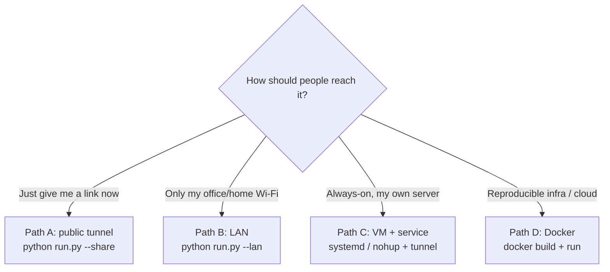

# 🚀 Deployment Guide

How to put the Research Assistant online — **easiest path first**. Pick the section that matches how you
want people to reach it. Every step is copy-paste.

> **TL;DR — the one-liner:** `python run.py --share` gives you a public HTTPS link in ~10 seconds.
> Everything below is for when you want something more permanent.

---

## Contents

1. [What you need (prerequisites)](#1-what-you-need)
2. [Choose your path](#2-choose-your-path)
3. [Path A — Public link (easiest)](#path-a--public-link-easiest)
4. [Path B — Same network (LAN)](#path-b--same-network-lan)
5. [Path C — Always-on server (VM)](#path-c--always-on-server-vm)
6. [Path D — Docker container](#path-d--docker-container)
7. [The PDF library (Oracle 23ai) — optional](#5-the-pdf-library-oracle-23ai--optional)
8. [Secrets & production checklist](#6-secrets--production-checklist)
9. [Verify it works + troubleshooting](#7-verify-it-works)

---

## 1. What you need

| Need | Why | Required? |
|---|---|---|
| **Python 3.11** | runs the app | ✅ always |
| **One chat-model API key** | Gemini (free), Mistral (free), or OpenAI (paid) | ✅ always |
| **An open port** (default `8600`) | the web server listens here | ✅ always |
| **Docker** | for the **code agent** sandbox (write-and-run-code) | ⚪ only if you want the code agent |
| **Oracle 23ai** | for the **PDF library** (local RAG) | ⚪ only if you want to search your own PDFs |
| **NVIDIA GPU** | faster embeddings/reranking + local figure reading | ⚪ optional (falls back to CPU) |

> Web search (arXiv, GitHub, web) works **with no key at all**. The app runs perfectly **web-only** —
> Oracle and Docker are both optional add-ons.

```bash
# one-time setup on the deploy machine
git clone <your-repo-url> research-assistant && cd research-assistant
python -m venv .venv
.venv\Scripts\activate                 # Linux/macOS: source .venv/bin/activate
pip install -r requirements.txt
cp .env.example .env                    # then edit .env — add at least ONE model key
```

---

## 2. Choose your path



| Path | Effort | URL people open | Stays up after you log off? |
|---|---|---|---|
| **A — Public link** | 🟢 1 command | `https://…trycloudflare.com` | only while your terminal runs |
| **B — LAN** | 🟢 1 command | `http://<your-ip>:8600` | only while your terminal runs |
| **C — VM service** | 🟡 ~15 min | your domain / tunnel | ✅ yes (systemd) |
| **D — Docker** | 🟡 ~15 min | mapped port / proxy | ✅ yes |

---

## Path A — Public link (easiest)

One command. Downloads the Cloudflare tunnel client once (into `data/tools/`), then prints a public URL.

```bash
python run.py --share
```

You'll see:

```
============================================================
  PUBLIC URL — share this link:
     https://random-words-1234.trycloudflare.com
============================================================
```

- **No account, no DNS, no firewall changes.** Anyone with the link can open it.
- ⚠️ **Keep `ENABLE_AUTH=true` in `.env`** so only people who sign up get in.
- The link lasts as long as the command runs. Want a **permanent custom domain**? Create a named tunnel
  in the Cloudflare Zero-Trust dashboard, then set `CLOUDFLARE_TUNNEL_TOKEN` (and `CLOUDFLARE_TUNNEL_HOSTNAME`
  to print it) in `.env` — `run.py --share` will use it automatically.

---

## Path B — Same network (LAN)

For teammates on the same Wi-Fi / office network.

```bash
python run.py --lan        # binds to 0.0.0.0:8600
```

1. Find your machine's IP — `ipconfig` (Windows) / `ip addr` (Linux) → e.g. `192.168.1.23`.
2. Share **`http://192.168.1.23:8600`**.
3. **Open the firewall once** (Windows, elevated PowerShell):
   ```powershell
   New-NetFirewallRule -DisplayName "Research Assistant 8600" -Direction Inbound -Action Allow -Protocol TCP -LocalPort 8600 -Profile Private
   ```
4. Keep the machine on and the server running. Teammates **sign up** and use it.

---

## Path C — Always-on server (VM)

Run it as a background service on a Linux VM (AWS/GCP/Azure/your box) so it survives reboots and logouts.

**1. Set up the app** (the one-time setup from [§1](#1-what-you-need)) under, say, `/opt/research-assistant`.

**2. Create a systemd service** — `/etc/systemd/system/research-assistant.service`:

```ini
[Unit]
Description=Research Assistant
After=network.target

[Service]
Type=simple
User=appuser
WorkingDirectory=/opt/research-assistant
Environment=PATH=/opt/research-assistant/.venv/bin
ExecStart=/opt/research-assistant/.venv/bin/python -m uvicorn webapp.server:app --host 127.0.0.1 --port 8600
Restart=on-failure
RestartSec=3

[Install]
WantedBy=multi-user.target
```

```bash
sudo systemctl daemon-reload
sudo systemctl enable --now research-assistant
sudo systemctl status research-assistant          # check it's running
```

**3. Put HTTPS in front** (recommended). Either a Cloudflare named tunnel (no open ports, free TLS) or
nginx as a reverse proxy:

```nginx
# /etc/nginx/sites-available/research-assistant
server {
    listen 80;
    server_name research.yourdomain.com;
    location / {
        proxy_pass http://127.0.0.1:8600;
        proxy_http_version 1.1;
        proxy_set_header Host $host;
        proxy_set_header X-Forwarded-For $proxy_add_x_forwarded_for;
        proxy_buffering off;                # IMPORTANT: streaming answers need this off
        proxy_read_timeout 300s;
    }
}
```
Then add TLS with `certbot --nginx -d research.yourdomain.com`.

> **Streaming note:** the app streams answers token-by-token (NDJSON). Disable proxy buffering
> (`proxy_buffering off`) or replies will appear to "hang" then dump all at once.

---

## Path D — Docker container

A `Dockerfile` and `.dockerignore` are included. The image runs the **web app**; Oracle and the chat
model stay external (as they should).

```bash
# 1. Build
docker build -t research-assistant .

# 2. Run (web-only is enough to start; mount data + pass env)
docker run -d --name research-assistant \
  -p 8600:8600 \
  --env-file .env \
  -v "$(pwd)/data:/app/data" \
  research-assistant
```

Open `http://localhost:8600`.

**Two things to know:**

- **The code agent needs Docker.** It launches throwaway sandbox containers via the Docker socket. To
  use it from inside the container, mount the host socket:
  `-v /var/run/docker.sock:/var/run/docker.sock` (this grants the container Docker access — only do it on
  a host you trust). Without it, everything works **except** the write-and-run-code agent.
- **GPU is optional.** For GPU embeddings/reranking, install the NVIDIA Container Toolkit and add
  `--gpus all`. Without it the app runs on CPU.

---

## 5. The PDF library (Oracle 23ai) — optional

Skip this entirely for a web-only deployment. To search **your own PDFs**, stand up Oracle 23ai and
bootstrap the schema **once**:

```bash
# Oracle 23ai Free in Docker (one-time)
docker run -d --name oracle-ai-db -p 1521:1521 \
  -e ORACLE_PWD=YourStrongPassword \
  container-registry.oracle.com/database/free:latest

# In .env:  ENABLE_LOCAL_RAG=true  and  ORACLE_USER / ORACLE_PASSWORD / ORACLE_DSN=localhost:1521/FREEPDB1

# Bootstrap the DB (once on a fresh database):
python -m backend.database.create_user        # create the app's DB user
python -m backend.database.create_schema      # create papers/chunks + the VECTOR column
python -m backend.database.check_oracle        # verify connectivity
python pipeline.py                             # index PDFs from data/papers/
python -m backend.database.db_status           # confirm the corpus is indexed
```

Full operator reference: **[docs/DEVELOP.md](docs/DEVELOP.md)**.

---

## 6. Secrets & production checklist

- [ ] **`.env` is never committed** (it's gitignored) and **never baked into the Docker image** (it's in
      `.dockerignore`). On servers, inject it via `--env-file`, systemd `EnvironmentFile=`, or your
      platform's secrets manager.
- [ ] **`ENABLE_AUTH=true`** for anything reachable beyond localhost.
- [ ] **Set `AUTH_SECRET_KEY`** to a long random value — otherwise sessions reset on every restart.
- [ ] **At least one model key** present (`GEMINI_API_KEY` / `MISTRAL_API_KEY` / `OPENAI_CLOUD_KEY`).
- [ ] **HTTPS in front** for any public deployment (tunnel or nginx+certbot).
- [ ] **`data/` is a mounted volume** (it holds the SQLite DBs, caches, and uploaded PDFs) — back it up.
- [ ] **Resources:** ~2 GB RAM minimum web-only; +~2 GB and a 6 GB+ GPU if you enable local embeddings/figures.

---

## 7. Verify it works

```bash
# the server answers
curl -i http://localhost:8600/login          # expect 200 (or a redirect) — it's serving

# what's indexed + which device (GPU/CPU)
python pipeline.py --status
```

| Symptom | Fix |
|---|---|
| `python run.py` starts then immediately stops | A stray console Ctrl+C — `run.py` now ignores one at startup; just run it again. |
| Public link works but answers fail | Add a model key to `.env` (`GEMINI_API_KEY=…`) and restart. |
| Streamed answers "hang" then dump at once | Turn **off** reverse-proxy buffering (`proxy_buffering off`). |
| Library shows 0 papers | Oracle is down/unindexed — `docker start oracle-ai-db`, then `python pipeline.py`. |
| Code agent says "sandbox unavailable" | Docker isn't reachable. Start Docker; in a container, mount `/var/run/docker.sock`. |
| Logged out after every restart | Set a fixed `AUTH_SECRET_KEY` in `.env`. |

---

<div align="center">
<sub>Need the architecture or accuracy numbers first? See <a href="README.md">README</a> · <a href="docs/SYSTEM_REPORT.md">docs/SYSTEM_REPORT.md</a>.</sub>
</div>
