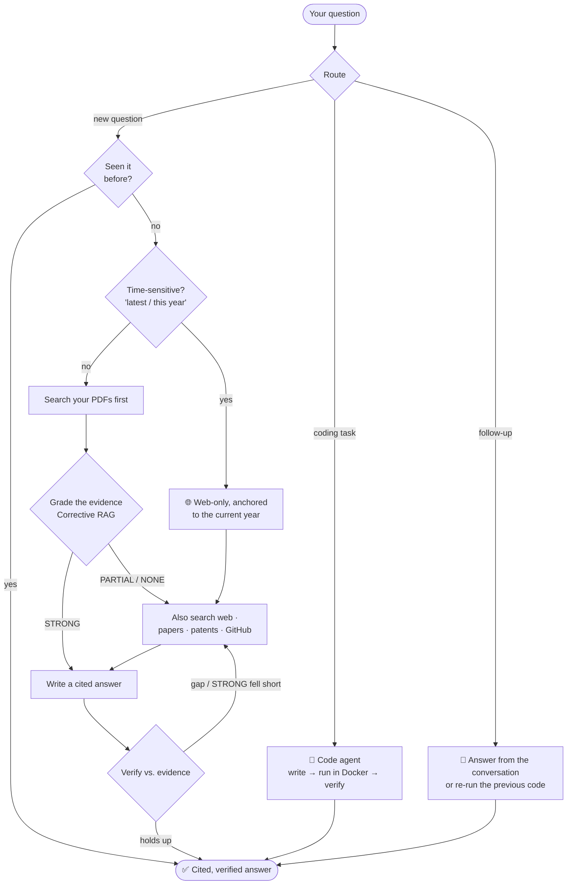
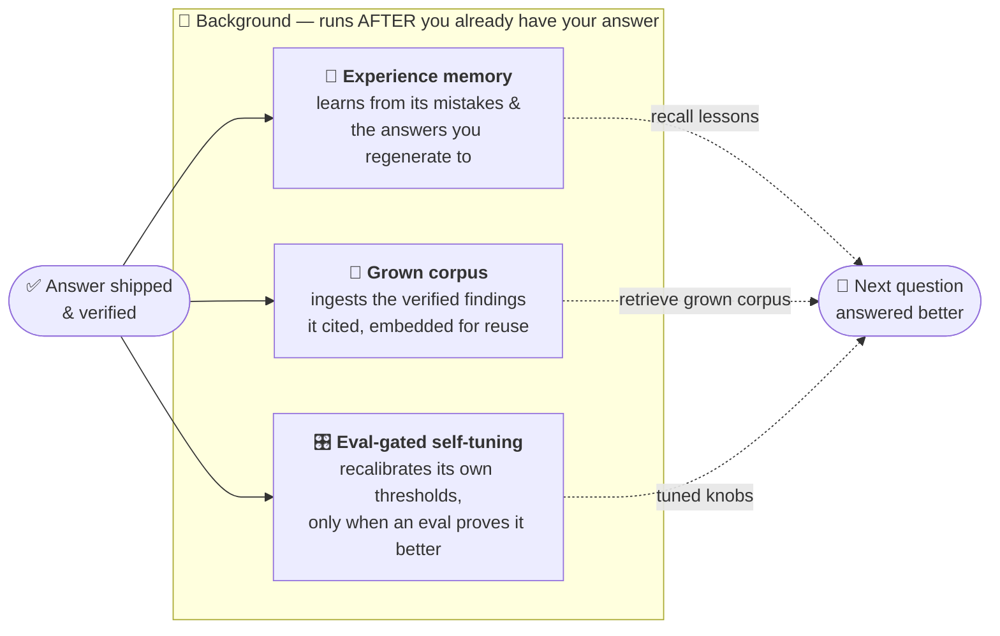
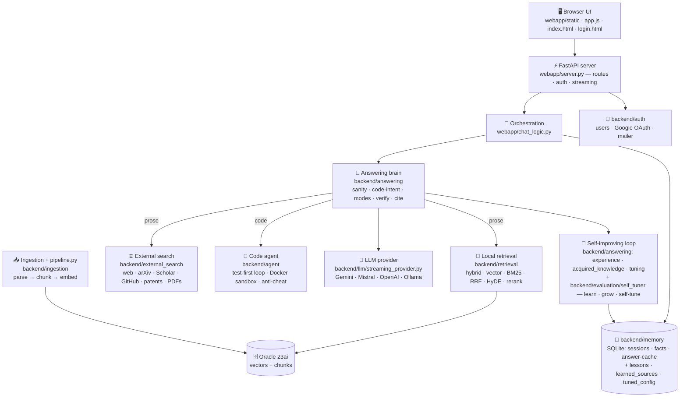

<div align="center">

# 🔎 Research Assistant

**Ask a hard question — get a real, *cited* answer. Hand it a coding task — watch it write, run, and verify the code.**

A self‑hosted research companion: a **FastAPI** backend, a **no‑build** HTML/CSS/JS frontend, an animated workspace, and whichever **LLM** you point it at. It searches real sources, answers only from what it finds, cites every claim, and verifies the draft before you see it.


[](LICENSE)

**[Quick start](#-quick-start) · [Share with your team](#-share-with-your-team) · [What you can ask](#-what-you-can-ask) · [How it works](#-how-it-works) · [Learns over time](#-it-gets-smarter-every-day) · [Features](#-features) · [Models](#-models) · [Config](#-configuration) · [Code map](#-code-map) · [Troubleshooting](#-troubleshooting)**

Open-source under the [MIT License](LICENSE) — use it, fork it, build on it.

</div>

---

Most "chat with AI" tools answer from the model's memory and hope it's right. **This one doesn't.** It searches real sources first — the open web, research papers, Wikipedia, patents, GitHub, and any PDFs you add — answers **only** from what it found, **cites every claim**, and checks the draft against that evidence before showing it. When the sources fall short, it says so instead of inventing. And when a question is really a coding task, it writes the program, runs it in a **locked‑down Docker sandbox**, and refines until it works.

And it **[gets better the more you use it](#-it-gets-smarter-every-day)** — learning from its own corrections, the answers you regenerate to, and its own measured quality, all in the background so it never costs you a moment of latency.

> [!NOTE]
> **Deep dive:** [🧭 The Complete Pipeline Guide](docs/PIPELINE_GUIDE.md) — every stage from question to verified answer, diagram-first (route → retrieve → grade → relevance-gate → verify → independent-check → cite), PDF-ready. See also [📊 How It Works](docs/HOW_IT_WORKS.md) for accuracy/latency numbers.

---

## 🚀 Quick start

```bash
git clone https://github.com/ianjan10/research-assistant
cd research-assistant

python -m venv .venv
.venv\Scripts\activate            # macOS/Linux: source .venv/bin/activate
pip install -r requirements.txt

copy .env.example .env            # macOS/Linux: cp .env.example .env
python run.py
```

Open **http://localhost:8600**, **sign up** on the login screen, and start asking.

> [!TIP]
> Web search works out of the box **with no API key** (arXiv + GitHub are free). You only need **one chat model** — a free Gemini key takes a minute (see [Models](#-models)). The PDF library is optional (it needs Oracle 23ai — see [Configuration](#-configuration)).

---

## 🔗 Share with your team

The app is single‑host: your machine runs it, teammates connect to it. Two built‑in modes (`run.py`):

| Command | Who can reach it | URL they open |
|---|---|---|
| `python run.py --lan` | Anyone on the **same Wi‑Fi / office network** | `http://<your-LAN-IP>:8600` |
| `python run.py --share` | **Anyone, anywhere** (temporary public link via Cloudflare tunnel) | `https://…trycloudflare.com` |

<details>
<summary><b>Same‑network (LAN) setup</b></summary>

1. `python run.py --lan` — binds to `0.0.0.0:8600`.
2. Find your IP (`ipconfig` → IPv4) and share `http://<that-ip>:8600`.
3. **Open the firewall once** (elevated PowerShell):
   ```powershell
   New-NetFirewallRule -DisplayName "Research Assistant 8600" -Direction Inbound -Action Allow -Protocol TCP -LocalPort 8600 -Profile Private
   ```
4. Keep your PC on and the server running; teammates **sign up** and use it.

> Keep `ENABLE_AUTH=true` so only signed‑in teammates get in. To pre‑create accounts instead of self‑signup, set `ENABLE_SIGNUP=false`.
</details>

<details>
<summary><b>Public link (remote teammates)</b></summary>

`python run.py --share` downloads the Cloudflare tunnel client once (into `data/tools/`) and prints a public `https://…trycloudflare.com` link — no account needed. For a permanent custom domain, set `CLOUDFLARE_TUNNEL_HOSTNAME` (see [.env.example](.env.example)). Always keep `ENABLE_AUTH=true` for a public link.
</details>

---

## 💬 What you can ask

| You ask… | You get… |
|---|---|
| *"Compare Raft and Paxos and when to choose each."* | A structured, **cited** explanation from primary sources |
| *"Read this arXiv paper and explain the core idea."* | A grounded walkthrough straight from the PDF |
| *"Implement and benchmark quicksort vs. mergesort on 1M ints."* | Working code, **run in a sandbox**, with the numbers |
| *"Find well‑known GitHub projects that do X."* | Famous repos first, with stars and links |
| *"What do my own papers say about Y?"* | Answers from the PDFs **you** uploaded, alongside the web |

Each answer shows inline citations `[1] [2]` (click to open the source), an evidence‑grade badge, and — for coding tasks — the agent's step‑by‑step timeline (wrote code → ran it → verified).

---

## ⚡ Fast vs Deep

A toggle in the composer. **Fast is the default** — choose Deep only when a question deserves extra digging.

| | 🏃 **Fast** (default) | 🔬 **Deep** |
|---|---|---|
| Best for | most questions | hard research questions |
| Sources | your PDFs first + a light web check | web + papers + patents + GitHub, multiple angles |
| Speed | quick | slower, more thorough |
| Verification | one pass | multiple rounds + auto‑review |

The accuracy bar is **identical** in both — Fast skips the *expensive* work, never the quality threshold.

---

## ✅ How it works



- **It picks the right source for each question, before answering.** A coding task goes to the autonomous agent; a follow-up ("what's the output of that?") is answered from the conversation. For everything else a **source router** decides what the question actually *needs*: **general knowledge / a calculation → reasoned directly** (no corpus pulled in, no forced citations, no "the sources say…" framing); **"latest / current / this year" → a web search** anchored to today (never the stale library presented as current); **a question about your documents' subject → retrieval + citations**. The mere presence of numbers never forces the code agent, and an off-topic corpus is never bolted onto a general question.
- **It grades its own evidence before answering** (Corrective RAG). Strong match in your library → answer from it; thin/missing → it searches the web to fill the gap.
- **It refuses to be misled by irrelevant sources.** A relevance gate keeps only sources that *directly* address the question — a topically-similar-but-irrelevant hit can't steer or be cited; if none are relevant, it answers from reasoning with no spurious citation.
- **Citations always point to real sources.** Every claim is tagged `[n]`, only the sources the answer actually cited are shown, and a citation to a non‑existent source number is **automatically removed**.
- **It checks its own work — twice.** A *draft → verify → refine* loop compares the answer to the evidence and rewrites only where there's a concrete gap (a failed library‑only answer **escalates to the web** and retries — Self‑RAG). Then an **independent** re-derivation plus unit/magnitude/limiting-case sanity must agree before the answer is labeled *verified* — because self-consistent isn't the same as correct.
- **It admits gaps** instead of guessing when the sources don't cover something.

### 🧠 Corrective RAG (grade‑then‑act)

Adaptive retrieval based on [Corrective RAG / Self‑RAG](https://arxiv.org/abs/2401.15884) (no LangGraph dependency): **retrieve your PDFs, *grade* coverage, then act on the grade.**

| Grade | Meaning | What happens | Badge |
|---|---|---|---|
| **STRONG** | your PDFs clearly cover it | answer from the library, **skip external search** | 🟢 *From your library* |
| **PARTIAL** | some relevant, but thin | keep the PDFs **and** search the web, merge | 🟡 *Library + web* |
| **NONE** | not in your PDFs | drop local, answer from the web | 🔵 *From the web* |

The grader scores **83.3%** on a labeled set (`python -m backend.evaluation.measure_evidence_grader` → [docs/CRAG_GRADING.md](docs/CRAG_GRADING.md)). Thresholds live in `.env` (`CRAG_STRONG_MIN`, …); `CRAG_ENABLED=false` reverts to always‑search.

---

## 🧬 It gets smarter every day

Most assistants are frozen at deploy time. This one **learns from its own runs** — three loops that all run **in the background, after your answer is delivered, so they add _zero latency_**:



| Loop | Learns from | Why it's safe | Flag |
|---|---|---|---|
| **🧠 Experience memory** | its own self-corrections (a fixed calculation, a reconciled conclusion) and the answers you **regenerate** to | lessons are *generalisable guidance*, never stored facts; preference lessons are **shape-only** (length/structure, never content); recency-weighted and pruned | `EXPERIENCE_MEMORY` (on) |
| **🌱 Grown corpus** | the external findings a **verified** answer actually **cited** — embedded in the background, then merged into future retrieval | only verified **and** cited passages; deduped by content hash; bounded + pruned; **skipped for "latest" queries** so it never serves stale data | `CORPUS_GROWTH` (on) |
| **🎛️ Self-tuning** | its own answer outcomes, scored through the existing **eval harness** | **eval-gated** (adopt only on a proven gain), **bounded**, **reversible** in one call, and **propose-only by default** — never silent | `SELF_TUNING` (opt-in) |

Every loop is **fail-open** — a learning error can never break an answer — and the ideas are ported from the best of the field: [Reflexion](https://arxiv.org/abs/2303.11366) (verbal self-reflection), [Mem0](https://github.com/mem0ai/mem0) (agent memory), and the [Generative Agents](https://arxiv.org/abs/2304.03442) memory stream (recency × relevance), with **no model-weight training and no heavy new dependencies**.

---

## 🧩 Features

<details>
<summary><b>🔐 Accounts &amp; login</b> — sign in, sign up, password reset, Google</summary>

A single self‑contained login screen (`webapp/static/login.html`) handles **Sign in / Sign up / Forgot** in one card with an animated waves background and dark/light theme. Sign in with **email or username**; sign‑up takes username, email, date of birth, password. Passwords are salted + hashed with **PBKDF2‑HMAC‑SHA256 (200k rounds)**; sessions are signed cookies (`AUTH_SECRET_KEY`). Optional **"Continue with Google"** (OAuth) when configured — see [docs/GOOGLE_SIGNIN.md](docs/GOOGLE_SIGNIN.md). Full reference: [docs/LOGIN_SCREEN.md](docs/LOGIN_SCREEN.md).

When `ENABLE_AUTH=false` (default for solo local use), the app is open and owned by a single `local` user — no login screen.
</details>

<details>
<summary><b>💻 The coding agent</b> — code that actually runs</summary>

When a question needs a program, it doesn't just print code — it **runs** it. It writes Python, executes it in a throwaway Docker container, reads the output, and **refines autonomously until it's genuinely correct** — freezing the parts that already pass and fixing only what fails. Correctness is **machine-verified**, not assumed: it generates its own visible tests, held-out checks on unseen inputs, and an independent reference oracle, with an anti-reward-hacking scan so it can't "game" the tests. If it can't fully verify, it stops with an honest *"partially verified — N/M checks"* label instead of faking a pass. You watch each step inline (write → run → verify → refine), and it's saved with the chat. The container is **network‑off, CPU/memory‑capped, hard‑timeout, non‑root, auto‑removed** — nothing it generates touches your machine. The scientific stack (numpy, scipy, pandas, scikit‑learn, …) is baked in.
</details>

<details>
<summary><b>📄 Use your own documents</b></summary>

Click **Add papers** in the sidebar to upload PDFs; they're parsed → chunked → embedded and searched alongside the web on every question. The library modal shows what's indexed (and flags PDFs that are on disk but not yet embedded).

```bash
python pipeline.py --corpus-report     # papers, chunks, topic coverage, gaps, duplicates
python pipeline.py --inspect-chunks 3  # see exactly how a document was chunked
```
See [docs/INGESTION_CHECKLIST.md](docs/INGESTION_CHECKLIST.md).
</details>

<details>
<summary><b>🧠 Contextual Retrieval</b> — chunks that know where they came from</summary>

At indexing time an LLM writes **one context sentence** per chunk (a technique [from Anthropic](https://www.anthropic.com/news/contextual-retrieval)), stored only inside the search index — what you read in citations is always the original chunk. It improves recall (measured +4.9% rel. recall@10 on this repo's 3‑paper benchmark; larger libraries benefit more), with **no query‑time latency** (the work is cached at indexing). Falls back Gemini → Mistral → plain chunks so indexing never breaks. Toggle: `CONTEXTUAL_CHUNKS=true|false`.
</details>

<details>
<summary><b>⚙️ GPU accelerated</b> — fast, consistent retrieval</summary>

With an NVIDIA GPU (CUDA), the cross‑encoder reranker runs in **fp16** (~2× speed, half the VRAM), **pre‑warmed at startup** so the first question isn't slow — retrieval is **~3× faster** than CPU with no latency spikes. No GPU? It falls back to CPU. (`DEVICE=auto`.)
</details>

<details>
<summary><b>🔭 Observability &amp; quality gates</b> (optional)</summary>

Turn on [Langfuse](https://langfuse.com) tracing for latency/cost/retrieval/verification per request (`LANGFUSE_ENABLED=true`, see [docs/OBSERVABILITY.md](docs/OBSERVABILITY.md)), or DeepEval quality gates (`DEEPEVAL_ENABLED=true`). Both **off by default, zero overhead** when off.
</details>

---

## 🤖 Models

The chat client speaks the OpenAI API, so you choose the provider — switch in the sidebar, no restart:

| Model | Cost | How |
|---|---|---|
| **Gemini 2.5 Flash** | Free | [aistudio.google.com/apikey](https://aistudio.google.com/apikey) → `GEMINI_API_KEY` |
| **Mistral Large / Codestral** | Free | [console.mistral.ai](https://console.mistral.ai) → `MISTRAL_API_KEY` |
| **GPT‑5.5** | Paid | your OpenAI key → `OPENAI_CLOUD_KEY` |
| **Any local model** | Free | point `OPENAI_BASE_URL` at Ollama (`http://localhost:11434/v1`) |

---

## 🔧 Configuration

The real `.env` is private and gitignored; **[.env.example](.env.example)** is the fully commented template. The knobs you'll actually touch:

| Variable | What it does |
|---|---|
| `GEMINI_API_KEY` · `MISTRAL_API_KEY` · `OPENAI_CLOUD_KEY` | Keys for the model(s) you want |
| `ENABLE_WEB_SEARCH` | Search the web / papers / patents / GitHub (on) |
| `ENABLE_LOCAL_RAG` · `ORACLE_DSN` | Also search your uploaded PDFs (needs Oracle 23ai) |
| `DEVICE` | `auto` uses your GPU when available |
| `ENABLE_AUTH` · `ENABLE_SIGNUP` · `AUTH_SECRET_KEY` · `SESSION_MAX_AGE` | Login on/off, self‑signup, cookie signing, session lifetime |
| `GOOGLE_CLIENT_ID` · `GOOGLE_CLIENT_SECRET` | Enable "Continue with Google" |

<details>
<summary>Use your own PDF library (Oracle 23ai vectors)</summary>

```env
ENABLE_LOCAL_RAG=true
ORACLE_DSN=localhost:1521/FREEPDB1
```
Start the database (e.g. `docker start oracle-ai-db`) **before** the app, then use **Add papers**. Without it, the app runs web‑only with no database.
</details>

<details>
<summary>Start fresh / wipe all local data</summary>

```bash
python -m backend.maintenance.factory_reset          # dry run — shows what WOULD be removed
python -m backend.maintenance.factory_reset --yes    # actually wipe (no backups)
```
Removes the Oracle index, conversations, accounts, uploaded PDFs, and caches for a clean‑install state. Spare a category with `--keep-oracle / --keep-chats / --keep-auth / --keep-pdfs / …`. Stop the app first so the SQLite files aren't locked.
</details>

---

## 🗺️ Code map



| Folder | What lives here | Open first |
|---|---|---|
| **`webapp/`** | FastAPI server, chat orchestration, no‑build UI | `server.py` · `chat_logic.py` |
| **`webapp/static/`** | Workspace + login UI (HTML/CSS/JS, canvas backgrounds) | `index.html` · `app.js` · `login.html` |
| **`backend/answering/`** | The decision brain — route, verify, cite, review | `agentic_answer.py` · `code_intent.py` |
| **`backend/answering/`** *(learning)* | Self-improving loop — experience memory, grown corpus, self-tuning layer | `experience.py` · `acquired_knowledge.py` · `tuning.py` |
| **`backend/evaluation/`** | Eval harnesses + the eval-gated self-tuner | `self_tuner.py` · `evaluate_*.py` |
| **`backend/retrieval/`** | Local hybrid RAG (vector + BM25 + RRF + rerank) | `hybrid_retrieve.py` |
| **`backend/external_search/`** | Web · arXiv · Scholar · Wikipedia · patents · GitHub · PDFs | `orchestrator.py` |
| **`backend/agent/`** | Autonomous code agent — write → run in Docker → verify | `loop.py` · `code_runner.py` |
| **`backend/ingestion/`** | PDF → chunks → embeddings (driven by `pipeline.py`) | `ingest_papers.py` |
| **`backend/llm/`** | One OpenAI‑compatible streaming client + model router | `streaming_provider.py` |
| **`backend/memory/`** | Conversations, facts, answer cache (SQLite) | `store.py` |
| **`backend/auth/`** | Accounts, Google OAuth, password‑reset email | `users.py` |
| **`backend/maintenance/`** | One‑shot factory reset (wipe all local data) | `factory_reset.py` |
| **`tests/`** | Offline tests — Docker / LLM / network mocked | `test_*.py` |

> 🧭 Deeper dives ([full docs index](docs/README.md)): **[docs/PIPELINE_GUIDE.md](docs/PIPELINE_GUIDE.md)** (the complete diagram-first pipeline guide, PDF-ready) · [docs/ARCHITECTURE.md](docs/ARCHITECTURE.md) (architecture + code map) · [docs/TECH_STACK.md](docs/TECH_STACK.md) (technology) · [docs/HOW_IT_WORKS.md](docs/HOW_IT_WORKS.md) + [docs/MEASUREMENT.md](docs/MEASUREMENT.md) (measured accuracy/latency) · [docs/LOGIN_SCREEN.md](docs/LOGIN_SCREEN.md).

---

## 🛠️ Development

```bash
.venv\Scripts\python.exe -m pytest -q          # full suite, fully offline/mocked
.venv\Scripts\pyflakes backend webapp           # lint
python pipeline.py --status                     # what's indexed + device (GPU/CPU)
python pipeline.py --corpus-report              # coverage + gaps report
```

Every change should run cleanly through `pytest` + `pyflakes` before it's done. The frontend has **no build step** — edit the files in `webapp/static/` and refresh.

---

## 🩺 Troubleshooting

| Symptom | Fix |
|---|---|
| Library shows 0 papers after upload | The Oracle DB is offline/unindexed. Start it (`docker start oracle-ai-db`), then re‑upload or run `python pipeline.py`. PDFs live on disk in `data/papers/`. |
| Teammates can't reach the LAN URL | Open the firewall port (see [Share with your team](#-share-with-your-team)); confirm you ran `--lan` and you're on the same network. |
| Logged out after every restart | Set `AUTH_SECRET_KEY` in `.env` (otherwise sessions use an ephemeral key). |
| Background isn't animating | The OS "reduce motion" setting calms decorative animations. |
| Port already in use | `run.py` auto‑clears a stale **Python** server on the port; or use `python run.py --port 9000`. |

---

<div align="center">
<sub>Python · FastAPI · vanilla JS · Docker · SQLite · CUDA — self‑hosted, no telemetry.</sub>
<br><sub>Released under the <a href="LICENSE">MIT License</a>.</sub>
</div>
