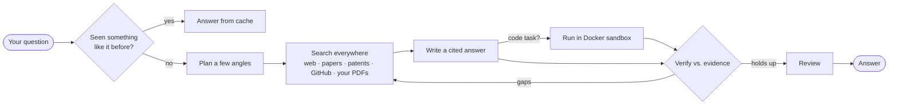

<div align="center">

# Research Assistant

**A self‑hosted answer engine and autonomous coding agent.**
Ask a hard technical question and get a cited, evidence‑backed answer — or hand it a task and watch it write, run, and test the code until it passes.


[Quick start](#quick-start) · [What it does](#what-it-does) · [How it works](#how-it-works) · [Models](#models) · [Coding agent](#the-coding-agent) · [Config](#configuration)

</div>

---

Most "chat with AI" tools answer from the model's memory and hope it's right. This one doesn't.

It retrieves real sources first — the open web, research papers (arXiv, Semantic Scholar), Wikipedia, patents, GitHub, and any PDFs you add — answers **only** from what it found, cites every claim, and checks the draft against that evidence before you ever see it. When the sources disagree or come up short, it tells you, instead of inventing something. And when a question is really a coding task, it writes the program, runs it in a locked‑down sandbox, and keeps fixing it until the tests pass.

Everything runs on your machine: a FastAPI backend, a dependency‑free HTML/CSS/JS frontend (no bundler, no framework), and whichever LLM you point it at.

---

## What it does

- **Answers from evidence, with citations.** It plans a few angles on your question, searches broadly, keeps the strongest sources, and writes an answer grounded in them — with inline references you can click back to.
- **Checks its own work.** A *draft → verify → refine* loop compares each answer against the retrieved evidence and rewrites until it holds up, followed by a final review pass.
- **Runs code to be sure.** Ask for an implementation and it writes Python, executes it in a **network‑isolated Docker sandbox**, and iterates until the program actually works.
- **Remembers.** Repeat or near‑duplicate questions come back instantly from a local cache instead of re‑running the whole pipeline.
- **Uses your documents.** Drop in PDFs and they're parsed, embedded, and searched right alongside the web on every question — entirely optional.

> [!TIP]
> A few things people throw at it:
>
> | Ask | What you get |
> |---|---|
> | *"Compare Raft and Paxos and when to choose each."* | A structured, cited explanation pulled from primary sources |
> | *"Read this arXiv paper and explain the core idea."* | A grounded walkthrough straight from the PDF |
> | *"Implement and benchmark quicksort vs. mergesort on 1M ints."* | Working code, **run in the sandbox**, with the numbers |
> | *"Find well‑known GitHub projects that do X."* | Famous repos first, with star counts and links |

---

## Quick start

```bash
git clone https://github.com/ianjan10/research-assistant
cd research-assistant

python -m venv .venv
.venv\Scripts\activate          # macOS/Linux: source .venv/bin/activate
pip install -r requirements.txt

copy .env.example .env          # macOS/Linux: cp .env.example .env
python run.py
```

Open **http://localhost:8600**, create an account, and start asking. Web search works out of the box with **no API key** — you just need one chat model (below).

---

## How it works



Search broadly → keep the best evidence → answer only from it → verify → remember it.

---

## Models

The chat client speaks the OpenAI API, so you choose the provider. The in‑app switcher ships with these — pick one in the sidebar, no restart needed:

| Model | Cost | How |
|---|---|---|
| **Gemini 2.5 Flash** | Free | [aistudio.google.com/apikey](https://aistudio.google.com/apikey) → `GEMINI_API_KEY` |
| **Mistral Large / Codestral** | Free | [console.mistral.ai](https://console.mistral.ai) → `MISTRAL_API_KEY` |
| **GPT‑5.5** | Paid | your OpenAI key → `OPENAI_CLOUD_KEY` |

<details>
<summary>Add a different OpenAI‑compatible provider</summary>

The router resolves any model by name. Add an entry to `PROVIDERS` + `CATALOG` in
`backend/llm/streaming_provider.py`, or just point the active `OPENAI_*` lines at it — e.g. a local Ollama:

```env
OPENAI_API_KEY=ollama
OPENAI_BASE_URL=http://localhost:11434/v1
OPENAI_MODEL=qwen3:8b
```
</details>

---

## The coding agent

There are two levels of "let it write code," from safe to powerful:

**1 — In‑answer code (always on).** When a question needs a program, the assistant writes Python and runs it in a throwaway Docker container — **no network, capped CPU/memory, hard timeout, non‑root**. Nothing it generates can touch your machine. The scientific stack (numpy, scipy, pandas, scikit‑learn, …) is baked into the sandbox image, so real work runs.

**2 — Autonomous build (opt‑in).** A full *write → run → test → fix* loop built on the Claude Agent SDK: it edits files in the repo, runs your test suite and linter, and keeps going until everything is green. You drive it from a **Build** panel in the UI or the CLI.

> [!WARNING]
> The autonomous agent runs shell and file tools on the **host**, not the sandbox. It's an owner tool, so it ships **off by default** (`ENABLE_AUTO_AGENT`), **localhost‑only**, and **login‑required**.

<details>
<summary>Enable and run it</summary>

```bash
npm install -g @anthropic-ai/claude-code   # the SDK drives this CLI
claude setup-token                         # log in (a Claude subscription works — no API key)
```
Set `ENABLE_AUTO_AGENT=true` in `.env`, restart, then either:

```bash
# Terminal
python -m backend.agent.auto_agent "add a /healthz endpoint with a test"
```
…or click **Build** in the top bar and watch the steps stream live.
</details>

---

## Configuration

The real `.env` is private and gitignored; **[.env.example](.env.example)** is the fully commented template. The knobs you'll actually touch:

| Variable | What it does |
|---|---|
| `GEMINI_API_KEY` / `MISTRAL_API_KEY` / `OPENAI_CLOUD_KEY` | Keys for the models you want |
| `ENABLE_WEB_SEARCH` | Search the web / papers / patents / GitHub (on) |
| `ENABLE_LOCAL_RAG` | Also search your uploaded PDFs |
| `ENABLE_ANSWER_CACHE` | Reuse answers for repeat questions |
| `ENABLE_AUTH` · `SESSION_MAX_AGE` | Login + how long a session lasts |
| `ENABLE_AUTO_AGENT` | The autonomous build agent (off by default) |

<details>
<summary>Use your own PDF library</summary>

Turn on local search and point it at an Oracle 23ai instance for vectors:

```env
ENABLE_LOCAL_RAG=true
ORACLE_DSN=localhost:1521/FREEPDB1
```
Then use **＋ Add papers** in the sidebar. PDFs are parsed, chunked, embedded, and searched together with the web. Without it, the app runs web‑only with no database.
</details>

<details>
<summary>Share it beyond your machine</summary>

```bash
python run.py --share   # temporary public https link
python run.py --lan     # reachable on your network
```
Keep `ENABLE_AUTH=true` so visitors must sign in.
</details>

---

## Development

```bash
.venv\Scripts\python.exe -m pytest -q          # 165 tests, fully offline/mocked
.venv\Scripts\pyflakes backend webapp          # lint
python pipeline.py --status                    # inspect the local PDF index
```

```
backend/   retrieval · external search · LLM router · agents · memory · auth · ingestion
webapp/    FastAPI server + chat orchestration + static UI (no build step)
docs/      deeper notes
run.py     launch the app  (--share / --lan)
```

---

<div align="center">
<sub>Python · FastAPI · vanilla JS · Docker · SQLite — self‑hosted, no telemetry.</sub>
</div>
