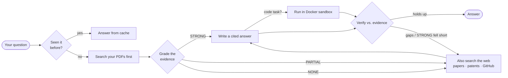
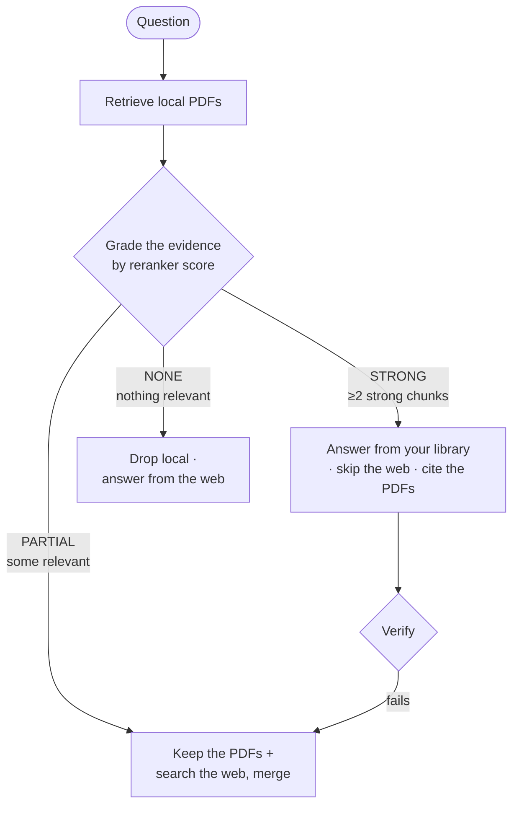
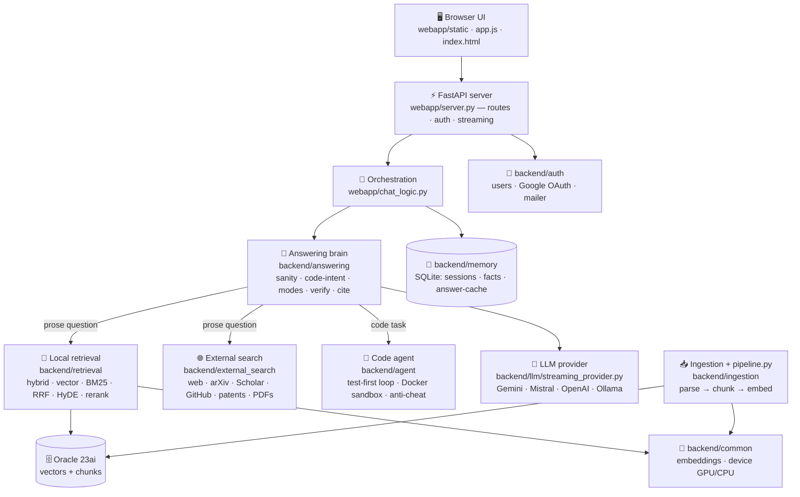

<div align="center">

# 🔎 Research Assistant

**Ask a hard question — get a real, cited answer. Or hand it a coding task — watch it write, run, and verify the code.**

Everything runs on your machine: a FastAPI backend, a dependency‑free HTML/JS frontend, and whichever LLM you point it at.

> [!IMPORTANT]
> **Portfolio showcase — not open source.** This repository is public so you can **read the code and see what I built**. It is **not licensed for use**: please don't run, copy, deploy, modify, or redistribute it. See the [LICENSE](LICENSE) (All Rights Reserved). The setup steps below document how the system works — they're for review, not a grant of permission. For any use, please get in touch first.


[](LICENSE)

**[Quick start](#-quick-start-5-minutes) · [What you can ask](#-what-you-can-ask) · [How it works](docs/HOW_IT_WORKS.md) · [Corrective RAG](#-corrective-rag-grade-then-act) · [Fast vs Deep](#-fast-vs-deep) · [Trust](#-why-you-can-trust-the-answers) · [Features](#-features) · [Code map](#-code-map-where-everything-lives) · [Config](#-configuration)**

</div>

---

Most "chat with AI" tools answer from the model's memory and hope it's right. **This one doesn't.**
It searches real sources first — the open web, research papers, Wikipedia, patents, GitHub, and any PDFs you add — answers **only** from what it found, **cites every claim**, and checks the draft against that evidence before you see it. When the sources come up short, it says so instead of inventing an answer. And when a question is really a coding task, it writes the program, runs it in a locked‑down sandbox, and fixes it until it works.

> [!NOTE]
> **New: [📊 How It Works — Interactive Pipeline Guide](docs/HOW_IT_WORKS.md).** Every pipeline explained the easy way — *what it does, why it's the best choice, the real accuracy + latency numbers, and clickable diagrams* of how it all fits together.

---

## 🚀 Quick start (5 minutes)

```bash
git clone https://github.com/ianjan10/research-assistant
cd research-assistant

python -m venv .venv
.venv\Scripts\activate            # macOS/Linux: source .venv/bin/activate
pip install -r requirements.txt

copy .env.example .env            # macOS/Linux: cp .env.example .env
python run.py
```

Open **http://localhost:8600**, create an account, and start asking.

> [!TIP]
> Web search works out of the box **with no API key** (arXiv + GitHub are free). You just need **one chat model** — the free Gemini key takes a minute (see [Models](#models)). That's it.

---

## 💬 What you can ask

| You ask… | You get… |
|---|---|
| *"Compare Raft and Paxos and when to choose each."* | A structured, **cited** explanation pulled from primary sources |
| *"Read this arXiv paper and explain the core idea."* | A grounded walkthrough straight from the PDF |
| *"Implement and benchmark quicksort vs. mergesort on 1M ints."* | Working code, **run in a sandbox**, with the numbers |
| *"Find well‑known GitHub projects that do X."* | Famous repos first, with stars and links |
| *"What do my own papers say about Y?"* | Answers from the PDFs **you** uploaded, alongside the web |

---

## ⚡ Fast vs Deep

A toggle under the message box. **Fast is the default** — pick Deep only when a question deserves the extra digging.

| | 🏃 **Fast** (default) | 🔬 **Deep** |
|---|---|---|
| Best for | most questions | hard research questions |
| Sources | your PDFs first + a light web check | web + papers + patents + GitHub, multiple angles |
| Speed | quick | slower, more thorough |
| Verification | one pass | multiple rounds + auto‑review |

The accuracy bar is **identical** in both — Fast just skips the *expensive* work, it never lowers the quality threshold.

---

## ✅ Why you can trust the answers



- **It grades its own evidence before answering** (Corrective RAG). Strong match in your library → answer from it. Thin or missing → it goes to the web to fill the gap. See [Corrective RAG](#-corrective-rag-grade-then-act).
- **Citations always point to real sources.** Every claim is tagged `[1] [2]`; a citation that points to a source number that doesn't exist is **automatically removed** — the model can't cite `[15]` when only 8 sources were found.
- **It checks its own work.** A *draft → verify → refine* loop compares the answer against the retrieved evidence and rewrites until it holds up — and if a library-only answer fails, it **escalates to the web and tries again** (Self-RAG).
- **It admits gaps.** If the sources don't cover something, it says so plainly instead of guessing.

---

## 🧠 Corrective RAG (grade-then-act)

Most RAG tools always do the same thing: search everything, every time. This one is **adaptive** — it
borrows the [Corrective RAG / Self‑RAG](https://arxiv.org/abs/2401.15884) idea (no LangGraph dependency):
**retrieve your PDFs first, *grade* how well they cover the question, then act on the grade.**



| Grade | Meaning | What happens | Badge |
|---|---|---|---|
| **STRONG** | your PDFs clearly cover it | answer from the library, **skip external search** (faster, no web/API spend) | 🟢 *From your library* |
| **PARTIAL** | some relevant, but thin | keep the PDFs **and** search the web/papers/GitHub, merge | 🟡 *Library + web* |
| **NONE** | not in your PDFs | drop local, answer from the web | 🔵 *From the web* |

- **Code‑from‑paper** — ask for code whose algorithm is in your PDFs and it extracts the algorithm
  from the paper, hands it to the code agent as the spec, and returns **tested code that cites the paper**.
- **Self‑RAG correction** — if a library‑only (STRONG) answer fails verification, it escalates to the
  web and regenerates once, flipping the badge to *Library + web*.
- **Measured** — the grader scores **83.3%** on a labeled set with a transparent confusion matrix and
  external‑skip rate: `python -m backend.evaluation.measure_evidence_grader` → [docs/CRAG_GRADING.md](docs/CRAG_GRADING.md).
- **Tunable & safe** — thresholds and toggles live in `.env` (`CRAG_STRONG_MIN`, `CRAG_PARTIAL_MIN`, …);
  `CRAG_ENABLED=false` falls back to the classic always‑search behavior.

---

## 🧩 Features

<details>
<summary><b>⚙️ GPU accelerated</b> — fast, consistent retrieval</summary>

If you have an NVIDIA GPU (CUDA), the cross‑encoder reranker runs on it automatically (`DEVICE=auto`) in **fp16** for ~2× speed at half the VRAM — comfortable even on a 6 GB laptop card. It's **pre‑warmed at startup**, so the first question isn't slow. No GPU? It falls back to CPU. On a GPU, retrieval is **~3× faster** with none of the CPU reranker's latency spikes. (Embeddings use Gemini by default; set `EMBEDDING_PROVIDER=local` to run a local embedder on the GPU too.)
</details>

<details>
<summary><b>📄 Use your own documents</b></summary>

Click **＋ Add papers** in the sidebar to upload PDFs. They're parsed, chunked, embedded, and searched right alongside the web on every question. Want to know what's indexed and where the gaps are?

```bash
python pipeline.py --corpus-report     # papers, chunks, topic coverage, gaps, duplicates
python pipeline.py --inspect-chunks 3  # see exactly how a document was chunked
```
See [docs/INGESTION_CHECKLIST.md](docs/INGESTION_CHECKLIST.md) for adding PDFs that *broaden* coverage instead of just inflating the count.
</details>

<details>
<summary><b>🧠 Contextual Retrieval</b> — chunks that know where they came from</summary>

**The problem:** when a PDF is split into chunks for search, each chunk loses its surroundings. A chunk that says *"The error dropped by 0.4 over the baseline"* never mentions echo cancellation — the *rest of the paper* did — so a search for "echo cancellation results" can't find it.

**The fix** (a technique [published by Anthropic](https://www.anthropic.com/news/contextual-retrieval)): at indexing time, an LLM reads the document and writes **one context sentence** for every chunk. It's prepended to the chunk **only inside the app's document index**:

```text
BEFORE — what the document search sees:
  "The error dropped by 0.4 over the baseline."
   ← not found for "echo cancellation results"

AFTER — what the document search sees:
  "This chunk reports the echo-cancellation results of the
   proposed neural network. The error dropped by 0.4 over
   the baseline."
   ← found for that search (context sentence written by the LLM)
```

What you read in citations is **always the original chunk** — the context sentence is stored separately and never shown.

**Measured on this repo's own benchmark** — 3 papers, 64 chunks, 20 test questions; both runs identical except the added context sentence:

| metric (what it means) | plain | contextual | change |
|---|---|---|---|
| recall@10 — *right chunk lands in the top 10* | 0.405 | **0.425** | +0.020 (**+4.9% rel.**) |
| recall@5 — *right chunk lands in the top 5* | 0.355 | **0.365** | +0.010 (**+2.8% rel.**) |
| ranking (MRR/nDCG) — *how high it ranks, max 1.0* | 0.81–0.82 | 0.82 | ~flat — already ~0.82 of a max 1.0 on 3 papers, little headroom |

> 🟢 **The honest read:** a real but modest gain on a tiny 3‑paper library — and it should **grow with your library**. The more papers you add, the more chunks look alike, and the more this disambiguation pays off (on large corpora, Anthropic measured up to a **~35% reduction in retrieval failures** — a different metric than ours, but the same direction). No extra latency when you ask a question: the LLM work (one short call per chunk) happens once at indexing and is **cached on disk**.

Robust by design: context‑sentence generation **falls back Gemini → Mistral** if one provider is rate‑limited, and if every LLM fails it falls back to plain chunks — indexing never breaks. Toggle with `CONTEXTUAL_CHUNKS=true|false`; `pipeline.py --incremental` detects the change and rebuilds automatically.
</details>

<details>
<summary><b>💻 The coding agent</b> — code that actually runs</summary>

When a question needs a program, it doesn't just print code and hope — it **runs** it. It writes Python, executes it in a throwaway Docker container, reads the output, and refines until it works. You watch each step (think → write → run → check) inline, and it's saved with the chat.

The container is locked down: **no network, capped CPU/memory, a hard timeout, non‑root, auto‑removed.** Nothing it generates can touch your machine. The scientific stack (numpy, scipy, pandas, scikit‑learn, …) is baked in.
</details>

<details>
<summary><b>🔭 Observability &amp; quality gates</b> (optional)</summary>

Turn on [Langfuse](https://langfuse.com) tracing to see latency, token cost, retrieval quality, and verification rounds per request (`LANGFUSE_ENABLED=true` — see [docs/OBSERVABILITY.md](docs/OBSERVABILITY.md)). Run the DeepEval quality gates (faithfulness / answer‑relevancy / context) with `DEEPEVAL_ENABLED=true`. Both are **off by default and zero‑overhead** when off.
</details>

---

## Models

The chat client speaks the OpenAI API, so you choose the provider. Pick one in the sidebar — no restart:

| Model | Cost | How |
|---|---|---|
| **Gemini 2.5 Flash** | Free | [aistudio.google.com/apikey](https://aistudio.google.com/apikey) → `GEMINI_API_KEY` |
| **Mistral Large / Codestral** | Free | [console.mistral.ai](https://console.mistral.ai) → `MISTRAL_API_KEY` |
| **GPT‑5.5** | Paid | your OpenAI key → `OPENAI_CLOUD_KEY` |
| **Any local model** | Free | point `OPENAI_BASE_URL` at Ollama (`http://localhost:11434/v1`) |

---

## 🔧 Configuration

The real `.env` is private and gitignored; **[.env.example](.env.example)** is the fully commented template. The knobs you'll actually touch:

| Variable | What it does |
|---|---|
| `GEMINI_API_KEY` · `MISTRAL_API_KEY` · `OPENAI_CLOUD_KEY` | Keys for the model(s) you want |
| `ENABLE_WEB_SEARCH` | Search the web / papers / patents / GitHub (on) |
| `ENABLE_LOCAL_RAG` | Also search your uploaded PDFs |
| `DEVICE` | `auto` uses your GPU when available |
| `ENABLE_AUTH` · `SESSION_MAX_AGE` | Login + how long a session lasts |

<details>
<summary>Use your own PDF library (Oracle 23ai vectors)</summary>

```env
ENABLE_LOCAL_RAG=true
ORACLE_DSN=localhost:1521/FREEPDB1
```
Then use **＋ Add papers**. Without it, the app runs web‑only with no database.
</details>

<details>
<summary>Share it beyond your machine</summary>

```bash
python run.py --share   # temporary public https link
python run.py --lan     # reachable on your network
```
Keep `ENABLE_AUTH=true` so visitors must sign in.
</details>

---

## 🗺️ Code map (where everything lives)

New to the codebase? Here's the whole thing on one screen. **The arrows show how a request flows; the table tells you which file to open first.**



| Folder | What lives here | Open first |
|---|---|---|
| **`webapp/`** | FastAPI server, chat orchestration, no‑build UI | `server.py` · `chat_logic.py` |
| **`backend/answering/`** | The decision brain — route, verify, cite, review | `agentic_answer.py` · `code_intent.py` |
| **`backend/retrieval/`** | Local hybrid RAG over your PDFs (vector + BM25 + RRF + rerank) | `hybrid_retrieve.py` |
| **`backend/external_search/`** | Web · arXiv · Semantic Scholar · Wikipedia · patents · GitHub · online PDFs | `orchestrator.py` |
| **`backend/agent/`** | Autonomous code agent — writes → runs in Docker → verifies | `loop.py` · `code_runner.py` |
| **`backend/ingestion/`** | PDF → chunks → embeddings (driven by `pipeline.py` at the root) | `ingest_papers.py` |
| **`backend/llm/`** | One OpenAI‑compatible streaming client + model router | `streaming_provider.py` |
| **`backend/database/`** | Oracle schema, CLOB→native‑VECTOR migration, admin CLIs | `create_schema.py` · `vector_migration.py` |
| **`backend/memory/`** | Conversations, facts, answer cache (SQLite) | `store.py` |
| **`backend/common/`** | Embeddings facade + GPU/CPU device picker | `embeddings.py` · `device.py` |
| **`backend/auth/`** | Accounts, Google OAuth, password‑reset email | `users.py` |
| **`backend/maintenance/`** | One‑shot factory reset (wipe all local data) | `factory_reset.py` |
| **`backend/evaluation/`** | Retrieval + LLM answer‑quality scoring | `evaluate_retrieval.py` |
| **`backend/observability/`** | Optional Langfuse request tracing (off by default) | `tracing.py` |
| **`tests/`** | 438 offline tests — Docker / LLM / network all mocked | `test_*.py` |

> 🧭 Deeper dives: **[docs/PROJECT_REPORT.md](docs/PROJECT_REPORT.md)** (the full picture — pipeline · tech · measurements · roadmap, PDF‑ready) · **[docs/HOW_IT_WORKS.md](docs/HOW_IT_WORKS.md)** (interactive pipeline guide + numbers) · **[docs/MEASUREMENT.md](docs/MEASUREMENT.md)** (classifier metrics) · **[docs/CRAG_GRADING.md](docs/CRAG_GRADING.md)** (CRAG grader metrics) · **[docs/ARCHITECTURE.md](docs/ARCHITECTURE.md)** (full diagrams) · **[docs/PIPELINE.md](docs/PIPELINE.md)** (step‑by‑step flow).

---

## 🛠️ Development

```bash
.venv\Scripts\python.exe -m pytest -q          # 438 passing, fully offline/mocked
.venv\Scripts\pyflakes backend webapp          # lint
python pipeline.py --status                    # what's indexed + which device (GPU/CPU)
python pipeline.py --corpus-report             # coverage + gaps report
```

New here? Start with the **[Code map](#-code-map-where-everything-lives)** above to see where each
piece lives, then read **[docs/ARCHITECTURE.md](docs/ARCHITECTURE.md)** for the full engineering deep‑dive.

---

<div align="center">
<sub>Python · FastAPI · vanilla JS · Docker · SQLite · CUDA — self‑hosted, no telemetry.</sub>
<br><sub>© 2026 Aniston Developer Team — <b>All Rights Reserved</b>. Public for portfolio/showcase only; see the <a href="LICENSE">LICENSE</a>. Not licensed for use.</sub>
</div>
