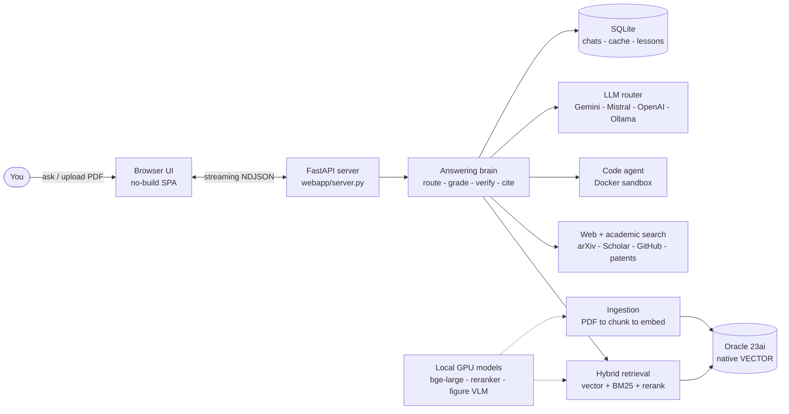
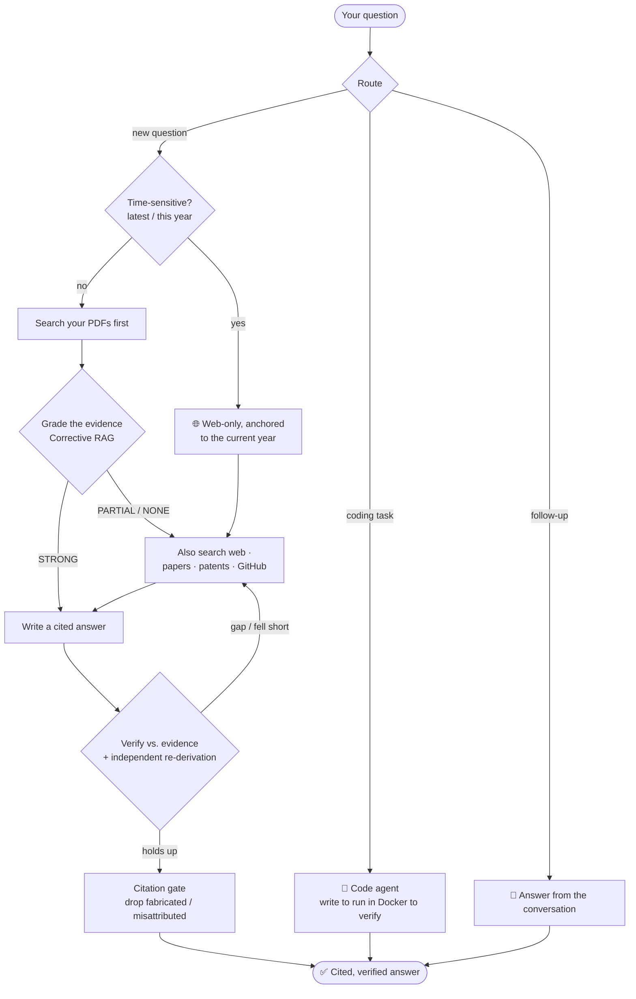
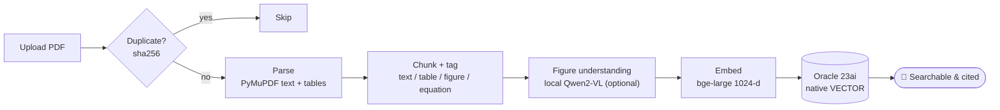
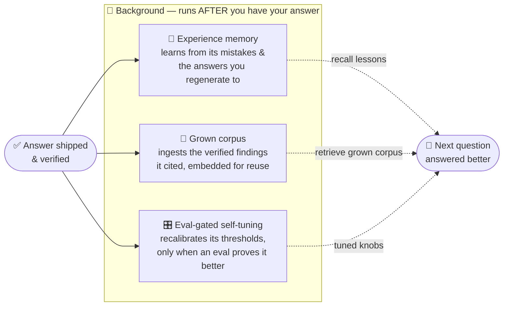
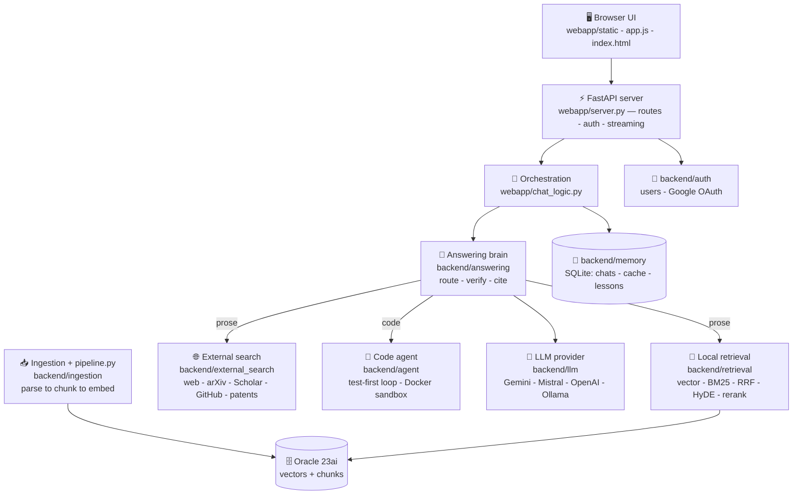

<div align="center">

# 🔎 Research Assistant

### Ask a hard question → get a real, *cited*, *verified* answer. Hand it a coding task → watch it write, run, and prove the code.

A **self-hosted** research companion that searches real sources, answers **only** from what it finds,
**cites every claim**, and checks the draft against the evidence before you ever see it.


[](LICENSE)

**[Quick start](#-quick-start) · [Architecture](#-architecture-at-a-glance) · [How it works](#-how-it-works) · [Add a paper](#-add-a-paper-the-ingestion-flow) · [Features](#-features) · [Models](#-models) · [Config](#-configuration) · [Deploy](#-deploy) · [Code map](#-code-map) · [Troubleshooting](#-troubleshooting)**

</div>

---

Most "chat with AI" tools answer from the model's memory and hope it's right. **This one doesn't.**
It searches real sources first — the open web, research papers, Wikipedia, patents, GitHub, and any
PDFs you add — answers **only** from what it found, **cites every claim**, and checks the draft against
that evidence before showing it. When the sources fall short, it says so instead of inventing. And when
a question is really a coding task, it writes the program, runs it in a **locked-down Docker sandbox**,
and refines until it works.

And it **[gets better the more you use it](#-it-gets-smarter-every-day)** — learning from its own
corrections, the answers you regenerate to, and its own measured quality, all in the background so it
never costs you a moment of latency.

> [!NOTE]
> **Deploying it?** → **[DEPLOY.md](DEPLOY.md)** is a step-by-step, copy-paste guide (easiest path first).
> **Understanding it?** → **[docs/SYSTEM_GUIDE.md](docs/SYSTEM_GUIDE.md)** (plain-English, diagram-first) and
> **[docs/SYSTEM_REPORT.md](docs/SYSTEM_REPORT.md)** (the full technical report).

---

## 🚀 Quick start

```bash
git clone <your-repo-url> research-assistant
cd research-assistant

python -m venv .venv
.venv\Scripts\activate            # macOS/Linux: source .venv/bin/activate
pip install -r requirements.txt

copy .env.example .env            # macOS/Linux: cp .env.example .env
python run.py
```

Open **http://localhost:8600**, **sign up** on the login screen, and start asking.

> [!TIP]
> Web search works out of the box **with no API key** (arXiv + GitHub are free). You only need **one
> chat model** — a free Gemini key takes a minute (see [Models](#-models)). The PDF library is optional
> (it needs Oracle 23ai — see [Configuration](#-configuration)). Going live? See **[Deploy](#-deploy)**.

---

## 🏗️ Architecture at a glance

One FastAPI server streams everything to a no-build browser UI. Behind it, an **answering brain** routes
each question, retrieves evidence (your PDFs + the web), runs the code agent when needed, and verifies
before replying. All models run **locally on your GPU**; only the chat LLM is a call you control.



| Layer | Folder | Does |
|---|---|---|
| **Frontend** | `webapp/static/` | No-build SPA — chat, sources drawer, login |
| **Server** | `webapp/` | FastAPI routes, auth, streaming, orchestration |
| **Answering** | `backend/answering/` | Route → grade evidence → verify → cite |
| **Retrieval** | `backend/retrieval/` | Hybrid local RAG (vector + BM25 + RRF + rerank) |
| **Search** | `backend/external_search/` | Web · arXiv · Scholar · Wikipedia · patents · GitHub |
| **Code agent** | `backend/agent/` | Write → run in Docker → self-verify |
| **Ingestion** | `backend/ingestion/` | PDF → tables/figures → chunks → embeddings |
| **LLM** | `backend/llm/` | One OpenAI-compatible client, vendor routing |
| **Store** | `backend/database/` + Oracle 23ai | Papers, chunks, native vectors |

---

## ✅ How it works

Every question is **routed first**, its evidence **graded**, and the draft **verified** — so you get a
grounded answer or an honest "I don't have that," never a confident guess.



- **It picks the right source before answering.** A coding task goes to the autonomous agent; a
  follow-up is answered from the conversation. Otherwise a **source router** decides what the question
  *needs*: general knowledge → reasoned directly (no forced citations); "latest" → a web search anchored
  to today; a question about your documents → retrieval + citations.
- **It grades its own evidence** (Corrective RAG). Strong match → answer from your library; thin/missing
  → search the web to fill the gap.
- **It refuses irrelevant sources.** A relevance gate keeps only sources that *directly* address the
  question — a topically-similar-but-irrelevant hit can't steer or be cited.
- **Citations always point to real sources.** Every cited DOI / arXiv id is **checked against real
  indexes** (Crossref / OpenAlex / arXiv); a fabricated one is **deleted**, and an LLM judge drops any
  citation whose source doesn't actually support the claim.
- **It checks its own work — twice.** A *draft → verify → refine* loop, then an **independent**
  re-derivation plus unit/magnitude sanity must agree before the answer is labeled *verified*.

### 🧠 Corrective RAG (grade-then-act)

| Grade | Meaning | What happens | Badge |
|---|---|---|---|
| **STRONG** | your PDFs clearly cover it | answer from the library, **skip external search** | 🟢 *From your library* |
| **PARTIAL** | some relevant, but thin | keep the PDFs **and** search the web, merge | 🟡 *Library + web* |
| **NONE** | not in your PDFs | drop local, answer from the web | 🔵 *From the web* |

The grader scores **83.3%** on a labeled set; the realistic hard-retrieval recall is **~88%**
(`docs/SYSTEM_REPORT.md` has the honest accuracy numbers). Thresholds live in `.env`.

---

## 📥 Add a paper (the ingestion flow)

Drop a PDF in the sidebar and it becomes searchable in seconds — **GPU-free parsing**, optional figure
understanding, then a single local embedding pass.



1. **Dedup** — a content hash (sha256) means the same PDF is never indexed twice.
2. **Parse** — PyMuPDF pulls clean text (~0.1 s/paper) and real `|grid|` tables (no ML).
3. **Chunk & tag** — split by section; each chunk tagged so retrieval can favor the right evidence.
4. **Figures** *(optional)* — each figure is cropped and described by a self-hosted vision model, then
   stored as a searchable chunk.
5. **Embed** — the local **bge-large** model turns each chunk into a 1024-d vector → Oracle's native
   `VECTOR` column powers cosine search.

```bash
python pipeline.py                      # index every PDF in data/papers/
python pipeline.py --corpus-report      # papers, chunks, coverage, gaps, duplicates
```

---

## ⚡ Fast vs Deep

A toggle in the composer. **Fast is the default** — choose Deep only when a question deserves extra digging.

| | 🏃 **Fast** (default) | 🔬 **Deep** |
|---|---|---|
| Best for | most questions | hard research questions |
| Sources | your PDFs first + a light web check | web + papers + patents + GitHub, multiple angles |
| Verification | one pass | multiple rounds + auto-review |

The accuracy bar is **identical** in both — Fast skips the *expensive* work, never the quality threshold.

---

## 🧬 It gets smarter every day

Most assistants are frozen at deploy time. This one **learns from its own runs** — three loops that all
run **in the background, after your answer ships, at _zero added latency_**.



Every loop is **fail-open** (a learning error can never break an answer) and **off-able** via `.env`
(`EXPERIENCE_MEMORY`, `CORPUS_GROWTH`, `SELF_TUNING`). No model-weight training, no heavy dependencies.

---

## 🧩 Features

<details>
<summary><b>💻 The coding agent</b> — code that actually runs</summary>

When a question needs a program, it doesn't just print code — it **runs** it. It writes Python, executes
it in a throwaway Docker container, reads the output, and **refines autonomously until it's genuinely
correct** — freezing the parts that pass and fixing only what fails. Correctness is **machine-verified**:
it generates its own tests, held-out checks on unseen inputs, and an independent reference oracle, with an
anti-reward-hacking scan so it can't "game" the tests. If it can't fully verify, it stops with an honest
*"partially verified — N/M checks"* label. The container is **network-off, CPU/memory-capped,
hard-timeout, non-root, auto-removed** — nothing it generates touches your machine.
</details>

<details>
<summary><b>📄 Use your own documents</b></summary>

Click **Add papers** to upload PDFs; they're parsed → chunked → embedded and searched alongside the web
on every question. Parsing is **fast and GPU-free**; embedding runs on the GPU with the local **bge-large**
model — free, offline, no quota. The library modal shows what's indexed and, for any PDF left half-done,
offers **Finish embedding** (complete it in place — no re-upload). See [docs/INGESTION_CHECKLIST.md](docs/INGESTION_CHECKLIST.md).
</details>

<details>
<summary><b>🔐 Accounts &amp; login</b></summary>

A self-contained login screen handles **Sign in / Sign up / Forgot** with email-or-username login.
Passwords are salted + hashed with **PBKDF2-HMAC-SHA256 (200k rounds)**; sessions are signed cookies.
Optional **"Continue with Google"** (OAuth) — see [docs/GOOGLE_SIGNIN.md](docs/GOOGLE_SIGNIN.md). With
`ENABLE_AUTH=false` (default for solo local use), the app is open under a single `local` user.
</details>

<details>
<summary><b>🧠 Contextual Retrieval &amp; ⚙️ GPU acceleration</b></summary>

Every chunk is embedded with a **"paper title · section" header** ([Anthropic's technique](https://www.anthropic.com/news/contextual-retrieval))
so a bare passage still knows where it came from — better recall, no query-time latency. With an NVIDIA
GPU the cross-encoder reranker runs in **fp16** (~2× speed), **pre-warmed at startup**. No GPU? It falls
back to CPU (`DEVICE=auto`).
</details>

<details>
<summary><b>🔭 Observability &amp; quality gates</b> (optional)</summary>

Turn on [Langfuse](https://langfuse.com) tracing (`LANGFUSE_ENABLED=true`) or DeepEval quality gates
(`DEEPEVAL_ENABLED=true`). Both **off by default, zero overhead** when off.
</details>

---

## 🤖 Models

The chat client speaks the OpenAI API, so you choose the provider — **switch in the sidebar, no restart**
(type any model id, not just the four below).

| Model | Cost | How |
|---|---|---|
| **Gemini 2.5 Flash** | Free | [aistudio.google.com/apikey](https://aistudio.google.com/apikey) → `GEMINI_API_KEY` |
| **Mistral Large / Codestral** | Free | [console.mistral.ai](https://console.mistral.ai) → `MISTRAL_API_KEY` |
| **GPT-5.5** | Paid | your OpenAI key → `OPENAI_CLOUD_KEY` |
| **Any local model** | Free | point `OPENAI_BASE_URL` at Ollama (`http://localhost:11434/v1`) |

---

## 🔧 Configuration

The real `.env` is private and gitignored; **[.env.example](.env.example)** is the fully commented
template. The knobs you'll actually touch:

| Variable | What it does |
|---|---|
| `GEMINI_API_KEY` · `MISTRAL_API_KEY` · `OPENAI_CLOUD_KEY` | Keys for the model(s) you want |
| `ENABLE_WEB_SEARCH` | Search the web / papers / patents / GitHub (on) |
| `ENABLE_LOCAL_RAG` · `ORACLE_DSN` | Also search your uploaded PDFs (needs Oracle 23ai) |
| `DEVICE` | `auto` uses your GPU when available |
| `ENABLE_AUTH` · `ENABLE_SIGNUP` · `AUTH_SECRET_KEY` | Login on/off, self-signup, cookie signing |
| `GOOGLE_CLIENT_ID` · `GOOGLE_CLIENT_SECRET` | Enable "Continue with Google" |

<details>
<summary>Use your own PDF library (Oracle 23ai vectors)</summary>

```env
ENABLE_LOCAL_RAG=true
ORACLE_DSN=localhost:1521/FREEPDB1
```
Start the database (e.g. `docker start oracle-ai-db`) **before** the app, then use **Add papers**.
First time on a new machine? See the DB-bootstrap recipe in **[docs/DEVELOP.md](docs/DEVELOP.md)**.
</details>

<details>
<summary>Start fresh / wipe all local data</summary>

```bash
python -m backend.maintenance.factory_reset          # dry run — shows what WOULD be removed
python -m backend.maintenance.factory_reset --yes    # actually wipe (no backups)
```
</details>

---

## 🚀 Deploy

The single easiest way to put this online — no servers, no Docker, a public HTTPS link in one command:

```bash
python run.py --share        # prints a public https://…trycloudflare.com URL (keep ENABLE_AUTH=true)
```

Other paths (LAN, a persistent VM/server, or Docker) are all covered step-by-step, copy-paste, in
**👉 [DEPLOY.md](DEPLOY.md)** — including prerequisites, the Oracle DB bootstrap, secrets, GPU notes, and
the code-agent Docker-socket requirement.

| Path | Command | Best for |
|---|---|---|
| **Public link** | `python run.py --share` | demos, remote teammates, fastest |
| **Same network** | `python run.py --lan` | office / home Wi-Fi |
| **Persistent server** | VM + systemd + tunnel/domain | always-on |
| **Container** | `docker build` (see `Dockerfile`) | reproducible infra |

---

## 🗺️ Code map



| Folder | What lives here | Open first |
|---|---|---|
| **`webapp/`** | FastAPI server, chat orchestration, no-build UI | `server.py` · `chat_logic.py` |
| **`webapp/static/`** | Workspace + login UI (HTML/CSS/JS) | `index.html` · `app.js` · `login.html` |
| **`backend/answering/`** | The decision brain — route, verify, cite, review (+ learning loop) | `agentic_answer.py` · `experience.py` |
| **`backend/retrieval/`** | Local hybrid RAG (vector + BM25 + RRF + rerank) | `hybrid_retrieve.py` |
| **`backend/external_search/`** | Web · arXiv · Scholar · Wikipedia · patents · GitHub · PDFs | `orchestrator.py` |
| **`backend/agent/`** | Autonomous code agent — write → run in Docker → verify | `loop.py` · `code_runner.py` |
| **`backend/ingestion/`** | PDF → chunks → embeddings (driven by `pipeline.py`) | `ingest_papers.py` |
| **`backend/llm/`** | One OpenAI-compatible streaming client + model router | `streaming_provider.py` |
| **`backend/database/`** | Oracle schema/user setup + admin (create · migrate · status · reset) | `create_schema.py` · [docs/DEVELOP.md](docs/DEVELOP.md) |
| **`backend/memory/` · `backend/auth/`** | Chats/cache (SQLite) · accounts, OAuth | `store.py` · `users.py` |
| **`scripts/`** | Operator CLIs — accounts, memory export/import, diagnostics | [docs/DEVELOP.md](docs/DEVELOP.md) |
| **`tests/`** | Offline tests — Docker / LLM / network mocked | `test_*.py` |

> 🧭 **Deeper dives** ([docs index](docs/README.md)): [SYSTEM_GUIDE](docs/SYSTEM_GUIDE.md) (visual, plain-English) ·
> [SYSTEM_REPORT](docs/SYSTEM_REPORT.md) (full technical report) · [PIPELINE_GUIDE](docs/PIPELINE_GUIDE.md) ·
> [ARCHITECTURE](docs/ARCHITECTURE.md) · [DEVELOP](docs/DEVELOP.md) (operator tools) · [DEPLOY](DEPLOY.md).

---

## 🛠️ Development

```bash
.venv\Scripts\python.exe -m pytest -q          # full suite, fully offline/mocked
.venv\Scripts\pyflakes backend webapp           # lint
python pipeline.py --status                     # what's indexed + device (GPU/CPU)
```

Every change should run cleanly through `pytest` + `pyflakes`. The frontend has **no build step** — edit
the files in `webapp/static/` and refresh.

---

## 🩺 Troubleshooting

| Symptom | Fix |
|---|---|
| Library shows 0 papers after upload | Oracle is offline/unindexed. Start it (`docker start oracle-ai-db`), then re-upload or run `python pipeline.py`. |
| `python run.py` starts then stops by itself | A stray console Ctrl+C at startup — fixed in `run.py` (it now ignores one and keeps serving). Just run it again. |
| Teammates can't reach the LAN URL | Open the firewall port (see [DEPLOY.md](DEPLOY.md)); confirm `--lan` and same network. |
| Logged out after every restart | Set `AUTH_SECRET_KEY` in `.env` (otherwise sessions use an ephemeral key). |
| Port already in use | `run.py` auto-clears a stale **Python** server on the port; or `python run.py --port 9000`. |

---

<div align="center">
<sub>Python · FastAPI · Oracle 23ai · vanilla JS · Docker · CUDA — self-hosted, no telemetry.</sub>
<br><sub>Released under the <a href="LICENSE">MIT License</a>.</sub>
</div>
