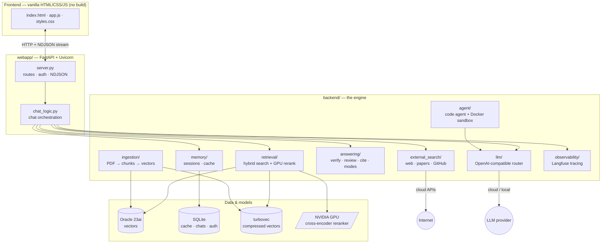
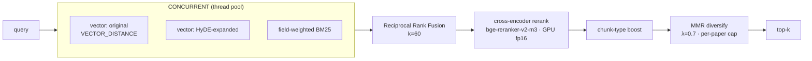
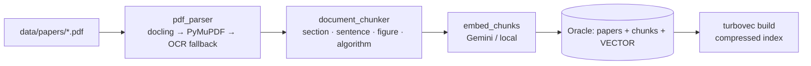
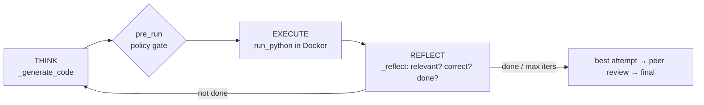

# Architecture, Technology & Full Pipeline

The complete, deep reference for **what this project uses and how every piece fits together** —
the tech stack, every module, and each pipeline (chat, retrieval, ingestion, the coding agent,
external search, evaluation, observability, and GPU).

> Plain‑English overview: see the [README](../README.md). This doc is the engineering map.

---

## 1. The system in one picture



**Design principles**
- **Reuse, don't rewrite.** Optional layers wrap proven functions; core paths are untouched when flags are off.
- **Optional + fallback‑safe.** Oracle off → web‑only; GPU absent → CPU; web search fails → local evidence still answers. Nothing hard‑fails.
- **Lean dependency tree.** One vector path, one page extractor, one agent loop — no parallel "alternative" stacks. `pip check` is clean.

---

## 2. Technology stack

| Layer | Technology | Version | Role |
|---|---|---|---|
| **Web framework** | FastAPI | 0.136.1 | HTTP API + routing + dependency‑injected auth |
| | Uvicorn | 0.46.0 | ASGI server (`python run.py` → `:8600`) |
| | Starlette `SessionMiddleware` + itsdangerous | 2.2.0 | signed session cookie |
| | python‑multipart | 0.0.28 | PDF upload form parsing |
| **Frontend** | vanilla HTML / CSS / JS | — | **no build step, no framework**; NDJSON stream via `fetch` + `ReadableStream` |
| | marked.js · highlight.js · KaTeX | CDN | markdown · code highlight · math |
| **Numerics** | NumPy / SciPy / pandas | 2.3.5 / 1.17.1 / 3.0.3 | vectors, scoring, data |
| **Reranker / embeddings** | sentence‑transformers | 5.5.0 | cross‑encoder reranker (+ local embedder option) |
| | transformers | 4.57.6 | model backbone |
| | **PyTorch (CUDA)** | 2.7.1+cu126 | **GPU inference** for the reranker (fp16) |
| **Embeddings (default)** | google‑genai | 1.75.0 | Gemini query/doc embeddings (`EMBEDDING_PROVIDER=google`) |
| **Vector DB** | Oracle 23ai (`oracledb`) | 4.0.0 | `VECTOR` columns + `VECTOR_DISTANCE` search |
| | **turbovec** | 0.7.0 | compressed (4‑bit) local vector index (`VECTOR_BACKEND=turbovec`) |
| **PDF parsing** | docling · PyMuPDF · pypdf | 2.93 / 1.27 / 6.11 | layout/table‑aware parse + fast fallback |
| **LLM client** | openai SDK | 1.109.1 | OpenAI‑compatible streaming (Gemini/Mistral/GPT/Ollama) |
| **Sandbox** | Docker | host | network‑isolated code execution |
| **HTTP / scraping** | requests · beautifulsoup4 | 2.34 / 4.14 | external fetch + readable‑text extraction |
| **Memory** | SQLite (stdlib) | — | answer cache · chats · auth (WAL) |
| **Observability** (optional) | Langfuse (OpenTelemetry) | 4.7.1 | per‑stage traces; `protobuf` pinned 5.29.5 |
| **Eval** (dev/test) | DeepEval · Ragas‑style metrics | 4.0.6 | faithfulness / relevancy / citation validity |
| **Tests / lint** | pytest · pyflakes · vulture | 9.0 / 3.4 / 2.16 | 169 tests, offline/mocked |

---

## 3. Directory map

```
backend/
├── llm/            streaming_provider.py    → OpenAI-compatible router (PROVIDERS + CATALOG)
├── retrieval/      hybrid_retrieve.py       → the retrieval pipeline (orchestrator)
│                   vector_retriever.py      → Oracle VECTOR_DISTANCE + Gemini/local embed
│                   retrieval_fusion.py      → field-weighted BM25 · RRF · MMR
│                   hyde_generator.py        → HyDE query expansion (template-based, no LLM)
│                   turbovec_index.py        → compressed 4-bit vector backend
├── external_search/ orchestrator.py         → parallel channels + shared timeout + rerank
│                   web_search.py            → providers (DuckDuckGo/Tavily/Brave/SerpAPI) + page text (bs4)
│                   scholar_search.py        → arXiv · Semantic Scholar · Wikipedia · patents
│                   github_search.py         → repos + code (stars-first)
│                   pdf_reader.py            → read online PDFs
│                   source_ranker.py         → cross-encoder rerank of external sources
│                   base.py                  → safe_get · is_safe_url · cached · timeouts/caps
├── answering/      agentic_answer.py        → draft → verify → refine loop + sandbox sim
│                   reviewer.py              → automatic peer review + relevance gate
│                   citations.py             → [n] validation/repair
│                   research_modes.py        → fast/deep run profiles
│                   query_sanity.py          → reject junk queries
├── agent/          loop.py                  → code agent: THINK → EXECUTE → REFLECT
│                   code_runner.py           → Docker sandbox runner (network-off, capped)
│                   hooks.py                 → pre-run audit/allow-block gate
│                   memory.py                → two-tier constant-size agent memory
│                   research_agent.py        → deep-research loop (plan → search → reflect → report)
├── ingestion/      ingest_papers.py         → PDF → parse → chunk → DB
│                   pdf_parser.py            → docling/PyMuPDF parse + tables/equations
│                   document_chunker.py      → section/sentence/figure/algorithm chunking
│                   embed_chunks.py          → embed chunks (Gemini/local)
│                   incremental_index.py     → only changed PDFs
│                   ocr_fallback.py          → OCR for image-only PDFs
├── database/       create_schema.py · vector_migration.py · db_status.py · reset_*.py
├── memory/         store.py                 → SQLite: sessions/turns/facts + answer_cache (WAL)
├── common/         embeddings.py            → provider dispatch (Gemini / local bge)
│                   device.py                → resolve_device (cuda/cpu/auto)
├── observability/  tracing.py               → Langfuse adapter (no-op when off)
├── evaluation/     evaluate_retrieval.py    → recall/latency report (json+md)
│                   evaluate_llm.py          → coverage · citation validity · judge
│                   corpus_report.py         → coverage/gaps report
├── auth/           users.py · google_oauth.py · mailer.py
└── config.py

webapp/
├── server.py       FastAPI app · routes · auth gate · NDJSON · GPU warmup (lifespan)
├── chat_logic.py   chat orchestration (the 10-stage pipeline)
├── settings.py     model catalog + selection
├── auth.py         session/login glue
├── ingest.py       PDF upload + live ingest progress
└── static/         index.html · app.js · styles.css   (the whole UI)
run.py              launcher (--share / --lan)
pipeline.py         build/refresh index · --status · --corpus-report · --inspect-chunks
```

---

## 4. The chat pipeline — `webapp/chat_logic.py :: stream_chat_events`

One request streams NDJSON events; each labeled stage is also a Langfuse span. **The run mode
(fast/deep) is applied first**, setting live env knobs for this request.

```mermaid
flowchart LR
    Q[question] --> SAN[query_sanity] --> MODE[apply_research_mode<br/>fast / deep]
    MODE --> CC{cache_check}
    CC -- hit --> OUT([stream cached answer])
    CC -- miss --> PLAN[plan angles<br/>_deep_queries]
    PLAN --> PAR
    subgraph PAR["per query — CONCURRENT"]
      LR[local_rag<br/>hybrid_retrieve]
      ES[external_search<br/>gather_external_evidence]
    end
    PAR --> SS[source_selection<br/>_public_sources] --> PB[prompt_build<br/>format_evidence]
    PB --> LS[llm_stream<br/>provider.stream_chat]
    LS --> CS[code_simulation<br/>run_best_python_block]
    CS --> AV{agentic_verify<br/>score >= MIN?}
    AV -- no, rounds left --> PB
    AV -- yes --> AR[auto_review<br/>+ relevance gate]
    AR --> CIT[citation guard<br/>strip out-of-range n]
    CIT --> MS[memory_save<br/>turn + answer cache] --> OUT
```



| Stage (span) | Does | Key code |
|---|---|---|
| `cache_check` | reuse a saved answer (lexical ≥0.97 or semantic ≥0.88) | `MemoryStore.find_cached_answer` |
| `local_rag` ‖ | hybrid retrieval over your PDFs | `hybrid_retrieve` |
| `external_search` ‖ | web/papers/GitHub (capped, partial‑safe) | `gather_external_evidence` |
| `source_selection` | number sources `[1..n]` | `_public_sources` |
| `prompt_build` | numbered evidence block, budget‑bounded | `format_evidence` |
| `llm_stream` | grounded answer (streamed) | `provider.stream_chat` |
| `code_simulation` | run any Python in the answer in Docker | `run_best_python_block` |
| `agentic_verify` | score answer vs evidence; loop if < `AGENTIC_MIN_VERIFY_SCORE` | `verify_answer` |
| `auto_review` | peer review + relevance gate (deep only) | `reviewer.review` |
| **citation guard** | strip `[n]` outside `[1..n_sources]` (saved + display) | `citations.repair_citations` |
| `memory_save` | persist turn + cache the clean body | `append_turn` / `cache_answer` |

**Fast vs Deep** (`research_modes.py`) sets these *live* per request — accuracy bar (`AGENTIC_MIN_VERIFY_SCORE=80`) is identical in both:

| knob | fast (default) | deep |
|---|---|---|
| sub‑queries · ext_top_k · web · arXiv reads | 0 · 8 · 4 · 0 | 3 · 20 · 8 · 3 |
| verify rounds · auto‑review | 1 · off | 3 · on |
| evidence chars · answer tokens · gather timeout | 14k · 3k · 12s | 28k · 8k · 30s |

---

## 5. The retrieval pipeline — `backend/retrieval/hybrid_retrieve.py`



- **3 independent rankings run concurrently** (thread‑safe embed lock), then **RRF** fuses them — fusion order preserved, so results are identical to sequential; only wall‑clock improves.
- **HyDE** (`hyde_generator.py`) expands the query into a hypothetical passage *without an LLM* (template + lexicon), then embeds it — a second recall angle.
- **Cross‑encoder rerank** (`BAAI/bge-reranker-v2-m3`) on **GPU in fp16** (`RERANKER_FP16`) — ~0.5s vs 5–37s on CPU. Pre‑warmed at startup (`hybrid_retrieve.warmup`).
- **MMR** diversifies + caps sources per paper; **chunk‑type boost** nudges equations/algorithms for matching intents.
- **Vector backend:** `VECTOR_BACKEND=turbovec` uses a compressed 4‑bit local index (`turbovec_index.py`) with overfetch + exact re‑rank; `oracle` uses Oracle's `VECTOR_DISTANCE` directly.

---

## 6. The ingestion pipeline — `pipeline.py` → `backend/ingestion/`



- **Chunking** is structure‑aware: canonical sections, sentence packing (`CHUNK_MAX_CHARS`, overlap), separate chunks for **figure captions** and **algorithm blocks**, plus `chunk_type` (`equation`/`algorithm`/`table`/`text`) and concept tags.
- **Incremental** (`--incremental`) re‑processes only changed PDFs.
- Inspect/verify: `pipeline.py --status` · `--corpus-report` · `--inspect-chunks <id>`.
- Upload from the UI (**＋ Add papers**) streams live progress via `webapp/ingest.py`.

---

## 7. External search — `backend/external_search/orchestrator.py`

Channels fetched **in parallel** with a **shared timeout**; slow channels return partial results (never block the gather), then everything is de‑duped and cross‑encoder re‑ranked.

| Channel | Source | Key/free |
|---|---|---|
| web | DuckDuckGo (default) / Tavily / Brave / SerpAPI | free / key |
| arXiv · Semantic Scholar · Wikipedia | scholarly APIs | free |
| patents | Google Patents (via web provider) | key |
| GitHub | repos + code (stars‑first) | free (token raises limits) |
| online PDFs | read PDFs surfaced by web/arXiv | free |

- **Page extraction:** `fetch_page_text` downloads the page and extracts the main readable text with **BeautifulSoup** (boilerplate stripped).
- **Safety:** `base.py` enforces timeouts (`EXTERNAL_HTTP_TIMEOUT`), a 3 MB cap, retries, and disk caching. `safe_get`/`is_safe_url` validate scheme/host (SSRF guard intentionally permissive by owner choice).

---

## 8. The LLM layer — `backend/llm/streaming_provider.py`

A single **OpenAI‑compatible** router. `PROVIDERS` + `CATALOG` map model names → endpoint/key, so the same `provider.stream_chat(...)` works across:

| Model | Cost | Env |
|---|---|---|
| Gemini 2.5 Flash | free | `GEMINI_API_KEY` |
| Mistral Large / Codestral | free | `MISTRAL_API_KEY` |
| GPT‑5.5 | paid | `OPENAI_CLOUD_KEY` |
| any local (Ollama, …) | free | `OPENAI_BASE_URL` |

`AGENT_MODEL` can route the code agent to a dedicated coder model. The chat model is picked live in the sidebar (`webapp/settings.py`).

---

## 9. The coding agent — `backend/agent/loop.py`

When a question needs a program, the agent **runs** it (it doesn't just print code):



- **Streamed** to the UI as think → write → run → check cards; saved with the chat.
- **Constant‑size memory** (`memory.py`): a two‑tier scheme keeps the prompt bounded across iterations.
- **The Docker sandbox** (`code_runner.py`, never weakened): `--network none`, capped `--memory`/`--cpus`/`--pids-limit`, hard timeout, non‑root, auto‑removed; a scientific image (numpy/scipy/pandas/sklearn/sympy/…) is built on first run.
- `/api/agent` streams the run in‑process (NDJSON); `/api/research` runs the deep‑research loop (`research_agent.py`: plan → search everywhere → reflect → report).

---

## 10. Data layer

| Store | Tech | Holds |
|---|---|---|
| **Oracle 23ai** (`FREEPDB1`) | `oracledb` | `papers`, `chunks` (+ `VECTOR` column) — the searchable corpus |
| **turbovec** | `data/vector_cache/chunks.tvim` | compressed (4‑bit) vector index (default backend) |
| **conversations.db** | SQLite WAL | sessions · turns · facts (chat history) |
| **memory.db** | SQLite WAL | `answer_cache` (lexical + semantic reuse) |
| **auth store** | SQLite | users / sessions (login) |
| **data/external_cache/** | disk | external fetch cache (`EXTERNAL_CACHE_TTL`) |

`backend/memory/store.py` is the single SQLite interface; conversations are split from the cache via an ATTACH‑based one‑time migration (never deletes the old file).

---

## 11. Accuracy, trust & caching

- **Citations** (`answering/citations.py`): every `[n]` outside `[1..n_sources]` is stripped from the **saved answer** (server) and the **live display** (`app.js linkifyCitations`); grouped `[1, 9, 3]` → `[1, 3]`.
- **Verification** (`agentic_answer.py`): draft → score vs evidence → refine until `≥ AGENTIC_MIN_VERIFY_SCORE` or round cap; low‑confidence answers get a styled warning (no raw reviewer jargon).
- **Peer review + relevance gate** (`reviewer.py`): off‑topic answers/code are never marked "verified".
- **Answer cache**: exact + **semantic** (embedding) reuse with freshness guards; cached body is footer‑free + citation‑repaired.

---

## 12. GPU acceleration

- `backend/common/device.py :: resolve_device` → `cuda` when available (`DEVICE`/`RERANKER_DEVICE`/`EMBEDDING_DEVICE=auto`).
- **Reranker** (`bge-reranker-v2-m3`) loads on the GPU in **fp16** (`RERANKER_FP16`) — ~2× faster, half VRAM (~1.5 GB, fits a 6 GB card). Embeddings are **Gemini** by default (API); set `EMBEDDING_PROVIDER=local` to run a local `bge` embedder on the GPU too (requires a matching re‑index).
- **Startup pre‑warm** (`hybrid_retrieve.warmup`, FastAPI `lifespan`, background thread) pays the ~14 s model load + CUDA init **once**, so the first user query is fast.
- Measured: retrieval **p50 ~10 s → ~3.2 s**, **p95 ~19.5 s → ~4.1 s** (the CPU reranker's 5–37 s variance is gone). CPU fallback is automatic.

---

## 13. Observability & evaluation

- **Langfuse tracing** (`observability/tracing.py`, off by default): one trace per chat + per agent run; spans for every stage with duration, success, counts, scores, verify rounds, and a token‑cost estimate. **No‑op + zero overhead** when `LANGFUSE_ENABLED=false`; never blocks the chat. (`docs/OBSERVABILITY.md`.)
- **Evaluation** (`backend/evaluation/`):
  - `evaluate_retrieval` → term‑recall, recall@k, MRR, nDCG, latency (p50/p95) → JSON **+ markdown** report.
  - `evaluate_llm` → answer coverage, **citation validity**, optional LLM‑judge.
  - **DeepEval gates** (`tests/test_llm_quality.py`, opt‑in) → faithfulness / answer‑relevancy / contextual‑relevancy ≥ 0.7.
  - `corpus_report` → papers, chunks, topic coverage, gaps, duplicates, failed ingestions.

---

## 14. Frontend — `webapp/static/`

`index.html` + `app.js` + `styles.css`, **no build step**. Consumes the NDJSON stream (`fetch` + `ReadableStream`), renders markdown (marked.js) + code (highlight.js) + math (KaTeX). Features: multi‑session sidebar with restore, **clickable numbered citation chips** → source drawer, the **Fast/Deep toggle**, live "thinking/coding" agent cards, model picker, PDF upload with live ingest progress, light/dark theme.

---

## 15. Configuration map (`.env.example`, 14 sections)

| § | Area | Notable flags |
|---|---|---|
| 01 | Runtime | `DEBUG_MODE` |
| 02 | Auth | `ENABLE_AUTH` · `SESSION_MAX_AGE` · `CONVERSATIONS_DB_PATH` |
| 03 | DB / local RAG | `ENABLE_LOCAL_RAG` · `ORACLE_DSN` · `VECTOR_BACKEND` · `TURBOVEC_*` |
| 04 | Chat LLM | `OPENAI_MODEL` · `GEMINI/MISTRAL/OPENAI_CLOUD_KEY` |
| 05 | Embeddings / rerank | `EMBEDDING_PROVIDER` · `EMBEDDING_MODEL` · `RERANKER_MODEL` |
| 06 | External search | `ENABLE_WEB_SEARCH` · `WEB_SEARCH_PROVIDER` · keys |
| 07 | Answer quality | `AGENTIC_MAX_VERIFY_ROUNDS` · `AGENTIC_MIN_VERIFY_SCORE` · `AUTO_REVIEW` · cache |
| 08 | Search limits | `EXTERNAL_HTTP_TIMEOUT` · per‑channel caps |
| 09 | Code agent | `AGENT_MAX_ITERS` · sandbox `AGENT_MEM_LIMIT`/`CPUS`/`RUN_TIMEOUT` |
| 10 | Device / GPU | `DEVICE` · `EMBEDDING_DEVICE` · `RERANKER_DEVICE` · `RERANKER_FP16` |
| 11 | Ingestion | `ENABLE_OCR` · `CHUNK_MAX_CHARS` |
| 12 | Retrieval knobs | `RRF_K` · `MMR_LAMBDA` · `ENABLE_HYDE` |
| 13 | Sharing | `CLOUDFLARE_TUNNEL_*` |
| 14 | Observability/eval | `LANGFUSE_ENABLED` · `DEEPEVAL_ENABLED` |

> **Run modes override** §07/§08 knobs per request (fast/deep); the values in `.env` are the fallback defaults for CLI/eval entry points.

---

## 16. Feature flags — default state

| Optional system | Flag | Default | Fallback when off/unavailable |
|---|---|---|---|
| Local PDF RAG | `ENABLE_LOCAL_RAG` | off | web‑only |
| turbovec | `VECTOR_BACKEND` | `turbovec` | Oracle vectors |
| GPU | `DEVICE=auto` | auto | CPU |
| Langfuse | `LANGFUSE_ENABLED` | off | no‑op |
| DeepEval gates | `DEEPEVAL_ENABLED` | off | tests skip |
| OCR | `ENABLE_OCR` | on | digital‑text parse only |

---

## 17. End‑to‑end request (deep mode, with a code task)

1. `POST /api/chat` `{question, mode:"deep", …}` → auth gate → `stream_chat_events`.
2. `apply_research_mode("deep")` sets live knobs; `query_sanity` checks the question.
3. `cache_check`: semantic/lexical reuse — if hit, stream and stop.
4. `_deep_queries` plans 3 angles; per angle, `local_rag` ‖ `external_search` run concurrently (turbovec + GPU rerank ‖ web channels, capped).
5. `source_selection` numbers sources; `prompt_build` builds the bounded, cited evidence block.
6. `llm_stream` drafts a grounded answer; `code_simulation` runs any Python in Docker.
7. `agentic_verify` scores it vs the evidence; below `MIN` → search more + refine (≤ rounds).
8. `auto_review` + relevance gate; **citation guard** strips invalid `[n]`.
9. `memory_save` persists the turn and caches the clean body.
10. The whole flow is one Langfuse trace (latency, tokens, scores, rounds) when enabled.

---

_Generated as the engineering reference for this repository. Pair with the [README](../README.md)
(plain‑English), [OBSERVABILITY.md](OBSERVABILITY.md), and [INGESTION_CHECKLIST.md](INGESTION_CHECKLIST.md)._
