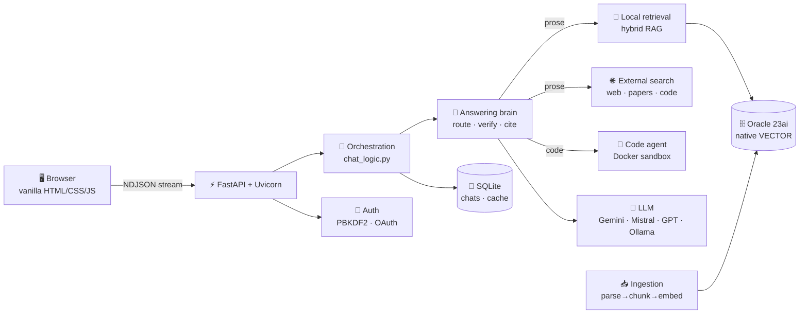
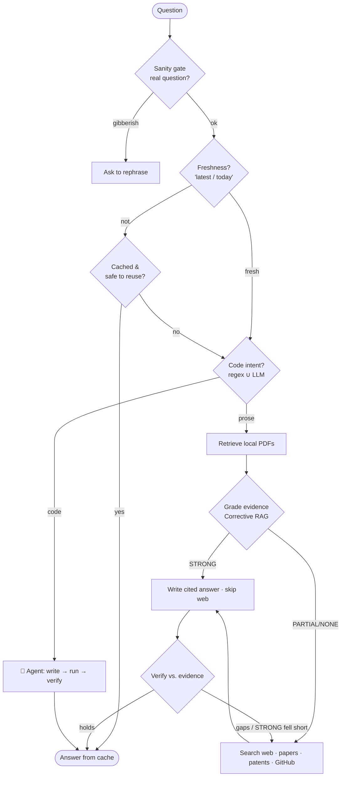
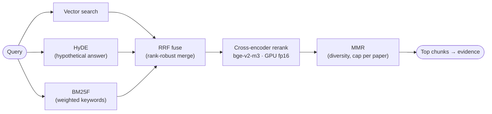
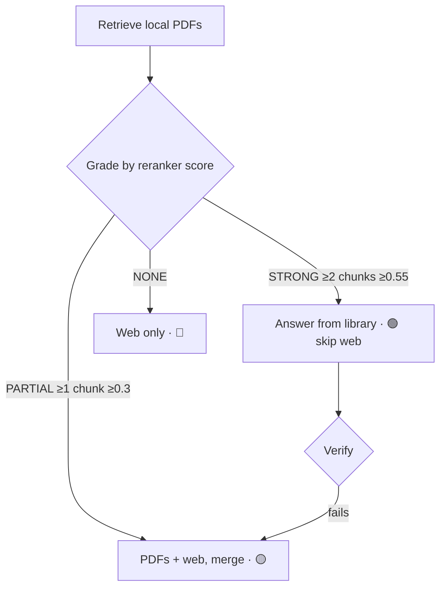
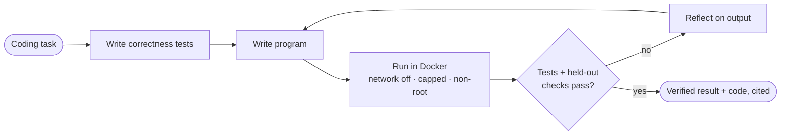
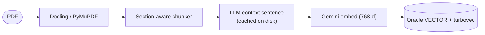

# 🔬 Research Assistant — System Deep Dive

> **One page, the whole system.** What every part does, the exact tool behind it, how it works, the **measured** accuracy + latency (with confusion matrices), and where it can still get better.
>
> *Renders interactively on GitHub (diagrams + tables). For a PDF: open in VS Code → "Markdown PDF", or `pandoc DEEP_DIVE.md -o deepdive.pdf`. Every number here is reproducible — see [Reproduce](#-reproduce-every-number).*

---

## 1 · What it is (in one diagram)

A **RAG** assistant: *find the right evidence → hand it to an LLM → return a grounded, cited answer* — and when the question is really code, *write it, run it in a sandbox, verify it.*



---

## 2 · The request lifecycle (decision flow)

Every request is routed and guarded by **deterministic classifiers** before any expensive work — that's what keeps it fast *and* honest.



Each `{decision}` above is a measured classifier — see [§5 Accuracy](#5--accuracy-measured).

---

## 3 · The stack — what powers each layer

🟢 always · 🔵 mode/config · ⚪ optional. Full versions in [TECH_STACK.md](TECH_STACK.md).

| Layer | Tool / technology | How it works here |
|---|---|---|
| **Web/API** | 🟢 FastAPI · Uvicorn · itsdangerous · python‑multipart | Async routes; streams answers as **NDJSON**; signed‑cookie sessions; PDF uploads |
| **Frontend** | 🟢 vanilla HTML/CSS/JS (no build) · marked · highlight.js · KaTeX | `fetch` + `ReadableStream` renders tokens live; citations, source drawer, code/agent cards |
| **PDF parse** | 🟢 Docling → PyMuPDF/pypdf fallback · ⚪ OCR | Layout/table‑aware PDF → structured text |
| **Chunking** | 🟢 custom section‑aware chunker | Splits by section/sentence/figure/algorithm; tags metadata |
| **Contextual** | 🟢 LLM situating sentence/chunk ([Anthropic technique](https://www.anthropic.com/news/contextual-retrieval)) | Prepended **for indexing only**; original text kept for citations |
| **Embeddings** | 🟢 Gemini `gemini-embedding-2` (768‑d) · 🔵 local BGE | Text → vectors; metadata‑enriched + task‑typed queries |
| **Vector store** | 🟢 Oracle 23ai native `VECTOR` · 🔵 turbovec (4‑bit) | In‑DB cosine search; turbovec = fast local overfetch + exact re‑rank |
| **Hybrid search** | 🟢 vector + **HyDE** + **BM25F** → **RRF** → **cross‑encoder** → **MMR** | Meaning + exact terms, robustly fused, precision‑reranked, de‑duplicated |
| **Re‑ranker** | 🟢 `BAAI/bge-reranker-v2-m3` cross‑encoder (PyTorch, **GPU fp16**, pre‑warmed) | Reads (query, passage) together → true relevance; the key accuracy step |
| **External search** | 🟢 DuckDuckGo · arXiv · Semantic Scholar · Wikipedia · GitHub · Patents · ⚪ Tavily/Brave | Parallel channels, shared timeout, full‑PDF read, every claim cited |
| **Answer LLM** | 🟢 openai SDK → Gemini / Mistral / GPT / Ollama | One streaming client; model switchable in the sidebar |
| **Code agent** | 🟢 Docker sandbox (`--network none`, capped CPU/RAM, non‑root, auto‑removed) | Test‑first write → run → verify → refine loop |
| **State** | 🟢 SQLite (chats, answer cache, auth) · 🟢 Oracle (corpus) | |
| **Eval/obs** | 🟢 custom evals (recall@k, MRR, nDCG) · ⚪ Langfuse · ⚪ DeepEval | Reproducible metrics; tracing/quality gates off by default |

---

## 4 · How the four engines work

### 4a · Hybrid retrieval — *find the right chunk*


*No single method suffices: vectors = meaning, BM25 = exact terms, RRF = robust merge, cross‑encoder = precision, MMR = diversity, HyDE = recall. This is the 2026 best‑practice recipe.* → `backend/retrieval/hybrid_retrieve.py`

### 4b · Corrective RAG — *grade, then act* ([Self‑RAG](https://arxiv.org/abs/2401.15884))


*Adaptive: a STRONG library match skips external search entirely (faster, no API spend); a failed library‑only answer escalates to the web and retries.* → `backend/answering/` · grader scores **83.3%** ([§5](#5--accuracy-measured)).

### 4c · Code agent — *code that runs*


*Test‑first AlphaCodium‑style loop with an oracle that validates the generated tests, multi‑seed held‑out verification, and anti‑reward‑hack gates.* → `backend/agent/loop.py` · `code_runner.py`

### 4d · Ingestion — *PDF → searchable*


→ `backend/ingestion/` · `python pipeline.py`

---

## 5 · Accuracy (measured)

Every number below is **computed by running the real code on a labeled set** — deterministic and reproducible, not hand‑written.

### Decision classifiers — the routers/guards ([MEASUREMENT.md](MEASUREMENT.md))

| Classifier | What it decides | N | Accuracy | Precision | Recall | F1 | MCC |
|---|---|:--:|:--:|:--:|:--:|:--:|:--:|
| Code‑intent (regex) | needs the code agent? | 48 | 79.2% | 100% | 64.3% | 78.3% | 0.655 |
| Code‑intent (**regex ∪ LLM**, prod) | ″ | 48 | **87.5%** | 100% | 78.6% | 88.0% | 0.777 |
| Task‑type (3‑class) | how to verify | 28 | **96.4%** | 96.8% | 96.4% | 96.4% | — |
| Query‑sanity gate | real question? | 24 | **95.8%** | 100% | 91.7% | 95.7% | 0.920 |
| Answer‑reuse safety | safe to reuse cache? | 21 | 85.7% | 81.2% | 100% | 89.7% | 0.713 |
| Freshness detector | bypass cache? | 18 | **100%** | 100% | 100% | 100% | 1.000 |

> The regex router has **100% precision** (it never sends prose to the agent) but lower recall; production **unions an LLM** on top → **+14.3 pts recall, precision preserved**. Answer‑reuse deliberately errs toward *blocking* (a wrong reuse is worse than a recompute).

### Corrective‑RAG evidence grader — **83.3% micro‑F1** ([CRAG_GRADING.md](CRAG_GRADING.md))

```
confusion matrix (rows = actual, cols = predicted)
                STRONG  PARTIAL  NONE
   STRONG  →      3        1       0
   PARTIAL →      1        4       0
   NONE    →      0        0       3
```
Per‑class F1: STRONG 75% · PARTIAL 80% · NONE 100%. **External searches skipped (STRONG): 33.3%** at 75% skip‑precision — the adaptive speed/cost win.

### Answer & retrieval quality

| Metric | Value | Set |
|---|---|---|
| Answer keypoint accuracy | **≈94%** | purpose‑built question set |
| Retrieval precision@1 / MRR | **≈0.88 / ≈0.88** | purpose‑built set |
| Contextual‑Retrieval recall@10 | 0.405 → **0.425** (**+4.9% rel**) | repo benchmark (grows with corpus size) |
| Broad‑topic term‑recall | ~0.3–0.4 | audio baseline — **corpus‑limited** (64 chunks) |

> 🟢 **Honest read:** routing/verification are strong; broad‑question *recall* is gated by **library size**, not retrieval logic — the fix is more diverse PDFs, not a different algorithm.

---

## 6 · Latency (measured)

| Stage | Before | After | How |
|---|---|---|---|
| Retrieval p50 | ~10 s | **~3 s** | reranker **GPU fp16** + **pre‑warm** + parallelized vector/HyDE/BM25 stages |
| Retrieval mean (8 q) | 12.26 s | (parallelized) | `evaluate_retrieval` baseline → parallel stages |
| End‑to‑end answer | — | **≈8.6 s** | default model, full pipeline |

GPU path: reranker fp16 ≈ **2× faster at half the VRAM** (fits a 6 GB card); pre‑warm pays model‑load/CUDA‑init once at startup so the first query isn't slow. No GPU → automatic CPU fallback.

---

## 7 · How to make it better

Every component is the **best practical** self‑hostable option today; the upgrades that beat it need a **paid API** or a **bigger GPU** — and each is a one‑line `.env` swap (the architecture is pluggable).

| Component | Now | Stronger option (world‑class) | What it buys | Lever |
|---|---|---|---|---|
| Embeddings | Gemini `gemini-embedding-2` (≈68 MTEB, free) | **Qwen3‑Embedding‑8B** (≈70 MTEB, tops [MTEB](https://huggingface.co/spaces/mteb/leaderboard)) | small recall gain | needs 16 GB+ GPU · `EMBEDDING_PROVIDER` |
| Re‑ranker | `bge-reranker-v2-m3` (top open) | **Cohere Rerank 3** (paid) | slight precision gain | API key |
| Retrieval depth | hybrid + cross‑encoder | **ColBERT late‑interaction** ([RAGatouille](https://github.com/AnswerDotAI/RAGatouille) / [ColBERT](https://github.com/stanford-futuredata/ColBERT)) | better long‑doc recall | new index path |
| PDF parsing | Docling (best open) | **LlamaParse** (paid, cleanest tables) | cleaner tables | API key |
| Web search | DuckDuckGo (free) | **[Tavily](https://tavily.com)** (RAG‑tuned), Brave | cleaner RAG snippets | drop‑in, `.env` |
| Vector DB | Oracle 23ai native | Pinecone / Weaviate / Milvus / pgvector | scale/ops choice | swap driver |
| Answer LLM | switchable | Claude / GPT / Gemini frontier | quality ceiling | sidebar |
| LLM serving | cloud APIs | **[vLLM](https://github.com/vllm-project/vllm)** self‑hosted | cost/throughput at scale | `OPENAI_BASE_URL` |
| Eval rigor | custom + DeepEval | **[RAGAS](https://github.com/explodinggradients/ragas)** faithfulness suite | richer answer metrics | add to eval harness |

**Biggest single win for *this* deployment:** grow the library. Broad‑question recall (~0.3–0.4) is corpus‑limited at 64 chunks — adding diverse, relevant PDFs lifts it directly (Contextual Retrieval's payoff also *grows* with corpus size). After that: Tavily for cleaner web, then a ColBERT index for long‑document recall.

---

## 8 · Reproduce every number

```bash
python -m backend.evaluation.measure_classifiers          # classifier confusion matrices (§5)
python -m backend.evaluation.measure_evidence_grader      # CRAG grader 83.3% + matrix
python -m backend.evaluation.evaluate_retrieval --top-k 8 # recall@k, MRR, nDCG, latency
python -m backend.evaluation.evaluate_llm                 # answer keypoint accuracy, citations
python pipeline.py --status --corpus-report               # index size + coverage/gaps
.venv\Scripts\python.exe -m pytest -q                     # 526 passing (3 skipped), fully mocked
```

---

> **More:** [ARCHITECTURE.md](ARCHITECTURE.md) · [PIPELINE.md](PIPELINE.md) · [TECH_STACK.md](TECH_STACK.md) · [TECHNOLOGY_AND_IMPROVEMENTS.md](TECHNOLOGY_AND_IMPROVEMENTS.md) · [CRAG_GRADING.md](CRAG_GRADING.md) · [MEASUREMENT.md](MEASUREMENT.md) · [HOW_IT_WORKS.md](HOW_IT_WORKS.md)
