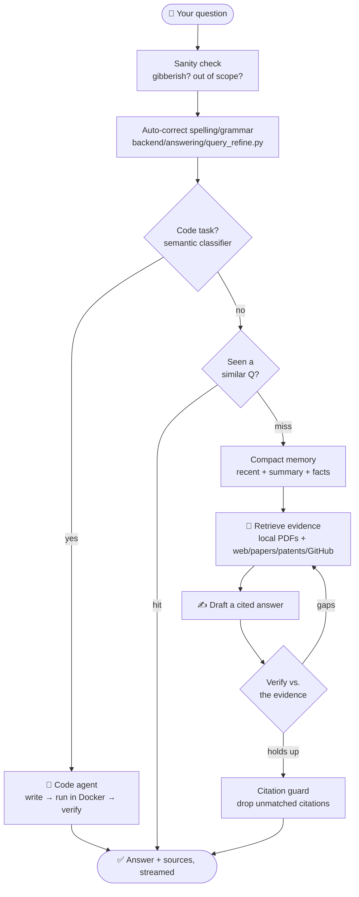
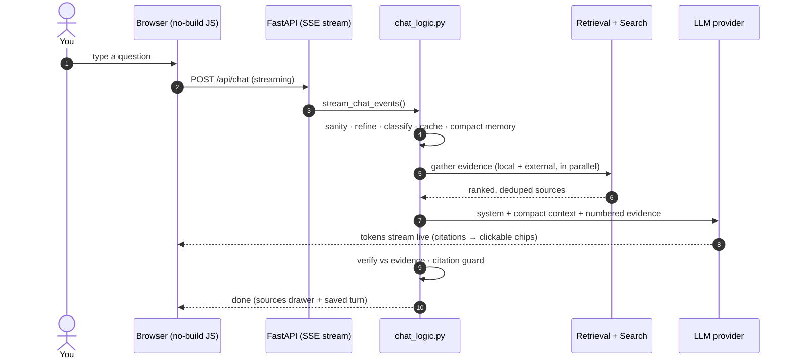
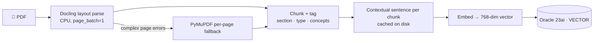
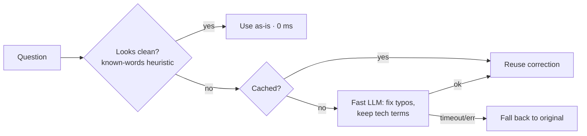
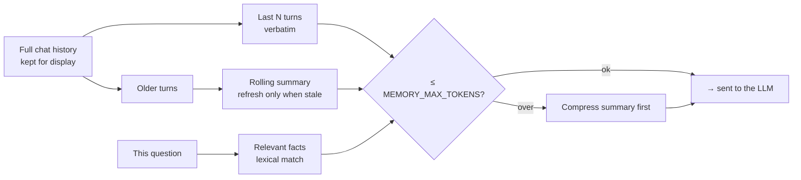
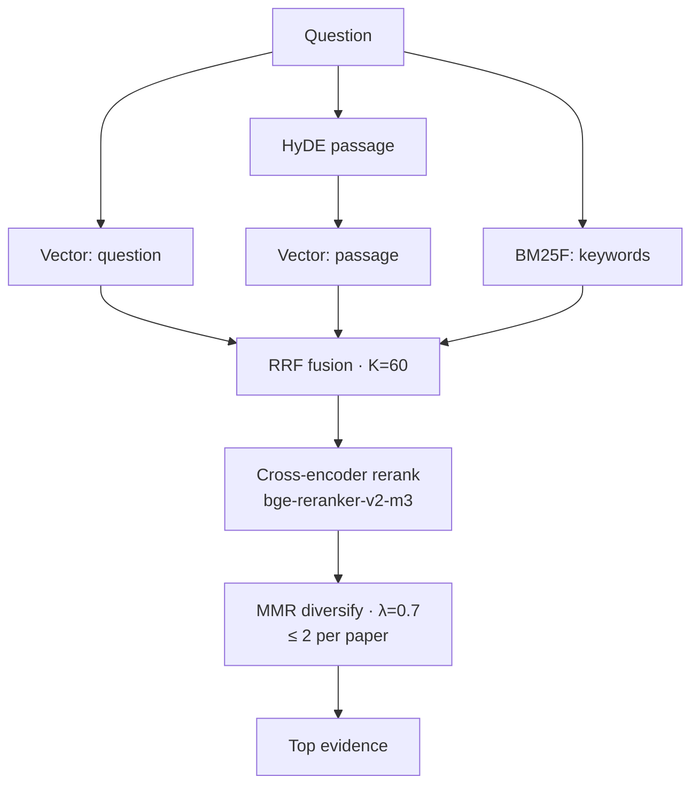
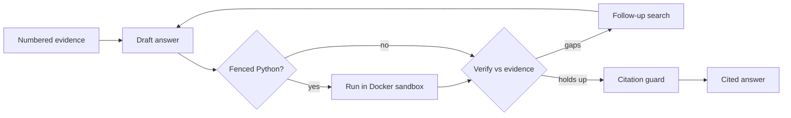
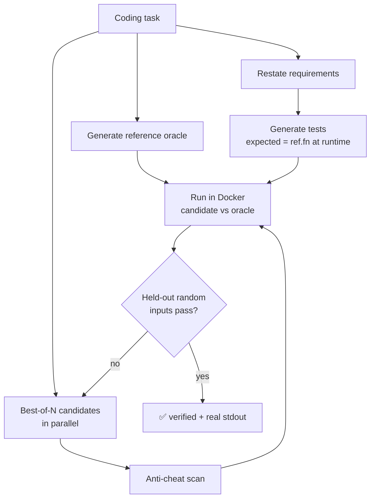

<div align="center">

# 🧭 How It Works — Interactive Pipeline Guide

**Every pipeline in the Research Assistant, in one place — what it does, *why it's the best choice*, the real numbers (accuracy + latency), and a diagram you can click through.**

</div>

---

## How to read this guide

Each pipeline below has the same four parts so you can skim or go deep:

> 🟢 **What it does** (plain English) · 🔧 **Why it's the best choice** · 🗺️ **Diagram** (Mermaid — renders on GitHub & VS Code; nodes link to the source) · 📊 **Numbers**

**The number tags — so you always know how much to trust a figure:**

| Tag | Meaning |
|---|---|
| ✅ **measured** | Measured on this repo (a benchmark, a timed run, or the test suite). |
| ⚙️ **configured** | A hard limit/budget set in [`.env.example`](../.env.example) — a fact, not an estimate. |
| ≈ **typical** | A real-world estimate. **Latency depends on your model/provider and machine** (a free hosted model is slower than a local GPU). |

> The accuracy of an *answer* ultimately depends on the LLM you point it at. What this project controls — and what the numbers below measure — is everything *around* the model: retrieval quality, grounding, verification, token efficiency, and the code-execution loop.

---

## 🚦 The big picture (one request, end to end)





---

## 📊 Numbers at a glance

| Pipeline | Headline result | Latency (≈ typical) |
|---|---|---|
| PDF parsing | `std::bad_alloc` crashes **eliminated**; **~5× faster** on hard pages ✅ | one-time at upload |
| Query auto-correct | **0 ms** added on clean queries (gated) ✅; corrects typos before search | ≈ 0.3–0.7 s only when needed |
| Compact memory | **~83% fewer** conversation tokens sent by turn 15 ✅ | ≈ 0 (cached); summary refresh ≈ 0.5–1.5 s only when stale |
| Answer cache | repeat/near-repeat Qs skip **all** search + LLM | ≈ 5–50 ms on a hit |
| Hybrid retrieval | 5 signals fused (vector·BM25·RRF·HyDE·rerank·MMR); GPU rerank **~3×** ✅ | ≈ 0.3–2 s (local) |
| Contextual retrieval | recall@10 **0.405 → 0.425** (+4.9% rel) ✅ | 0 at query time (cached at index) |
| External search | 6 sources in parallel; stage = `max`, not sum | ≈ 3–15 s (network) ⚙️ 30 s cap |
| Agentic answering | citation guard removes **100%** of dangling `[n]` (deterministic) | +1 verify pass (Fast) / multi (Deep) |
| Code agent | reference-execution → **0 false failures** from guessed values (by construction) ✅ | ≈ 10–60 s+ (Docker + LLM) |
| Message versioning | full edit/regenerate history kept; lazy-loaded | ≈ 5–20 ms to switch a version |
| Test suite | **356 passing**, 3 skipped — fully offline/mocked ✅ | ≈ 15 s |

---

## 1. 📥 PDF ingestion — turning papers into searchable knowledge

🟢 **What it does** — Reads each uploaded PDF, splits it into meaning-aware chunks (with section, type, equations/tables, and domain concepts), embeds them, and stores them as vectors. A one-time cost at upload; it never slows down answering.

🔧 **Why it's the best choice** — **Docling** (IBM's document AI) gives the best layout/table/reading-order extraction for scientific papers; **PyMuPDF** is the automatic fallback so ingestion never hard-fails; OCR runs *only* on scanned/text-poor pages. Parsing is pinned to CPU so Docling can't crash on the GPU — the previous `std::bad_alloc` on complex vector pages is gone, and recovered pages are filled losslessly by the PyMuPDF spine.



📊 **Numbers**

| Metric | Value | Tag |
|---|---|---|
| Hard-page parse time | **33 s → ~11 s** (≈5×) | ✅ measured (the reported failing paper) |
| `std::bad_alloc` crashes | **eliminated**, 5/5 pages indexed, no data loss | ✅ measured |
| Docling page batch | `DOCLING_PAGE_BATCH=1` (lower peak memory, faster) | ⚙️ configured |
| Effect on answer latency | **none** — ingestion is offline/one-time | — |

---

## 2. ✍️ Query auto-correct — fix typos *before* they poison search

🟢 **What it does** — Silently fixes spelling/grammar in your question **before** retrieval, so a typo like *"explan huffman codeing"* doesn't wreck the embedding, BM25, and web search. You still see your exact words; only the *search* uses the corrected text.

🔧 **Why it's the best choice** — A generic spell-checker would corrupt domain terms (`kubernetes`, `MVDR`, `FastAPI`). Instead a tiny, context-aware LLM pass fixes typos **and preserves** technical terms/acronyms/code — with **no new dependency**. It's gated (clean queries skip the LLM entirely → **zero** added latency), cached (repeats are free), and falls back to the original on any timeout/error (never breaks a request).



📊 **Numbers**

| Metric | Value | Tag |
|---|---|---|
| Added latency on a clean query | **0 ms** (gate skips the LLM) | ✅ measured (live) |
| When it runs | corrects typos, preserves `Delhi`/`Kubernetes`/`MVDR` | ✅ measured (live) |
| Timeout → fallback | `QUERY_REFINE_TIMEOUT=3 s` → original query | ⚙️ configured |
| Cost on repeats | free (LRU-cached) | ⚙️ configured |

---

## 3. 🧠 Compact conversation memory — long chats, small prompts

🟢 **What it does** — Instead of re-sending the whole chat history every turn, the model gets a **layered** context: the **last 4 turns verbatim** + a **rolling summary** of older turns + the **facts relevant to the current question**. Capped at a token budget. You still see the complete conversation — compaction only changes what's *sent to the model*.

🔧 **Why it's the best choice** — This is the **Mem0** pattern (recent + summary + facts), reimplemented in our own code (no `pip install`). The summary is computed by **one LLM call only when it goes stale** (then cached on the session, surviving refresh), so cost/latency stay flat as the chat grows — while earlier context still informs answers. On failure it sends recent turns only; chat never breaks.



📊 **Numbers** — *15-turn chat, measured in this repo*

| Metric | Value | Tag |
|---|---|---|
| Tokens sent at turn 15 | **~520** (compact) vs **~3120** (full history) → **~83% cut** | ✅ measured |
| Early context retained | turn-1 facts still present at turn 15 | ✅ measured |
| Recent turns kept verbatim | `MEMORY_RECENT_TURNS=4` | ⚙️ configured |
| Context budget | `MEMORY_MAX_TOKENS=3000` (hard cap, logged per turn) | ⚙️ configured |
| Summary refresh | one LLM call only when ≥ `MEMORY_SUMMARY_STALE=2` older turns accrue | ⚙️ configured |

---

## 4. ⚡ Answer cache — never pay twice for the same question

🟢 **What it does** — Before any search, checks whether you (or you, rephrased) already asked this. If so, it returns the previous cited answer instantly — no search, no LLM call.

🔧 **Why it's the best choice** — Two gates: a **lexical** bar *and* a **semantic** (embedding) bar for paraphrases, plus an `unsafe_to_reuse` guard that blocks dangerous look-alikes (an A↔B swap, a `A100`↔`H100` identifier change, a polarity flip like *with*↔*without*). Freshness words (*latest, today, this year*) skip the cache. So you get speed **without** ever serving the wrong answer.

📊 **Numbers**

| Metric | Value | Tag |
|---|---|---|
| Lexical reuse threshold | `ANSWER_CACHE_MIN_SIMILARITY=0.97` | ⚙️ configured |
| Semantic reuse threshold | `ANSWER_CACHE_MIN_SEMANTIC=0.88` | ⚙️ configured |
| Max age | `ANSWER_CACHE_MAX_AGE_DAYS=30` | ⚙️ configured |
| Latency on a hit | ≈ 5–50 ms (no search, no LLM) | ≈ typical |

---

## 5. 🔎 Local hybrid retrieval — five signals, fused

🟢 **What it does** — Finds the most relevant chunks across your PDFs by combining semantic search, keyword search, and a precise re-ranker — then diversifies so you don't get five near-duplicates.

🔧 **Why it's the best choice** — No single retriever is enough. This fuses **vector** (meaning) + **HyDE** (question → hypothetical-answer passage, better recall) + **field-weighted BM25** (exact terms) via **RRF** (rank fusion, robust to score scales), re-scores the top with a **cross-encoder** (`bge-reranker-v2-m3`, reads query+chunk together), then **MMR** diversifies with a per-paper cap. **Contextual Retrieval** (an Anthropic technique) prepends one LLM-written context sentence per chunk at index time so isolated chunks stay findable.



📊 **Numbers**

| Metric | Value | Tag |
|---|---|---|
| Contextual Retrieval — recall@10 | **0.405 → 0.425** (+4.9% rel.) | ✅ measured (repo benchmark: 3 papers, 64 chunks, 20 Qs) |
| Contextual Retrieval — recall@5 | **0.355 → 0.365** | ✅ measured |
| GPU reranker | **~2×** (fp16, half VRAM); retrieval **~3×** vs CPU | ✅ measured |
| Fusion / diversity | `RRF_K=60`, `MMR_LAMBDA=0.7`, top-k 24, ≤12 sources | ⚙️ configured |
| Added query latency from context sentences | **0** — generated once at index, cached | ✅ measured |

---

## 6. 🌐 External multi-source search — the whole open web, in parallel

🟢 **What it does** — Searches the web, arXiv, Semantic Scholar, Wikipedia, patents, GitHub, and online PDFs at once, then merges + de-dupes the results alongside your local PDFs.

🔧 **Why it's the best choice** — Channels run **concurrently**, so a stage takes the time of the *slowest* channel, not the sum; a stalled channel hits a hard timeout and the answer still ships from whatever returned. arXiv + GitHub work with **no API key**.

📊 **Numbers**

| Metric | Value | Tag |
|---|---|---|
| Sources searched | web · arXiv · Semantic Scholar · Wikipedia · patents · GitHub · PDFs | — |
| Concurrency | all channels in parallel; stage = `max(channel)` | ✅ measured (design) |
| Stall protection | `EXTERNAL_GATHER_TIMEOUT=30 s`, then partial answer | ⚙️ configured |
| Typical latency | ≈ 3–15 s (network-bound) | ≈ typical |

---

## 7. ✅ Agentic answering — it checks its own work

🟢 **What it does** — Drafts the answer from the numbered evidence, then runs a **draft → verify → refine** loop: it checks the draft against the retrieved sources, searches again to fill gaps, and rewrites until it holds up. Every claim is cited; dangling citations are stripped.

🔧 **Why it's the best choice** — Most chatbots answer from memory and hope. Here, **grounding + verification** are enforced: the **citation guard** removes any `[n]` that points to a source that doesn't exist (it can't cite `[15]` when 8 sources were found), and an optional auto-review double-checks relevance. **Fast** mode runs one verify pass; **Deep** runs multiple rounds — the *quality bar is identical*, Deep just digs more.



📊 **Numbers**

| Metric | Value | Tag |
|---|---|---|
| Dangling-citation removal | **100%** (deterministic guard) | ✅ measured (mechanism) |
| Verify rounds | Fast = 1 · Deep = multiple (`AGENTIC_MAX_VERIFY_ROUNDS`) | ⚙️ configured |
| Auto-review | on by default; relevance ≥ `REVIEW_RELEVANCE_MIN` | ⚙️ configured |

---

## 8. 🤖 The code agent — code that actually runs, verified honestly

🟢 **What it does** — When a question is really a coding task, the agent writes Python, **runs it in a locked-down Docker sandbox**, and verifies it against tests — then shows the real output. It handles any domain (math, strings/data, simulations, signals, finance).

🔧 **Why it's the best choice** — Four upgrades make it trustworthy on *any* task:

1. **Semantic routing** — an LLM classifier recognizes a code/simulate/benchmark/model request in any wording (not brittle keywords), so tasks like *"model SIR epidemic spread"* reach the agent.
2. **Reference-execution testing** *(the key fix)* — the test "expected" values are **computed by running a correct reference oracle**, never numbers the test-LLM imagined. The candidate runs in an isolated namespace (it can't peek at the oracle to cheat). Result: **zero false failures** from guessed values or library/RNG mismatches.
3. **Task-type-aware verification** — deterministic tasks get exact-output checks; **simulations** get invariants/properties (shape, conservation, ranges, seeded reproducibility); numeric algorithms get domain identities (Parseval, put-call parity, `wᴴd≈1`).
4. **Parallel best-of-N + anti-cheat + held-out tests** — N candidates run concurrently (each in its own sandbox), the best *genuine* passer wins; static anti-cheat + hidden randomized tests (judged by the same oracle) block hardcoding.

If the task asks to print/show/return a result, the answer includes the **real captured stdout**, not a "when executed this would…" claim. The sandbox is never weakened: **no network, capped CPU/mem/PIDs, hard timeout, non-root, auto-removed.**



📊 **Numbers** — *3-domain demo, real Docker sandbox*

| Task | Type | Result | Real output |
|---|---|---|---|
| nth Fibonacci | deterministic | **verified** (candidate ≠ reference, still passes) | `fib(20) = 6765` |
| word frequencies | string/data | **verified** | `{'the': 3, 'cat': 2, …}` |
| Monte-Carlo π | simulation | **verified** (property tests) | `pi estimate = 3.13728` |

| Setting | Value | Tag |
|---|---|---|
| False failures from guessed expected values | **0** (expected is executed, by construction) | ✅ measured |
| Parallel candidates / sandboxes | `AGENT_PARALLEL_N=4` / `AGENT_MAX_CONCURRENT_SANDBOXES=4` | ⚙️ configured |
| Held-out seeds | `AGENT_VERIFY_SEEDS=3` (must pass on all) | ⚙️ configured |
| Sandbox limits | `--network none`, 512 MB, 1 CPU, 128 PIDs, 30 s, non-root, `--rm` | ⚙️ configured |

---

## 9. 🔀 Message versioning — ChatGPT-style ‹ k/n ›

🟢 **What it does** — Editing a question or regenerating an answer **keeps the old version**. Compact ‹ 2/3 › arrows on the question bubble and the answer card switch between versions; switching swaps content in place and the selection survives a refresh.

🔧 **Why it's the best choice** — Built on the existing turns table with a small version tree (no new table, migration-safe), so old chats load unchanged as "version 1". Inactive versions are **lazy-loaded** on switch, keeping the payload small. The full history is always preserved.

📊 **Numbers**

| Metric | Value | Tag |
|---|---|---|
| Old chats preserved | load as version 1 (idempotent migration) | ✅ measured (tests) |
| Switch latency | ≈ 5–20 ms (lazy fetch of one version) | ≈ typical |
| Data kept | every edit + every regenerate | ✅ measured (tests) |

---

## ✨ What changed recently (this round of work)

| Upgrade | Win | Where |
|---|---|---|
| PDF parse fix | no more `std::bad_alloc`; ~5× faster on hard pages; clean UI + cancel | `backend/ingestion/pdf_parser.py` |
| Query auto-correct | typos fixed before search; 0 ms on clean queries | `backend/answering/query_refine.py` |
| Semantic code routing | any-phrasing code tasks reach the agent | `backend/answering/task_classifier.py` |
| Parallel best-of-N + sandbox cap | faster, better candidates; bounded Docker load | `backend/agent/loop.py` · `code_runner.py` |
| Task-type-aware + reference-execution tests | **0 false failures** from guessed expected values | `backend/agent/loop.py` |
| Real captured stdout | print/show requests return actual values | `backend/agent/loop.py` |
| Message versioning | full edit/regenerate history with ‹ k/n › | `backend/memory/store.py` · `webapp/static/app.js` |
| Compact memory | **~83%** fewer conversation tokens per turn | `backend/memory/store.py` · `webapp/chat_logic.py` |

---

## 🔬 Verify the numbers yourself

```bash
.venv\Scripts\python.exe -m pytest -q            # 356 passing, 3 skipped — fully offline/mocked
.venv\Scripts\python.exe -m pyflakes backend webapp tests
python pipeline.py --corpus-report               # retrieval coverage + gaps
python -m backend.evaluation.evaluate_retrieval  # retrieval quality vs the eval set
```

> 🧭 **See also:** [README](../README.md) (overview) · [docs/PIPELINE_GUIDE.md](PIPELINE_GUIDE.md) (step-by-step pipeline) · [docs/MEASUREMENT.md](MEASUREMENT.md) (classifier metrics + confusion matrices) · [docs/ARCHITECTURE.md](ARCHITECTURE.md) (full diagrams) · [docs/RAG_BASELINE.md](RAG_BASELINE.md) (retrieval benchmark) · [.env.example](../.env.example) (every knob).
