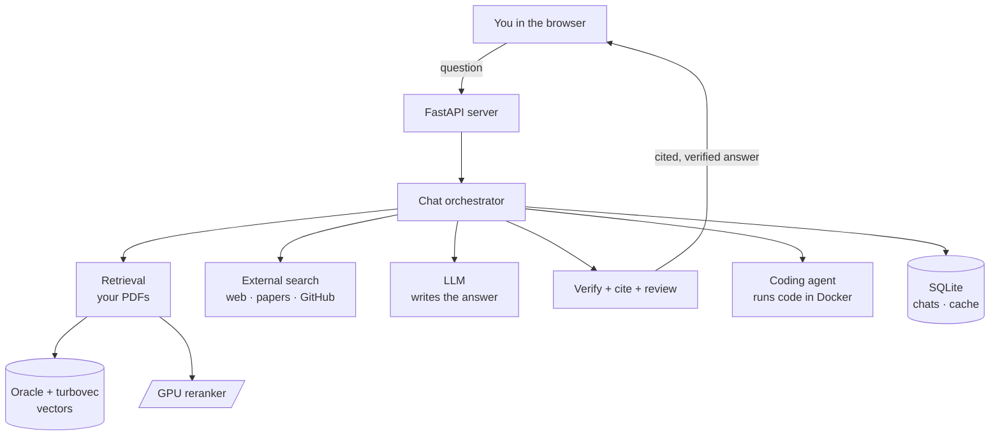
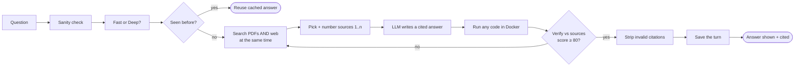
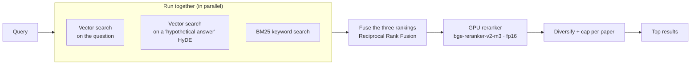
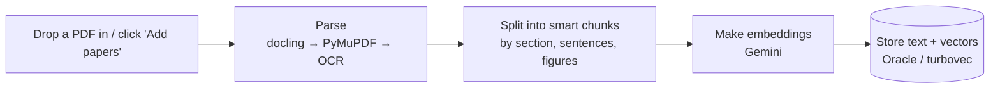
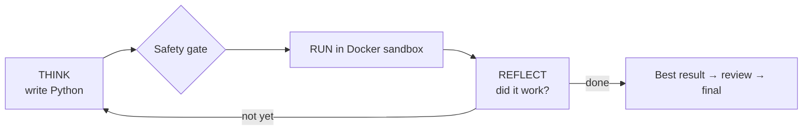

# Build an Interactive PDF — "Research Assistant" Project Guide

> **This file is a brief for an AI (e.g. Claude).** Paste it and say:
> *"Using this brief, produce an interactive, beginner‑friendly PDF that explains the whole
> project — its pipeline, every tool, and every technology."*
> Part A tells you **how** to build the PDF. Part B gives you **all the content** to put in it.

---

# PART A — How to build the PDF (instructions to the generator)

**Goal.** A polished, **interactive, easy‑to‑understand** PDF that a non‑expert can follow, yet
detailed enough that an engineer learns the full architecture. Think "premium product handbook."

**Audience.** Mixed — a curious beginner AND a developer. Explain jargon the first time it appears.

**Make it interactive (use real PDF features):**
- **Clickable Table of Contents** on page 2, linking to each section.
- **PDF bookmarks/outline** for every section and sub‑section (left‑panel navigation).
- **Internal hyperlinks**: every cross‑reference ("see Retrieval pipeline") jumps to that page.
- **External hyperlinks**: tool names link to their official sites/docs.
- **A glossary** at the end with anchor links from the first use of each term.
- **"Back to Contents" link** in the footer of every page.

**Visual design:**
- Clean, light, generous whitespace; one accent colour (indigo `#4f46e5`).
- **Colour‑coded callout boxes:** 🟦 *Info*, 🟩 *Tip / good practice*, 🟧 *Watch‑out*, 🟥 *Never do this*.
- **Diagrams:** render every Mermaid block below as a real flow diagram (or a clean equivalent).
  If your tool can't render Mermaid, redraw the same boxes/arrows as vector graphics.
- **Tables** kept (don't flatten them to text).
- A **colour key** used consistently for sources: 🟢 green = *local paper*, 🔴 red = *web source*.
- Use icons/emoji as visual anchors per section (🔎 search, 🧠 reasoning, 💻 code, 🗄️ data, ⚙️ config).

**Tone.** Friendly, confident, concrete. Short paragraphs. Lead each section with a one‑line
"what this is" before the detail.

**Suggested page order:** Cover → Contents → What it is → Big picture diagram → Technology stack
→ The 7 pipelines (one short chapter each) → Data layer → Configuration → What's new/changed →
Glossary. Aim for ~20–30 pages. Put one big diagram per pipeline chapter.

---

# PART B — The content (everything the PDF should explain)

## 1. What this project is (plain language)

**Research Assistant** is a self‑hosted "answer engine + coding agent." You ask a question and it
**searches real sources** (the open web, research papers, Wikipedia, patents, GitHub, and your own
PDFs), **answers only from what it found, cites every claim, and verifies the draft against those
sources before showing it.** If a question is really a programming task, it **writes the code, runs
it in a locked‑down sandbox, and fixes it until it works.** Everything runs on your machine; only
the chat LLM is a cloud call.

**One‑line pitch:** *"Ask a hard question — get a real, cited, verified answer. Or hand it a coding
task and watch it write, run, and prove the code."*

It opens at **http://localhost:8600**.

---

## 2. The big picture

**How a question flows (high level):**
1. You type a question (or a coding task) → the server receives it.
2. It checks a **cache** (did I already answer this?).
3. It **searches** your PDFs *and* the web at the same time.
4. It picks the best sources, numbers them `[1] [2] …`, and asks the LLM to **write a cited answer**.
5. A **verifier** scores the answer against those sources; if it's weak, it searches more and rewrites.
6. Invalid citations are stripped; the turn is **saved** so it reloads later.

---

## 3. Technology stack (every tool, and why)

| Area | Technology | What it does here |
|---|---|---|
| **Web server** | **FastAPI** + **Uvicorn** | Serves the app + the streaming chat API at `:8600` |
| **Front end** | Plain **HTML / CSS / JavaScript** (no build step, no framework) | The whole UI; streams the answer token‑by‑token |
| UI libraries (via CDN) | **marked.js**, **highlight.js**, **KaTeX** | Render markdown, code highlighting, math |
| **AI answer model** | Any **OpenAI‑compatible LLM** (Gemini, Mistral, GPT, or local Ollama) | Writes the answer; you pick the model in the sidebar |
| **Embeddings** | **Google Gemini** embeddings (default) | Turns text into vectors for semantic search |
| **Vector search** | **Oracle 23ai** (`VECTOR` columns) + **turbovec** (compressed local index) | Finds the most relevant PDF chunks |
| **Reranker** | **BAAI bge‑reranker‑v2‑m3** cross‑encoder, on the **GPU in fp16** (via **PyTorch + CUDA**) | Re‑orders search hits by true relevance — the accuracy step |
| **Keyword search** | **BM25** (field‑weighted) | Classic keyword matching, fused with the vector results |
| **PDF parsing** | **docling**, **PyMuPDF**, **pypdf** (+ OCR fallback) | Reads your PDFs into clean, structured text |
| **Web/page fetch** | **requests** + **BeautifulSoup** | Downloads web pages and extracts the readable text |
| **Code sandbox** | **Docker** | Runs the agent's generated Python with **no network**, capped CPU/RAM, a timeout |
| **Memory** | **SQLite** (built into Python) | Stores chats, the answer cache, accounts |
| **Observability** *(optional, off)* | **Langfuse** | Per‑request traces: latency, token cost, verify rounds |
| **Quality eval** *(optional, off)* | **DeepEval** + custom metrics | Scores faithfulness / relevancy / citation validity |
| **Tests / lint** | **pytest**, **pyflakes** | 176 automated tests, all offline/mocked |

> 🟦 **Info:** the project was deliberately **slimmed for production** — heavier optional systems
> (a headless‑browser scraper, a graph database, a distributed task queue, a second agent engine)
> were removed so the dependency tree is clean and there are no version conflicts.

---

## 4. The pipelines (one chapter each)

### 4.1 🔎 The chat pipeline — how an answer is built

One question streams a series of labelled steps. **Fast** mode (the default) is quick and
local‑first; **Deep** mode does the full web sweep with extra verification.

| Step | Plain meaning |
|---|---|
| Sanity check | Reject empty/garbage questions |
| Fast / Deep | Choose how much effort to spend (see 4.x) |
| Cache | If an almost‑identical question was answered recently, reuse it |
| Search PDFs + web | Both run **in parallel** so it's fast |
| Number sources | Each source gets `[1] [2] …` so claims can cite it |
| Write answer | The LLM is told to answer **only from the numbered sources** and cite them |
| Run code | If the answer contains Python, it's executed in the sandbox to prove the result |
| Verify | A second pass scores how well every claim is backed by the sources (0–100). Below **80** → search more + rewrite |
| Strip invalid citations | A citation like `[15]` when only 8 sources exist is removed automatically |
| Save | The whole turn is written to the database so it survives a page reload |

> 🟩 **Tip for the PDF:** show the **Fast vs Deep** table:
>
> | | 🏃 Fast (default) | 🔬 Deep |
> |---|---|---|
> | Sources | your PDFs + a light web check | web + papers + patents + GitHub, several angles |
> | Verification | one pass | several rounds + auto‑review |
> | Speed | quick | slower, thorough |
> The **accuracy bar is identical** in both — Fast only skips the *expensive* work.

### 4.2 🧠 The retrieval pipeline — finding the right text

- **Three searches run at once** and are **fused** — a vector search on your question, a second
  vector search on a *hypothetical answer* to the question (**HyDE**, which widens recall), and a
  classic **keyword (BM25)** search.
- The **GPU reranker** then re‑orders the candidates by true relevance — this is the accuracy step,
  and on a GPU in **fp16** it's ~0.5 s instead of 5–37 s on CPU. The models are **pre‑warmed at
  startup** so the first question isn't slow.
- **MMR** removes near‑duplicates and limits how many chunks come from one paper.

### 4.3 🗂️ The ingestion pipeline — adding your PDFs

- Upload a PDF (or run the indexer). It's parsed, **chunked by structure** (sections, sentences,
  figure captions, algorithm blocks), embedded, and stored.
- Helper commands: `pipeline.py --status` (what's indexed), `--corpus-report` (coverage + gaps),
  `--inspect-chunks <id>` (see exactly how a paper was split).

### 4.4 💻 The coding agent — code that actually runs

- When a question is a coding task, the agent **writes Python, runs it in a throwaway Docker
  container, reads the output, and refines** until it works — you watch each step live.
- The sandbox is locked down: **no network, capped CPU/memory, a hard timeout, non‑root,
  auto‑removed.** Nothing it generates can touch your machine.
- **The result is saved** as part of the chat, so the code + output reload when you reopen.

> 🟥 **Never weaken the sandbox** (network‑off, CPU/RAM caps, timeout) — it's the safety boundary.

### 4.5 🌐 The external search — the web channels

Several sources are fetched **in parallel** with a shared time limit; slow ones return partial
results instead of blocking, then everything is de‑duplicated and reranked.

| Channel | Source |
|---|---|
| Web | DuckDuckGo (default; optional Tavily/Brave/SerpAPI keys) |
| Papers | arXiv · Semantic Scholar · Wikipedia |
| Patents | Google Patents |
| Code | GitHub (popular/most‑starred first) |
| PDFs | reads PDFs found on the web |

Page text is extracted with **BeautifulSoup**. Safety limits (timeout, 3 MB cap, caching) apply to
every fetch.

### 4.6 ⚡ GPU acceleration

- If you have an **NVIDIA GPU (CUDA)**, the **reranker** runs on it in **fp16** automatically — ~2×
  faster at half the memory (fits a 6 GB laptop card). It's pre‑warmed at startup. No GPU → it falls
  back to CPU.
- Result: retrieval median dropped from **~10 s to ~3 s**, and the slow‑query spikes disappeared.

### 4.7 ✅ Trust, citations & colour code

- **Every claim is cited** `[n]`, and a citation pointing to a source that doesn't exist is removed.
- **Sources are colour‑coded** so you instantly know what you're clicking:
  - 🟢 **Green = your local paper** — clicking shows its text (it's your file; no web page to open).
  - 🔴 **Red = web/external source** — clicking **opens the page in a new browser tab**.
- **The "caution" banner** ("couldn't be fully verified…") appears when the verifier scored the
  answer **below 80/100** — i.e. it couldn't confirm every claim against the sources it found. It's
  an honesty signal, not an error.

---

## 5. 🗄️ The data layer (where everything is stored)

| Store | Type | Holds |
|---|---|---|
| **Oracle 23ai** (`FREEPDB1`) | Oracle DB | `PAPERS`, `CHUNKS` — your PDF text + vectors |
| **turbovec** (`chunks.tvim`) | local file | a compressed copy of the vectors for fast search |
| `data/conversations.db` | SQLite | your **chat history** (sessions, turns) — reloads on reopen |
| `data/memory.db` | SQLite | the **answer cache** (reused answers) |
| `data/auth.db` | SQLite | your **login** account(s) |
| `data/llm_costs.db` | SQLite | optional cost tracking |
| `data/logs/agent_audit.jsonl` | text log | a record of each coding‑agent run |

> 🟧 **Watch‑out (for the PDF reader):** SQLite uses "WAL" mode — recent writes sit in a `…-wal`
> sidecar file until the app closes. To view a database in **DB Browser for SQLite**, **close the
> app first** (or open read‑only), or it'll look empty. View **Oracle** with **DBeaver** (host
> `localhost`, port `1521`, service `FREEPDB1`).

---

## 6. ⚙️ Configuration (the `.env` file, 14 sections)

The real `.env` is private; `.env.example` is the commented template. The knobs that matter most:

| Setting | Meaning |
|---|---|
| `GEMINI_API_KEY` / `MISTRAL_API_KEY` / `OPENAI_CLOUD_KEY` | Keys for the chat model(s) |
| `ENABLE_WEB_SEARCH` | Search the web/papers/GitHub (on) |
| `ENABLE_LOCAL_RAG` | Also search your uploaded PDFs |
| `VECTOR_BACKEND` | `turbovec` (fast local) or `oracle` |
| `EMBEDDING_PROVIDER` | `google` (Gemini) by default |
| `DEVICE` | `auto` uses the GPU when present |
| `RERANKER_FP16` | half‑precision reranker on GPU (faster, less memory) |
| `AGENTIC_MIN_VERIFY_SCORE` | the verification bar (default **80**) — raise for stricter answers |
| `ENABLE_AUTH` / `SESSION_MAX_AGE` | login + how long it lasts |

---

## 7. 🆕 What's new / recently improved (state "till now")

- **Fast vs Deep modes** — a toggle under the message box; Fast is the local‑first default.
- **Citation validation** — invalid `[n]` are stripped from both the saved answer and the display.
- **Parallel retrieval + GPU fp16 reranker + startup pre‑warm** — much faster, consistent answers.
- **Coding runs now persist** — they save as a normal turn and reload after you reopen the chat
  (previously they vanished).
- **Source colour code** — 🟢 local vs 🔴 web; red sources open in a **new tab** via a real link.
- **Auto cache‑busting** — UI changes load on a normal reload (no hard‑refresh needed).
- **Leaner stack** — removed the unused headless‑browser scraper, graph DB, task queue, and a
  duplicate agent engine; the dependency tree is now conflict‑free.
- **`reset_chats` utility** — `python -m backend.memory.reset_chats` backs up + empties the chat
  history for a clean slate (keeps your login and indexed papers).

---

## 8. 📚 Glossary (define on first use in the PDF)

- **RAG (Retrieval‑Augmented Generation):** answer by first *retrieving* real sources, then having
  the LLM write from them — so answers are grounded and citable, not made up.
- **Embedding:** a list of numbers representing a piece of text's meaning, so similar texts are
  "close" and can be searched by meaning.
- **Vector search:** finding text by meaning (nearest embeddings) rather than exact keywords.
- **BM25:** a classic keyword‑relevance score; complements vector search.
- **HyDE:** generate a *hypothetical answer* and search with it too — widens what you find.
- **RRF (Reciprocal Rank Fusion):** a simple, robust way to merge several ranked lists into one.
- **Reranker / cross‑encoder:** a model that reads the query and a candidate together and scores
  true relevance — the accuracy step after the fast searches.
- **fp16 (half precision):** running the model in 16‑bit numbers — ~2× faster, half the GPU memory,
  negligible quality impact for reranking.
- **MMR:** a method that keeps results relevant *and* diverse (drops near‑duplicates).
- **Sandbox:** an isolated Docker container with no network and strict limits where generated code
  runs safely.
- **Cache‑busting:** adding a version tag to asset URLs so browsers fetch the newest file.
- **WAL:** SQLite's write‑ahead log — recent writes live in a sidecar file until checkpointed.

---

## 9. Suggested PDF structure (pages)

1. **Cover** — title, one‑line pitch, a small architecture thumbnail.
2. **Contents** (clickable).
3. **What it is** (Section 1) — plus the "how a question flows" 6‑step list.
4. **Big picture** (Section 2 diagram, full page).
5. **Technology stack** (Section 3 table, with external links).
6. **Pipelines** — one page each: Chat, Retrieval, Ingestion, Coding agent, External search, GPU,
   Trust & colour code (Sections 4.1–4.7), each led by its diagram.
7. **Data layer** (Section 5) + the WAL/DB‑viewer watch‑out box.
8. **Configuration** (Section 6 table).
9. **What's new** (Section 7).
10. **Glossary** (Section 8, with anchor links).

> Keep diagrams large and uncluttered, use the callout colours consistently, and make **every**
> tool name and cross‑reference a clickable link. End with a one‑line footer: *"Self‑hosted ·
> FastAPI · Docker · CUDA · no telemetry."*

---

_Everything above reflects the project's current state. Pair with `docs/ARCHITECTURE.md` (the deep
engineering reference) and the `README.md` (the plain‑English overview)._
