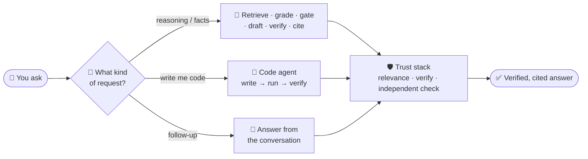
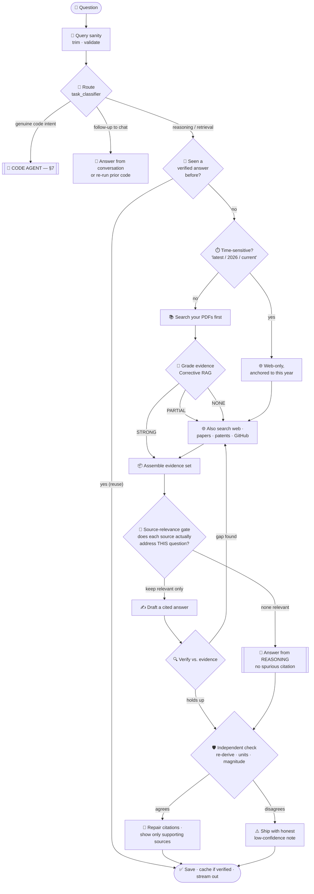
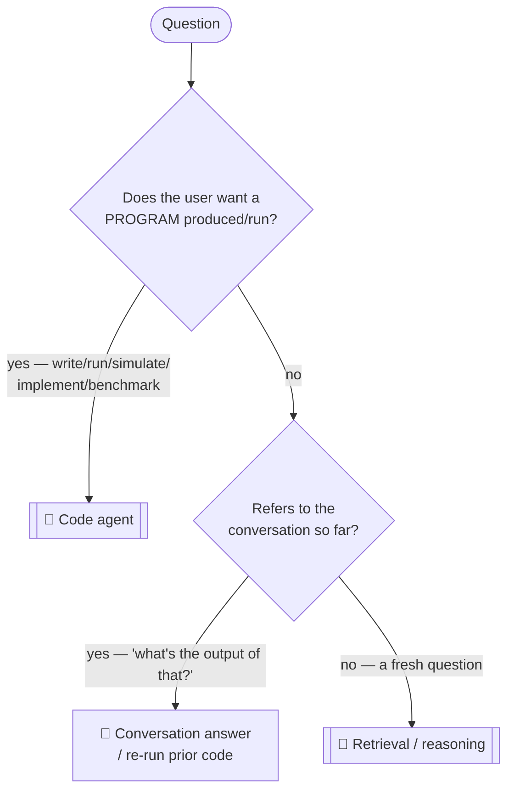
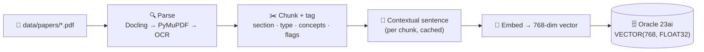
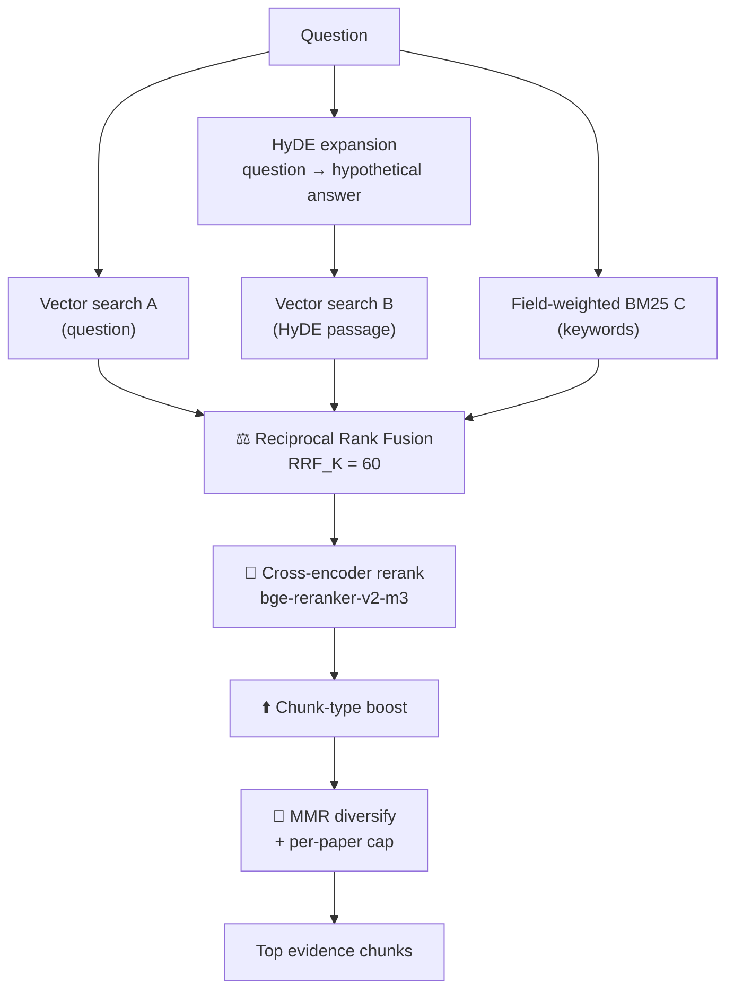
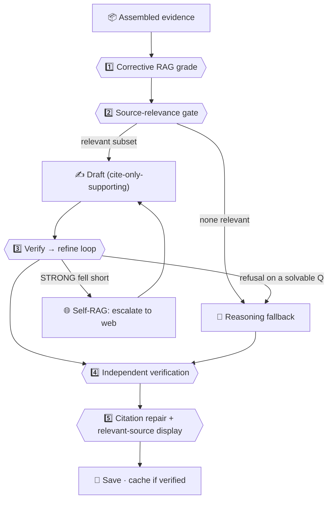
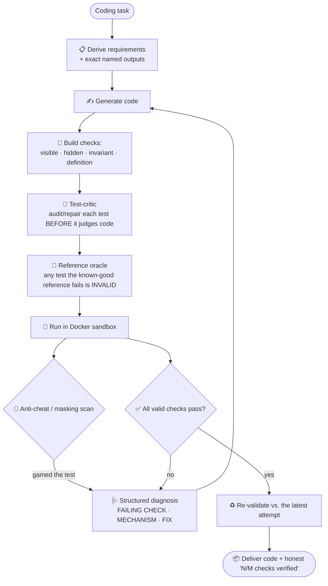
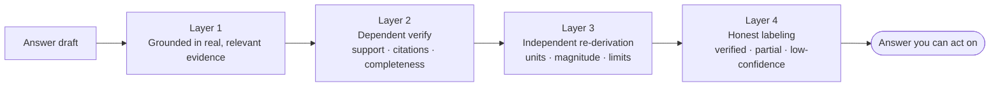
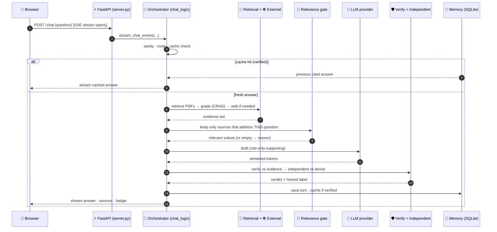
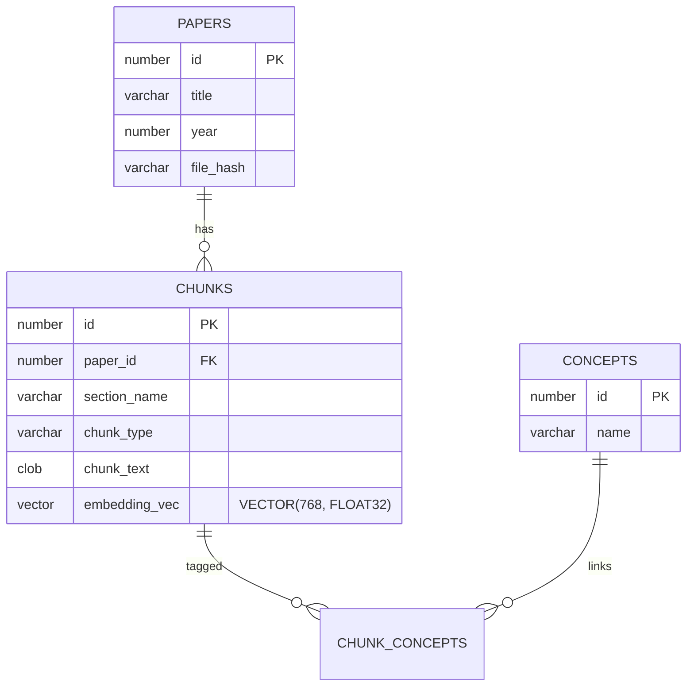

# 🧭 Research Assistant — The Complete Pipeline Guide

**An end-to-end, diagram-first walkthrough of how a question becomes a verified, cited answer — and how a coding task becomes working, tested code.**

*Plain-English where it can be, technical where it must be. Every stage has a diagram.*

---

> [!NOTE]
> **Generating a PDF from this file.** This guide is written in GitHub-Flavored Markdown with
> [Mermaid](https://mermaid.js.org/) diagrams. To produce a polished PDF, hand this file to Claude
> and ask it to *"render every Mermaid diagram and export as a PDF."* (Or use VS Code's *Markdown PDF*
> extension, or `mermaid-cli` + `pandoc`.) The collapsible **▸ Details** blocks expand in any Markdown
> viewer; in a flat PDF they render as normal sections.

---

## 📑 Table of contents

1. [The 30,000-foot view](#1--the-30000-foot-view)
2. [The master flow — a question's whole life](#2--the-master-flow--a-questions-whole-life)
3. [Stage A — Routing: decide what kind of request this is](#3--stage-a--routing-decide-what-kind-of-request-this-is)
4. [Stage B — Ingestion: turning PDFs into searchable knowledge](#4--stage-b--ingestion-turning-pdfs-into-searchable-knowledge)
5. [Stage C — Retrieval: finding the right evidence](#5--stage-c--retrieval-finding-the-right-evidence)
6. [Stage D — Answering: drafting, gating, verifying, citing](#6--stage-d--answering-drafting-gating-verifying-citing)
7. [Stage E — The code agent: write → run → verify](#7--stage-e--the-code-agent-write--run--verify)
8. [The trust stack — why you can believe the answer](#8--the-trust-stack--why-you-can-believe-the-answer)
9. [A full request, as a sequence diagram](#9--a-full-request-as-a-sequence-diagram)
10. [Data model & where state lives](#10--data-model--where-state-lives)
11. [Technology stack](#11--technology-stack)
12. [Configuration cheat-sheet](#12--configuration-cheat-sheet)
13. [Glossary](#13--glossary)

---

## 1. 🛰️ The 30,000-foot view

The Research Assistant answers a question by **searching real sources, grounding the answer in what
it finds, citing every claim, and checking its own work before you see it** — or, when the request is
really a program, by **writing code, running it in a locked-down sandbox, and refining until it's
verifiably correct.**

Three big ideas separate this from "chat with an AI":

| Principle | What it means in practice |
|---|---|
| **Ground, don't guess** | The answer is built from retrieved evidence; when sources fall short it says so instead of inventing. |
| **Route by intent** | A calculation is *reasoned*, a program is *written and run*, a follow-up is *answered from context* — the system decides **what the user wants**, not just what words appear. |
| **Self-consistent ≠ correct** | An answer is only labeled *verified* when an **independent** check — a re-derivation plus unit/magnitude/limiting-case sanity, or a reference oracle for code — agrees. |

---

## 2. 🗺️ The master flow — a question's whole life

This is the single most important diagram in the guide. Everything in §3–§8 is a zoom-in on one box here.

> [!TIP]
> **How to read it:** the diamonds are *decisions*, the double-bordered boxes are *sub-pipelines*
> (the code agent and the reasoning fallback have their own flows), and every path converges on
> **DONE**, where the turn is saved, conditionally cached, and streamed to the browser.

---

## 3. 🧭 Stage A — Routing: decide what kind of request this is

Before anything else, the orchestrator (`webapp/chat_logic.py`) decides **what kind of request** this
is. Getting this wrong is expensive — a calculation sent to the code agent wastes a sandbox run; a
program sent to retrieval ships a toy demo. Routing is **by intent, not by surface words.**

| Router | Module | Decides |
|---|---|---|
| **Code-intent** | `backend/answering/task_classifier.py` (semantic LLM) + `code_intent.py` (regex backstop) | program vs. answer |
| **Conversation** | `backend/answering/conversation_router.py` | new question vs. follow-up to the chat |
| **Freshness** | `chat_logic._freshness_sensitive` | needs *today's* web vs. the static library |

<b>▸ Details — why "numbers ≠ code"</b>

The classifier decides **what the user wants**, never whether math is involved. *"How much storage for
3 minutes of 44.1 kHz audio? Show your reasoning"* is a **reasoning** question — the mere presence of
numbers, a formula, or a required numeric answer does **not** make it a code task. The route is `code`
only when the user wants software produced or run, **or** the computation genuinely needs execution
(large / iterative / data-driven beyond hand reasoning). A fast regex (`is_code_intent`) is unioned in
as a high-recall backstop, and the whole decision degrades to regex-only if the LLM is unavailable, so
routing never blocks.

---

## 4. 📥 Stage B — Ingestion: turning PDFs into searchable knowledge

Run with `python pipeline.py` (incremental: `--incremental`). This is a **one-time cost at upload** —
it does not affect answer speed. PDFs become parsed, chunked, tagged, embedded vectors in Oracle 23ai.

| Step | Module | What & why |
|---|---|---|
| **Parse** | `ingestion/pdf_parser.py` | Docling (layout/tables/reading-order) → PyMuPDF fallback → OCR only for scanned pages. Ingestion never hard-fails. |
| **Chunk + tag** | `ingestion/document_chunker.py` | Semantic chunks, each tagged with section, chunk-type, `has_equation/algorithm/table`, and domain concepts — all high-signal for retrieval. |
| **Contextual chunk** | (indexing-time LLM) | One context sentence per chunk ([Anthropic's technique](https://www.anthropic.com/news/contextual-retrieval)) stored *only* in the index. Improves recall with **no query-time latency**. `CONTEXTUAL_CHUNKS=true`. |
| **Embed** | `ingestion/embed_chunks.py` | 768-dim vector per chunk (Gemini Embedding by default, or a local `sentence-transformers` model). |
| **Store** | `database/vector_migration.py` | Native Oracle `VECTOR` column; exact COSINE by default, optional HNSW/IVF index. |

---

## 5. 🔎 Stage C — Retrieval: finding the right evidence

The heart of local search: a **hybrid, multi-signal retriever** (`backend/retrieval/hybrid_retrieve.py`)
that combines meaning-based and keyword-based matching, fuses them, then re-ranks for precision.

| Technique | Where | Why it's there |
|---|---|---|
| **HyDE** | `hyde_generator.py` | Embedding an answer-shaped passage retrieves better than a bare question. |
| **Vector / semantic** | Oracle `VECTOR_DISTANCE COSINE` | Meaning-based matching. |
| **BM25F** (field-weighted) | `retrieval_fusion.py` | Exact-term matching; title/concepts/section weigh more than body. |
| **RRF** | `retrieval_fusion.py` | Merges 3 rankings by *rank* — robust to mismatched score scales. |
| **Cross-encoder rerank** | `hybrid_retrieve.py` | Reads query + chunk together for a precise final relevance score. |
| **MMR** | `retrieval_fusion.py` | Relevant **and** diverse — no five near-duplicate chunks. |

---

## 6. 🧠 Stage D — Answering: drafting, gating, verifying, citing

This is where retrieved evidence becomes a trustworthy answer. It is **not** "stuff the chunks into a
prompt and hope." Five guards stand between retrieval and the reply.

### The five guards

| # | Guard | Module | What it prevents |
|---|---|---|---|
| 1 | **Corrective RAG** | `answering/evidence_grader.py` | Burning the web budget when your PDFs already answer it — and shipping nothing when they don't. |
| 2 | **Source-relevance gate** | `answering/relevance_gate.py` | A *topically-similar but irrelevant* source steering or being cited in the answer. |
| 3 | **Verify → refine** | `answering/agentic_answer.py` | An unsupported or incomplete draft going out unchecked. |
| 4 | **Independent verification** | `answering/agentic_answer.py` | A *self-consistent but wrong* answer being labeled "verified." |
| 5 | **Citation hygiene** | `chat_logic.py` + `answering/citations.py` | A `[n]` that points to a non-existent or off-topic source. |

<b>▸ 1 · Corrective RAG (grade-then-act)</b>

After local retrieval, the grader scores coverage from the reranker scores already on each chunk (no
extra LLM call) and **acts on the grade**:

| Grade | Meaning | Action | Badge |
|---|---|---|---|
| **STRONG** | PDFs clearly cover it | answer from the library, skip external search | 🟢 *From your library* |
| **PARTIAL** | some, but thin | keep PDFs **and** search the web, merge | 🟡 *Library + web* |
| **NONE** | not in your PDFs | drop local, go to the web | 🔵 *From the web* |

Thresholds (`CRAG_STRONG_MIN`, `CRAG_PARTIAL_MIN`, `CRAG_STRONG_COUNT`) are live `.env` reads;
`CRAG_ENABLED=false` reverts to always-search.

<b>▸ 2 · Source-relevance gate (the newest guard)</b>

CRAG decides *where* to search; the relevance gate decides whether *what was found* is actually usable.
The failure it fixes: a reasoning-answerable question (an audio-storage **calculation**) retrieves 8
*topically-audio-but-irrelevant* papers — and **reranker scores can't catch that** (high topical
similarity, wrong content). So a bounded LLM judge confirms each top source *directly* helps answer
**this** question:

- **Keep only** the relevant subset → only those can ground or be cited.
- **None relevant** → discard them all and answer from reasoning, with **no spurious citation**.
- **Fail-open:** if the judge is unavailable/unparseable, keep everything (a hiccup never strips grounding).

`SOURCE_RELEVANCE_GATE=true` by default.

<b>▸ 3 · Verify → refine loop (+ Self-RAG escalation)</b>

A bounded **draft → verify → refine** loop (`ENABLE_AGENTIC_ANSWER_LOOP=true`). The verifier checks
evidence support, citation use, and completeness. On a concrete gap it searches again (local + web)
and rewrites against the expanded evidence. A **library-only (STRONG)** answer that fails verification
**escalates to the web once and retries** (Self-RAG). If the draft contains fenced Python, the longest
block runs in the Docker sandbox and that result feeds verification. The loop **early-stops** when the
draft passes or the verifier names no gap, so easy questions stay fast.

A special case: if the draft *refuses* a self-contained question ("the evidence doesn't cover this")
because retrieval was irrelevant, the system **reroutes to reasoning** instead of shipping the refusal.

<b>▸ 4 · Independent verification — "self-consistent ≠ correct"</b>

An answer's own self-derived checks share its assumptions, so a flaw baked into those assumptions (a
missed unit conversion, a wrong factor, an implausible magnitude) passes them undetected. So after the
dependent verify passes, an **independent** route runs: re-derive the answer *from scratch by a
different method*, plus objective sanity — **unit consistency**, **order-of-magnitude / plausibility**,
**limiting / known cases**. An answer is labeled **verified only when the independent check agrees**.
Disagreement → the answer ships with an honest low-confidence note and is **not** cached as verified.
`AGENTIC_INDEPENDENT_VERIFY=true` by default.

<b>▸ 5 · Citation hygiene & answer-quality caching</b>

- **Repair:** any `[n]` pointing outside the real source list is removed (saved + live display).
- **Relevant-source display:** the side panel shows only the sources the answer actually cited — a
  maths answer no longer lists biology hits the search happened to return.
- **Quality, not source, governs reuse:** an answer is cached with a `verified` flag. Only an
  *independently-verified* answer is reusable; a low-quality one is recorded but never replayed, and a
  later verified answer upgrades it. A reasoning answer with no sources is still cacheable on its quality.
- **Freshness** ("latest / this year / current") bypasses the cache so it always re-searches.

---

## 7. 🤖 Stage E — The code agent: write → run → verify

When the request is genuine code intent, the autonomous agent (`backend/agent/loop.py`) takes over. It
doesn't just print code — it **writes, runs, and refines until the result is machine-verified**, inside
a locked-down Docker sandbox. Correctness is *proven*, not assumed.

| Gate | Role |
|---|---|
| **Requirements + instruction-adherence** | Print *exactly* the named outputs, use the *specified* method, implement the *exact* formula. |
| **Reference oracle** | A known-correct reference solution; **any generated test the reference doesn't pass is invalid** and quarantined — a universal gate across all test types. |
| **Visible / hidden / invariant tests** | Visible examples + held-out checks on unseen inputs + property/invariant checks (incl. unit/magnitude/limiting-case sanity). |
| **Test-critic** | A distinct reviewer audits and repairs every generated test **before** it's allowed to fail candidate code. |
| **Anti-cheat / masking** | `backend/agent/anticheat.py` scans for hard-coded outputs, swallowed errors, and tests "gamed" to pass. |
| **Structured diagnosis** | On failure, a dedicated diagnosis role emits *FAILING CHECK → MECHANISM → FIX DIRECTIVE*, validated against the **current** attempt (not a stale one). |
| **Completeness / return-contract** | The deliverable actually produces the required outputs and matches the requested signature. |
| **Re-validation** | Before finalizing, the chosen attempt is re-checked against its *own* latest output. |

> [!IMPORTANT]
> **The sandbox never weakens.** Every run is **network-off, CPU/memory-capped, hard-timeout,
> non-root, and auto-removed**. Generated Python only ever runs inside the container — never on the
> host. The scientific stack (numpy, scipy, pandas, scikit-learn, …) is baked into the image.

If the agent can't fully verify, it stops with an honest *"partially verified — N/M checks"* label
instead of faking a pass.

---

## 8. 🛡️ The trust stack — why you can believe the answer

Every path — reasoning, retrieval, or code — passes through layered, **independent** checks. The point
of independence: a check that shares the answer's assumptions can't catch the answer's mistakes.

| Layer | Reasoning / retrieval answer | Code answer |
|---|---|---|
| **Grounding** | relevance-gated, cite-only-supporting evidence | task-derived requirements + exact outputs |
| **Dependent check** | verify vs. evidence | visible + hidden tests |
| **Independent check** | re-derive + unit/magnitude/limit sanity | reference oracle + invariants |
| **Honesty** | low-confidence note on disagreement | "N/M checks verified" |

---

## 9. 🔁 A full request, as a sequence diagram

---

## 10. 🗄️ Data model & where state lives

**Knowledge** (the indexed library) lives in Oracle 23ai; **conversation state** lives in SQLite.

| Store | File / DB | Holds |
|---|---|---|
| **Knowledge** | Oracle 23ai (`papers`, `chunks`, vectors) | The searchable PDF library. |
| **Conversations** | `data/conversations.db` (SQLite) | Sessions + versioned turns (ChatGPT-style edit/regenerate tree), agent runs. |
| **Cache & facts** | `data/memory.db` (SQLite) | `answer_cache` (with a `verified` flag), extracted facts. |
| **Accounts** | SQLite (`backend/auth`) | Users, sessions, Google OAuth, password-reset. |

---

## 11. 🧰 Technology stack

| Layer | Technology |
|---|---|
| **Language / server** | Python 3.11 · FastAPI + Uvicorn · Server-Sent Events (NDJSON streaming) |
| **Frontend** | HTML / CSS / vanilla JS — **no build step** (`webapp/static/`) |
| **Knowledge store** | Oracle Database Free 23ai (relational + native `VECTOR`) · python-oracledb |
| **Embedding** | Gemini Embedding (768-dim) · or local `BAAI/bge-base-en-v1.5` |
| **Reranker** | `BAAI/bge-reranker-v2-m3` cross-encoder (fp16 on CUDA, CPU fallback) |
| **Doc parsing** | Docling · PyMuPDF fallback · PaddleOCR/Tesseract (scanned pages) |
| **LLM** | One OpenAI-compatible streaming client → Gemini · Mistral · OpenAI · local Ollama |
| **Code sandbox** | Docker (network-off, capped, non-root, auto-removed) |
| **Observability** | Optional Langfuse tracing · DeepEval gates (off by default) |

---

## 12. ⚙️ Configuration cheat-sheet

The real `.env` is private/gitignored; **`.env.example`** is the commented template. The knobs that map
to this guide's stages:

| Stage | Variable | Effect |
|---|---|---|
| Routing | `CODE_INTENT_SEMANTIC` | LLM intent classifier on/off (regex backstop always on). |
| Retrieval | `ENABLE_LOCAL_RAG` · `ORACLE_DSN` · `DEVICE` | Local PDF search; GPU placement. |
| External | `ENABLE_WEB_SEARCH` | Web · papers · patents · GitHub. |
| CRAG | `CRAG_ENABLED` · `CRAG_STRONG_MIN` · `CRAG_PARTIAL_MIN` | Grade thresholds; `false` = always-search. |
| Relevance gate | `SOURCE_RELEVANCE_GATE` | Drop topically-similar-but-irrelevant sources (default on). |
| Verify | `ENABLE_AGENTIC_ANSWER_LOOP` · `AGENTIC_MAX_VERIFY_ROUNDS` | Draft→verify→refine loop. |
| Independent | `AGENTIC_INDEPENDENT_VERIFY` | Re-derive + sanity confirmation (default on). |
| Cache | `ENABLE_ANSWER_CACHE` · `ANSWER_CACHE_MIN_SIMILARITY` | Reuse of verified answers. |
| Ingestion | `CONTEXTUAL_CHUNKS` · `EMBEDDING_PROVIDER` · `CREATE_VECTOR_INDEX` | Index quality/build. |

---

## 13. 📖 Glossary

| Term | Meaning |
|---|---|
| **RAG** | Retrieval-Augmented Generation — answer from retrieved documents, not just model memory. |
| **Corrective RAG (CRAG)** | Grade retrieved evidence, then *act* on the grade (answer / supplement / re-search). |
| **Source-relevance gate** | An LLM check that keeps only sources that *directly* address the question. |
| **Self-RAG** | A library-only answer that fails verification escalates to the web and retries. |
| **Independent verification** | Confirming an answer by a *different* route (re-derive + unit/magnitude/limit sanity). |
| **Reference oracle** | A known-correct solution; any test it fails is treated as an invalid test. |
| **HyDE** | Hypothetical Document Embeddings — turn a question into an answer-shaped passage for better recall. |
| **RRF** | Reciprocal Rank Fusion — merge several ranked lists by rank position. |
| **Cross-encoder** | A model that reads query + candidate *together* for a precise relevance score. |
| **MMR** | Maximal Marginal Relevance — pick results that are relevant *and* diverse. |
| **SSE** | Server-Sent Events — stream the answer to the browser token by token. |

---

Kept in sync with the code. Companion docs: <a href="HOW_IT_WORKS.md">HOW_IT_WORKS</a> ·
<a href="ARCHITECTURE.md">ARCHITECTURE</a> · <a href="PIPELINE.md">PIPELINE</a> (reference) ·
<a href="../README.md">README</a>.
 Python · FastAPI · Oracle 23ai · Docker · CUDA — self-hosted, no telemetry. MIT License.

