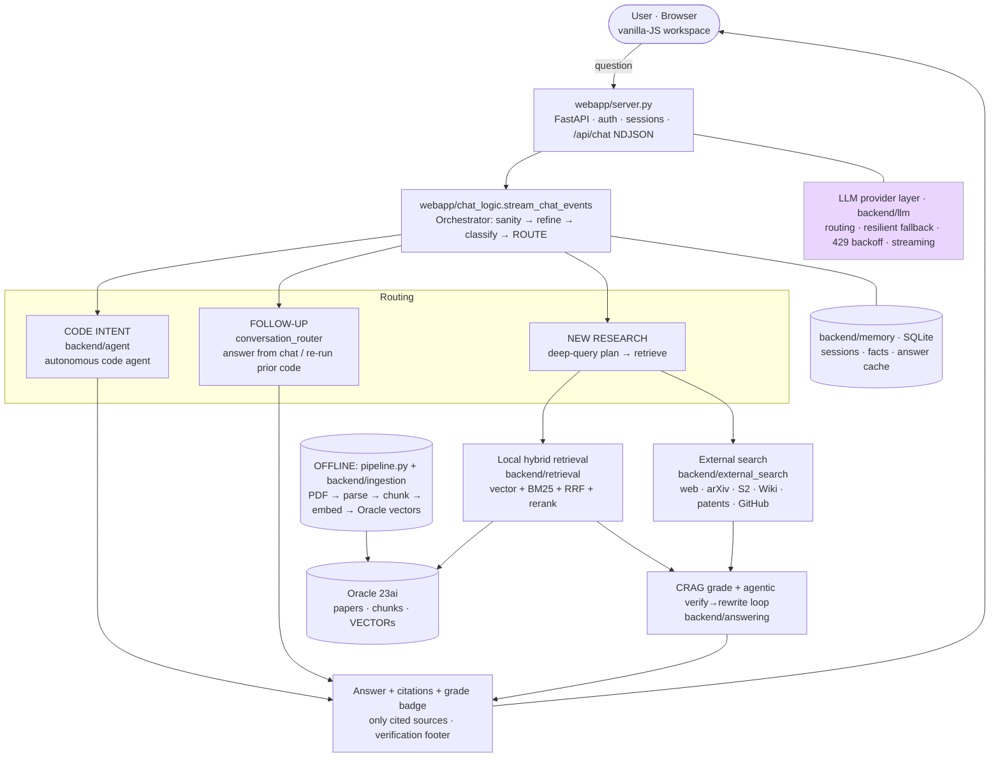
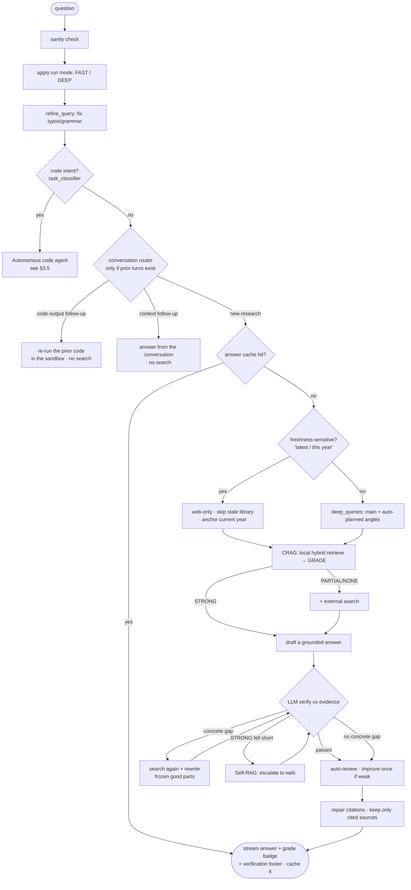
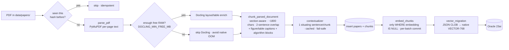
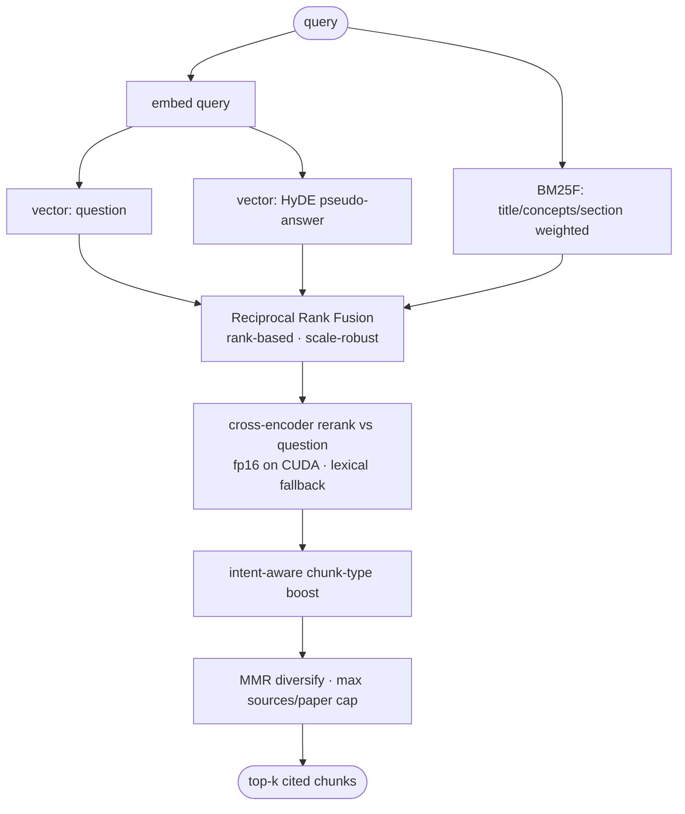
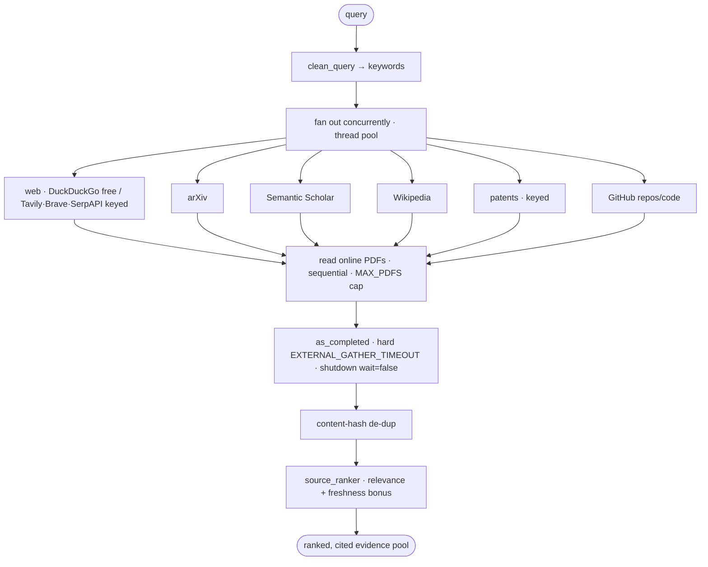
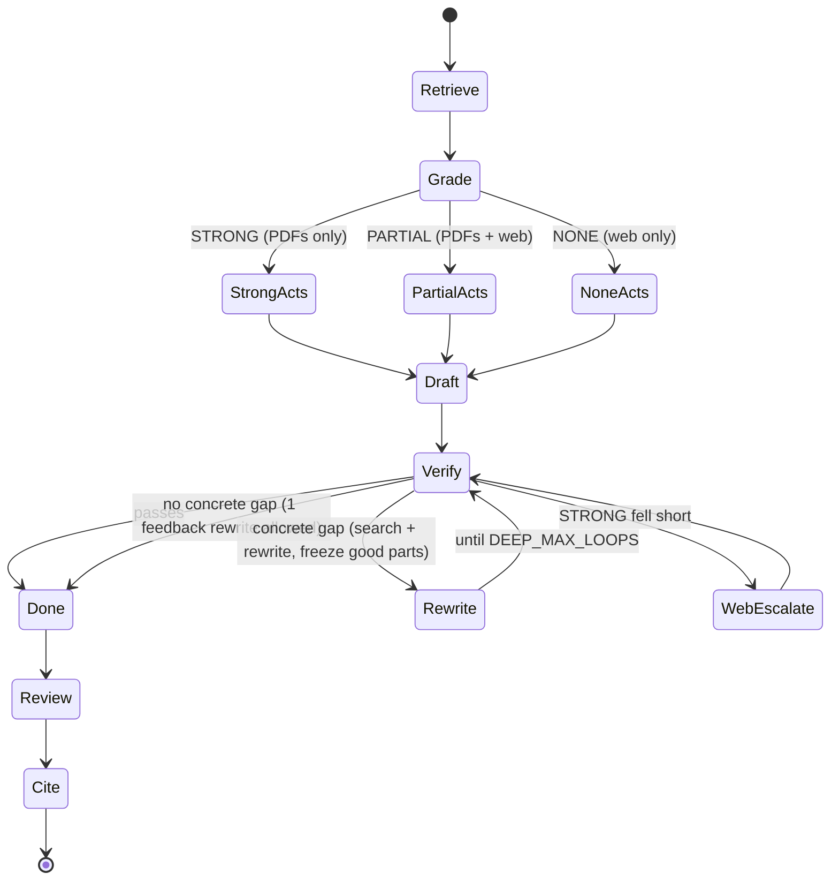
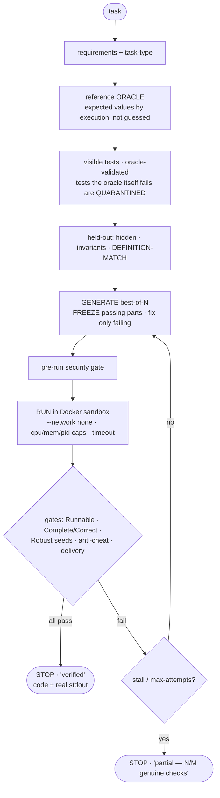
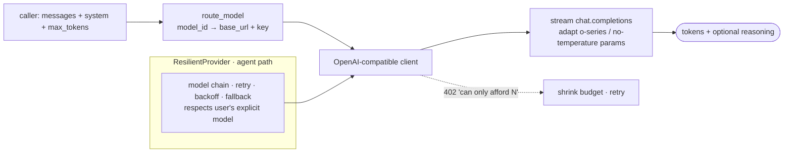
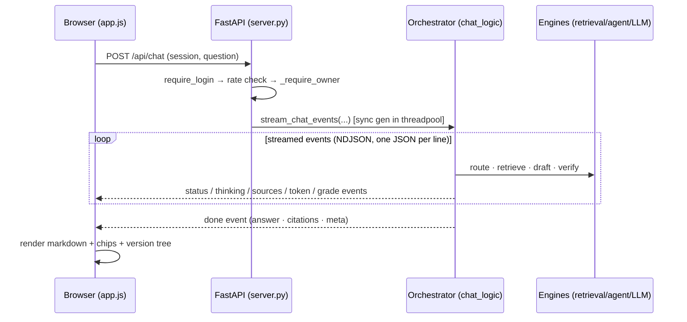

# Research Assistant — Full Pipeline & Architecture

> **Purpose of this document.** A deep, code-grounded walkthrough of *how the system is built today*, *what each part actually does*, and *what we want to improve next*. It is written to be rendered into an **interactive PDF** — every diagram is Mermaid (renders on GitHub and in most Markdown→PDF tools), and the sections are self-contained.

**One line:** A self-hosted, retrieval-augmented research assistant. A FastAPI app streams answers as NDJSON while an orchestrator routes each question to the right engine — a **local PDF RAG** over Oracle 23ai vectors, an **external multi-source web/paper search**, a **Corrective-RAG + agentic verify-rewrite answerer**, and a **fully autonomous code agent** that writes, runs, and verifies Python inside a locked-down Docker sandbox.

---

## Table of contents

1. [System at a glance](#1-system-at-a-glance)
2. [End-to-end request lifecycle](#2-end-to-end-request-lifecycle)
3. [Subsystem deep dives](#3-subsystem-deep-dives)
   - [3.1 PDF ingestion pipeline](#31-pdf-ingestion-pipeline)
   - [3.2 Hybrid local retrieval](#32-hybrid-local-retrieval)
   - [3.3 External search orchestration](#33-external-search-orchestration)
   - [3.4 Answering pipeline — CRAG + agentic loop](#34-answering-pipeline--crag--agentic-loop)
   - [3.5 Autonomous code agent](#35-autonomous-code-agent)
   - [3.6 LLM provider layer](#36-llm-provider-layer)
   - [3.7 Web app · API · streaming · auth · frontend](#37-web-app--api--streaming--auth--frontend)
4. [Cross-cutting design principles](#4-cross-cutting-design-principles)
5. [Technology stack](#5-technology-stack)
6. [Future improvements roadmap](#6-future-improvements-roadmap)

---

## 1. System at a glance

**How to read it.** The browser hits FastAPI, which streams newline-delimited JSON events back. The orchestrator (`stream_chat_events`) makes one routing decision per message and dispatches to one of three engines. Research questions fan out to local + external retrieval, get **graded and verified** before the answer is shown, and only the sources the answer actually cited are surfaced. Every box that generates text (router, planner, drafter, verifier, code agent, even the ingest-time "context" sentence) calls the single **LLM provider layer**.

---

## 2. End-to-end request lifecycle

This is what happens, in order, for a single chat message (`webapp/chat_logic.stream_chat_events`):

**Key guarantees of this lifecycle**

- **Routing before answering.** A coding task never enters the prose pipeline; a follow-up never launches a fresh web sweep; only a genuinely new question retrieves. A *confidence floor + a deixis veto* ensure a confident-but-wrong "follow-up" classification can never starve a new question of search.
- **Grade-then-act (Corrective RAG).** The system grades how well the local library covers the question *before* deciding whether to spend on external search.
- **Bounded self-correction.** The verify→rewrite loop **early-stops** when the draft passes or there is no concrete, fixable gap; it caps at `DEEP_MAX_LOOPS`; a library-only answer that fails verification **escalates to the web once** (Self-RAG).
- **Honesty.** Citations are repaired so `[n]` always resolves; only cited sources are shown; a date anchor + entity-attribution guard prevent stale/mis-attributed claims.

---

## 3. Subsystem deep dives

### 3.1 PDF ingestion pipeline

**What it does.** Turns the PDFs in `data/papers/` into a searchable Oracle 23ai vector index. Per PDF it extracts per-page text, splits into section-aware/type-tagged chunks, adds an Anthropic-style "contextual retrieval" situating sentence per chunk, embeds each chunk to a 768-d vector, and stores papers + chunks + native `VECTOR`s.

**How it works (mechanism).** `pipeline.py` runs each stage as a **separate subprocess** so a native crash in one cannot kill the others, and stops at the first failure.
- **Stage 1 — parse + chunk** (`ingest_papers.py`, `pdf_parser.py`, `document_chunker.py`): a SHA-256 content hash gives dedup/idempotency; **PyMuPDF is the source of truth**; the heavy **Docling** layout parser runs *only* when free memory exceeds `DOCLING_MIN_FREE_MB` (pre-empting an uncatchable native OOM/segfault) and its markdown is used only if it covers ≥60% of the PyMuPDF text; CPU **OCR** runs only on text-poor pages. Chunking packs sentences to ~1800 chars with 2-sentence overlap, extracts figure/table captions + algorithm blocks as standalone chunks, tags each chunk with section / type / `audio_concepts`, and dedupes. Page-coverage warnings mean **no page is dropped silently**.
- **Stage 2 — embed** (`embed_chunks.py`, `backend/common/embeddings.py`): selects rows `WHERE embedding IS NULL` (so a 429 quota crash resumes cleanly), prepends the context sentence *only for embedding*, and writes L2-normalized 768-d vectors (Gemini API or a local BGE model), committing per batch.
- **Stage 3 — vector migrate** (`vector_migration.py`): converts the JSON embedding into a native `VECTOR(768, FLOAT32)` column for cosine search.
- **Incremental mode** (`incremental_index.py`): diffs a SHA-256 manifest and reprocesses only changed PDFs (fast no-op when nothing changed).

**Key files:** `pipeline.py` · `backend/ingestion/{ingest_papers,pdf_parser,document_chunker,contextualizer,ocr_fallback,embed_chunks,incremental_index}.py` · `backend/database/vector_migration.py` · `backend/common/embeddings.py`

**Strengths:** crash isolation (per-stage subprocess, per-PDF try/except incl. `MemoryError`, Docling memory guard); idempotent + resumable; no silent page loss; retrieval-aware chunking; GPU kept free for query-time work (parse/OCR forced to CPU).

---

### 3.2 Hybrid local retrieval

**What it does.** Given a question, finds the most relevant chunks from the local corpus. Runs three retrievers **in parallel** — dense vector on the question, dense vector on a **HyDE** pseudo-answer, and field-weighted **BM25** — fuses them with **Reciprocal Rank Fusion**, cross-encoder **reranks**, boosts intent-matching chunk types, and applies **MMR** diversification with a per-paper cap.

**How it works.** Embed the query → the three rankings run concurrently on a thread pool → **RRF** fuses them (rank-based, so it is robust to the cosine-vs-BM25 score-scale mismatch that breaks naive linear fusion) → the pool is **cross-encoder reranked** against the original question (fp16 on GPU, pre-warmed at startup) → additive chunk-type boosts → **MMR** with a hard `MAX_SOURCES_PER_PAPER` cap so one paper can't dominate. Every stage **degrades gracefully**: a reranker OOM falls back to a 0..1 lexical reranker; a turbovec cache miss falls back to Oracle; HyDE failure is non-fatal. FAST/DEEP knobs are read from env per request.

**Key files:** `backend/retrieval/hybrid_retrieve.py` (+ rerank / BM25 / HyDE / turbovec helpers)

**Strengths:** genuinely hybrid (dense + sparse + HyDE) fused by RRF; strong tested fallbacks; concurrent rankings + cached BM25 stats + GPU warmup; HyDE with **no** LLM/API call (template + lexicon); research-corpus tuning (BM25F field weighting, contextual sentence indexed, MMR per-paper cap).

> ⚠ **Honest note:** the `graph_reason` / GraphRAG field is plumbed to the UI but **always empty** — it is not implemented today.

---

### 3.3 External search orchestration

**What it does.** An optional, opt-in evidence channel that supplements local RAG with the public internet. Fans one query across web, arXiv, Semantic Scholar, Wikipedia, patents, and GitHub, reads online PDFs it finds, normalizes everything into uniform citation-bearing records, then de-dupes and re-ranks against the question. **It never crashes the request:** any failing / timed-out / keyless channel is skipped with a warning.

**How it works.** `clean_query()` → fan out the selected channels on a thread pool (free: arXiv/S2/Wiki/GitHub; keys add web + patents) → each channel hits its API through a shared cached, size-capped, backoff-aware `safe_get` → results consumed via `as_completed` with a hard `EXTERNAL_GATHER_TIMEOUT` and `shutdown(wait=False)` so stragglers can't block the response → content-hash de-dup → `source_ranker` re-ranks with a **freshness bonus** that scales up when the query says "latest/recent/&lt;year&gt;". Online PDFs are read **sequentially** and capped (`MAX_PDFS`) to bound memory.

**Key files:** `backend/external_search/{orchestrator,web_search,source_ranker,base}.py` + channel modules

**Strengths:** strong fault isolation (`gather_external_evidence` never raises); true concurrency with a hard wall-clock cap; works with **zero keys**; uniform citation-first `ExternalSource` model with secret-stripping `to_public()`; defense-in-depth fetching (3 MB cap, timeout, streamed download, 429/5xx backoff, post-redirect re-validation, PDF magic-header check, TTL disk cache); recency awareness.

> ⚠ **Intentional:** there is **no SSRF/private-IP guard** (the owner wants unrestricted fetching). Re-enable only behind a flag for untrusted/multi-tenant use.

---

### 3.4 Answering pipeline — CRAG + agentic loop

**What it does.** The orchestration layer that turns a chat message into a grounded, cited answer streamed as JSON events. It decides *how* to answer (reuse cache · send to the code agent · answer a follow-up from the conversation · run a fresh research sweep), then for research it retrieves evidence, grades local coverage (**Corrective RAG**), and **draft → verify → rewrite** in a bounded agentic loop, escalating a library-only answer to the web if it fails (**Self-RAG**).

**The CRAG grade table**

| Grade | Meaning | Action | Badge |
|---|---|---|---|
| **STRONG** | the PDFs clearly cover it | answer from the library, **skip external search** | 🟢 *From your library* |
| **PARTIAL** | relevant but thin | keep the PDFs **and** search the web, merge | 🟡 *Library + web* |
| **NONE** | not in the PDFs | drop local, answer from the web | 🔵 *From the web* |

**Conversation-aware routing (the recent hardening).** Before any retrieval, a `conversation_router` (one bounded LLM call + regex fallback, only when prior turns exist) classifies the message: **code-output follow-up** (re-run the previous code), **context follow-up** (answer from the chat), or **research**. A confidence floor *and* a deixis veto mean a confident-but-wrong "follow-up" verdict can never skip search for a genuinely new question.

**Freshness.** Time-sensitive questions ("latest", "this year", "&lt;year&gt;") deliberately **bypass the cache and the stale local library**, go web-only, and anchor the search + the answer to **today's real date**.

**Output discipline.** Only the sources the answer actually **cited** are shown (so a maths question never lists biology hits), citations are repaired so `[n]` always resolves, and an **entity-attribution guard** stops the model crediting a result to the wrong org.

**Key files:** `webapp/chat_logic.py` · `backend/answering/{agentic_answer,conversation_router,research_modes,citations,evidence_grader,reviewer,task_classifier,query_refine}.py`

**Strengths:** clean separation into small testable modules; cost-aware (FAST/DEEP, grade reuses reranker scores, caches, evidence budgets, loop early-stop); degrades gracefully and never breaks chat; strong grounding (verifier + Self-RAG + auto-review + citation repair + cited-only sources).

---

### 3.5 Autonomous code agent

**What it does.** Given a coding/algorithm request, it writes Python, runs it in a locked-down throwaway Docker container, and labels it **"verified" only if it provably passes machine-checked correctness gates** — never on "it ran." It generates its own acceptance criteria (requirements, visible tests, a reference oracle, held-out hidden tests, invariants, and one definition-match check per requested output), runs everything across random seeds, feeds genuine failures back, defends against reward-hacking, and labels honestly.

**How it works.** requirements → task-type → **reference oracle** (expected values by *execution*) → visible tests (a test the known-correct oracle itself fails is **quarantined** so a flawed test can't fail correct code) → **LOOP** (≤ `AGENT_MAX_ATTEMPTS`, default 10): generate best-of-N candidates that **freeze already-passing parts and fix only the failing ones** → pre-run security gate → run in the sandbox (candidate isolated in module `_sol` so it can't read the oracle — `ref.*` cheats hit `NameError`) → gates (Runnable, Complete/Correct on visible tests, Robust on held-out across seeds, anti-cheat static scan, delivery/output discipline) → verified → stop; else carry feedback + freeze, retry. Stops at max-attempts or **stall** (`AGENT_STALL_LIMIT`, default 3 no-progress rounds) with an honest *"partial — N/M genuine checks"*.

**REAL vs FALSE failure (governs what gets fixed):**
- **REAL** = output genuinely violates the spec/invariant, or the code special-cased the examples (fails held-out) → **fix the CODE**.
- **FALSE** = correct code rejected by a flawed test (guessed expected value, too-tight tolerance, wrong-quantity check) → **fix the TEST (quarantine it), never weaken a correct check**.

**Sandbox safety (never weakened):** `--network none`, non-root, memory/CPU/PID caps, wall-clock timeout, code piped on stdin with nothing mounted, auto-removed; concurrency bounded by a semaphore. **Output discipline:** stdout is captured head+tail so a requested value printed *after* a large intermediate dump is never truncated away.

**Key files:** `backend/agent/{loop,code_runner,anticheat,hooks,deps}.py`

**Strengths:** correctness machine-verified across seeds (visible AND held-out AND invariants AND definition-match); strong reward-hacking defense (static scan + oracle isolation + behavioural held-out); reference-oracle + test-quarantine; honest labeling; freeze-verified-parts + regression detection + stall detection for efficient, self-improving iteration.

---

### 3.6 LLM provider layer

**What it does.** A thin, provider-agnostic streaming chat layer: one factory (`get_provider`) and one method (`stream_chat`) so callers never care whether the model is Gemini, Mistral, OpenAI, OpenRouter, or local Ollama. It routes each model id to the right endpoint + key, adapts request params for quirky APIs, streams tokens (and optional hidden "reasoning"), and shrinks the token budget on low-credit 402 errors.

**How it works.** `route_model` resolves `model_id → (base_url, api_key)` via a `PROVIDERS/CATALOG` table → constructs an OpenAI-compatible client → `stream_chat` opens a streaming completion, adapting params per model. On a 402 "can only afford N" it shrinks the budget and retries; if the stream can't open it re-raises the real error so the UI shows a true message. `ResilientProvider` (in the agent) composes this base across a model chain with retry/backoff/fallback, respecting the user's explicit model choice.

**Key files:** `backend/llm/streaming_provider.py` · `ResilientProvider` (in `backend/agent/loop.py`)

**Strengths:** single OpenAI-compatible abstraction across 5 providers; explicit per-model base-URL + key routing; parameter adaptation; never silently empty; clean separation (base stays simple, retry/fallback isolated); lazy imports keep startup light.

---

### 3.7 Web app · API · streaming · auth · frontend

**What it does.** The FastAPI web layer and vanilla-JS workspace users interact with. It serves the chat UI, streams answers + agent/ingest progress as **NDJSON**, manages per-user sessions with a signed cookie, handles login/signup/reset/Google OAuth, exposes CRUD for conversations and the ChatGPT-style version tree, drives PDF upload + live ingestion, and lets the user switch the active LLM. The frontend renders markdown + math + clickable citations, a reasoning timeline, a code-agent step timeline with an in-card IDE/console, a sources drawer, and a Three.js background.

**How it works.** A global `require_login` + per-IP rate check + `_require_owner` ownership check run **before** any streaming. Chat uses a sync generator run in a threadpool yielding event dicts as NDJSON; the agent/research routes use a worker thread pushing events onto a queue the response drains. The frontend is one IIFE: throttled `requestAnimationFrame` markdown rendering, citation chips resolved by `source.n`, a lazy-loaded version tree, a 401→login redirect, and a Three.js background with a Canvas-2D fallback.

**Key files:** `webapp/server.py` · `webapp/auth.py` · `webapp/static/{app.js,app-bg.js,styles.css,index.html,login.html}`

**Strengths:** centralized security gate (no endpoint can leak another user's data); hardened auth (anti-enumeration forgot-password, Host-poisoning defense, OAuth state nonce); clean NDJSON contract; dependency-light but polished UX; mtime cache-busting; optional systems degrade gracefully.

---

## 4. Cross-cutting design principles

| Principle | How it shows up |
|---|---|
| **Grounded, never guessing** | answers come only from retrieved evidence; the verifier + Self-RAG + citation repair enforce it; the system says "not covered" instead of inventing |
| **Graceful degradation** | local RAG off → web still works; web off → local still works; Docker off → clear message; reranker OOM → lexical fallback; a dead channel → partial results |
| **Cost-awareness** | FAST/DEEP profiles, CRAG grade reuses reranker scores (zero extra LLM), answer/external/grade caches, evidence budgets, agentic early-stop, bounded concurrency |
| **Honesty over a fake pass** | the code agent labels *verified / partial / rejected_cheating / failed*; it never games tests or weakens a correct check to go green |
| **Sandbox safety (non-negotiable)** | generated code runs only in Docker: network-off, non-root, cpu/mem/pid caps, timeout, nothing mounted |
| **Live configuration** | tunables are read from env per request (no frozen module constants) so `.env`/mode changes apply immediately |

---

## 5. Technology stack

| Layer | Technology |
|---|---|
| **Backend / API** | Python 3.11 · FastAPI · Uvicorn · NDJSON streaming |
| **Frontend** | Vanilla HTML/CSS/JS (no build step) · Three.js background · Mermaid/markdown/KaTeX rendering |
| **Local RAG store** | Oracle 23ai native `VECTOR` (cosine) + chunk/paper tables |
| **Retrieval** | dense vectors · BM25F · HyDE · Reciprocal Rank Fusion · cross-encoder reranker (CUDA fp16) · MMR |
| **Embeddings** | Gemini API *or* local `sentence-transformers` BGE (768-d) |
| **PDF parsing** | PyMuPDF (source of truth) · Docling (layout/tables, memory-guarded) · PaddleOCR/Tesseract (text-poor pages) |
| **External search** | DuckDuckGo (free) · Tavily/Brave/SerpAPI (keyed) · arXiv · Semantic Scholar · Wikipedia · patents · GitHub |
| **LLM providers** | Gemini · Mistral/Codestral · OpenAI · OpenRouter · local Ollama (OpenAI-compatible) |
| **Code sandbox** | Docker (network-off, capped, non-root, auto-removed) + baked scientific stack (numpy/scipy/pandas/sklearn) |
| **Memory / sessions** | SQLite (conversations · facts · answer cache) · signed-cookie auth · optional Google OAuth |
| **Observability (optional)** | Langfuse tracing · DeepEval quality gates (off by default) |
| **Tests** | ~590 offline tests (Docker / LLM / network fully mocked) |

---

## 6. Future improvements roadmap

### 6.1 Highest-leverage (cross-cutting)

1. **Scale local retrieval.** BM25 is an O(N) Python scan over every chunk on every query — replace with an inverted index / `rank_bm25` / Oracle Text, and invalidate the chunk/BM25 caches when new papers are ingested (today they only refresh on restart).
2. **Multi-tenant safety.** Add CSRF protection (Origin allowlist / double-submit token) on the JSON POSTs, gate `/api/model` behind an admin role (any logged-in user can currently change the global model/key), drive the `Secure` cookie flag from env, bound the in-process rate-limiter dict, and offer an opt-in SSRF guard.
3. **Resilience on the chat path.** Today only the *agent* path has retry/fallback — wrap the live chat path in the resilient provider too, classify errors by typed exception (not substring), and honor `Retry-After` headers with jitter.
4. **Concurrency-safe modes.** `apply_research_mode` mutates process-global `os.environ`; make the FAST/DEEP profile request-scoped (a settings object / `contextvars`) so concurrent requests with different modes can't interleave.

### 6.2 Per-subsystem

| Subsystem | Improvements |
|---|---|
| **Ingestion** | write the native `VECTOR` directly in Stage 2 (drop Stage 3 + the JSON-CLOB round-trip); carry Docling per-item page numbers through to chunks (markdown-parsed papers can't cite a real page today); act on *deleted* PDFs in incremental mode (orphan rows linger); token-aware chunking tied to the embedder's limit; stream `embed_chunks` instead of `fetchall()` |
| **Retrieval** | inverted-index BM25; normalize rerank scores before adding chunk-type/MMR boosts; cosine (not Jaccard) MMR similarity using the existing embeddings; gate HyDE on topic confidence; either implement the `graph_reason` GraphRAG field or remove it; differentiate FAST vs DEEP retrieval depth (identical today) |
| **External search** | async I/O (httpx/asyncio) with per-channel deadline budgets; near-duplicate detection (arXiv abs/pdf/S2 dupes survive); harden the DuckDuckGo scraper + add a second keyless fallback; per-channel cache TTLs |
| **Answering** | split the ~340-line `stream_chat_events` into named helpers; reduce LLM fan-out (merge refine + classify + route into one structured call); include mode/source-config in the answer-cache key; distinguish a verifier *parse-failure* from a genuine low score; add control-flow tests for the orchestration branches |
| **Code agent** | generate the oracle/definition checks with a **different** provider than the solver (break correlated blind spots); tighten `_check_completeness` from token-substring to value-adjacent-to-label; early-exit a round once one candidate is fully verified; constrain build-time `pip` installs to an allowlist/pinned index (the dep build has network) |
| **LLM layer** | move `ResilientProvider` into `backend/llm/` as a reusable layer; set explicit client timeout/max-retries; name the magic numbers; type the `Union[str, Dict]` stream return |
| **Web app** | split the ~1400-line `app.js` into ES modules; add Pydantic request models for boundary validation; wire or remove the dead `/api/research` + `preview.html`; add an idle/keep-alive timeout on the fetch reader |

### 6.3 Bigger bets (capability)

- **Real GraphRAG** over the `audio_concepts` graph (concept-expansion retrieval) — the field is already plumbed end-to-end.
- **Cross-encoder / embedding relevance filter on external sources** so the answer's evidence pool is topically tight (not just search-API-ranked).
- **Per-source recency + authority scoring** surfaced to the user (date + domain trust badges).
- **A "degraded mode" indicator** so users always know when an answer was produced on reduced evidence (external timeout, verifier exception, web-search off).

---

Research Assistant — Python · FastAPI · Oracle 23ai · Docker · CUDA. Source document for an interactive architecture PDF.

