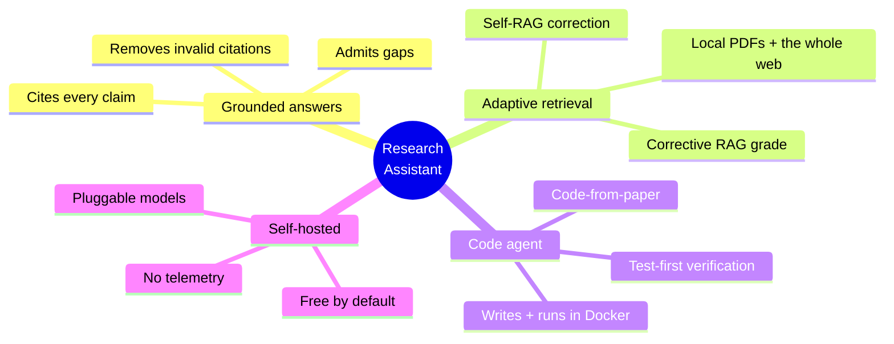
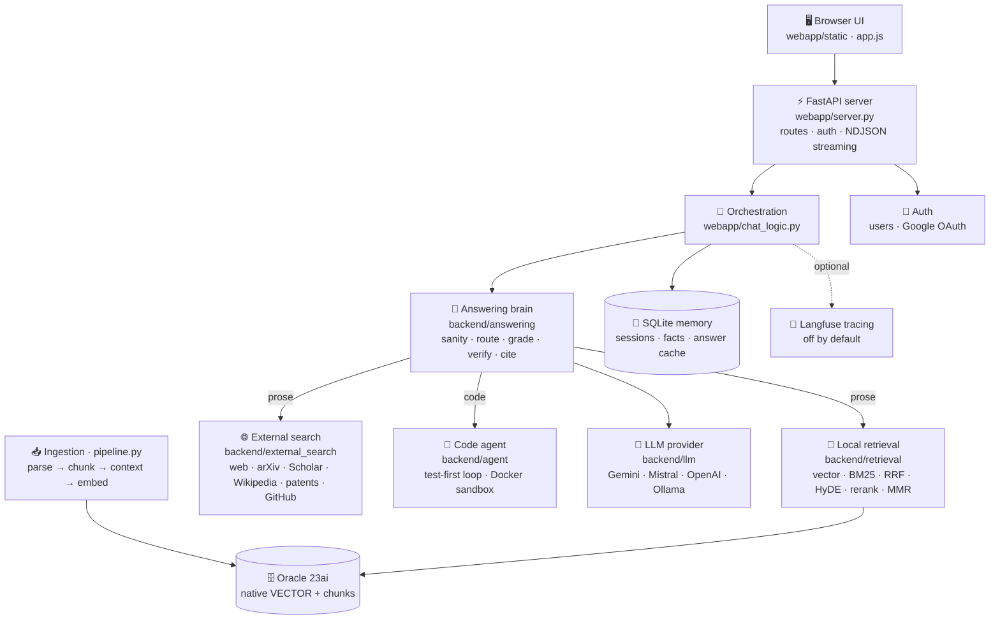
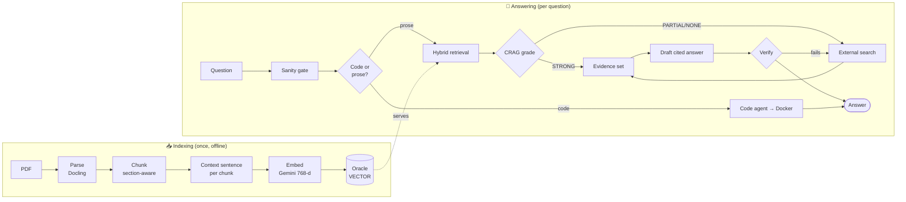
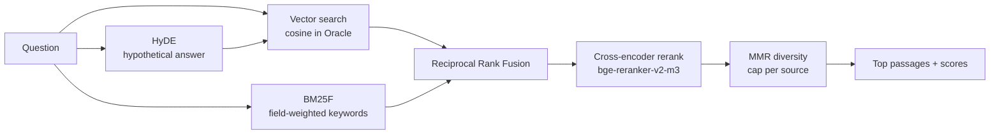
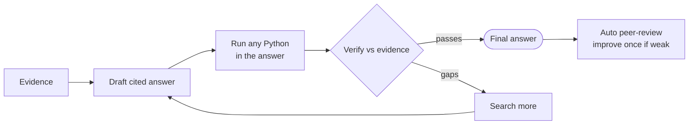
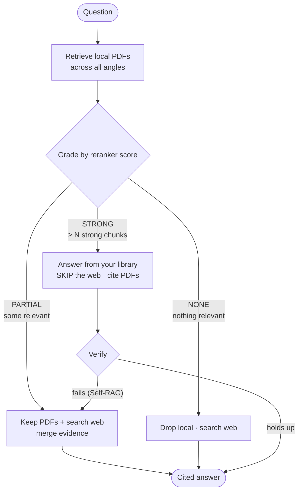
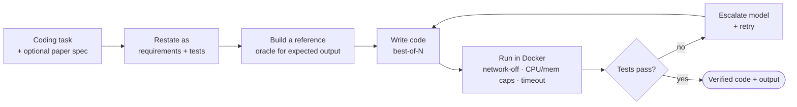
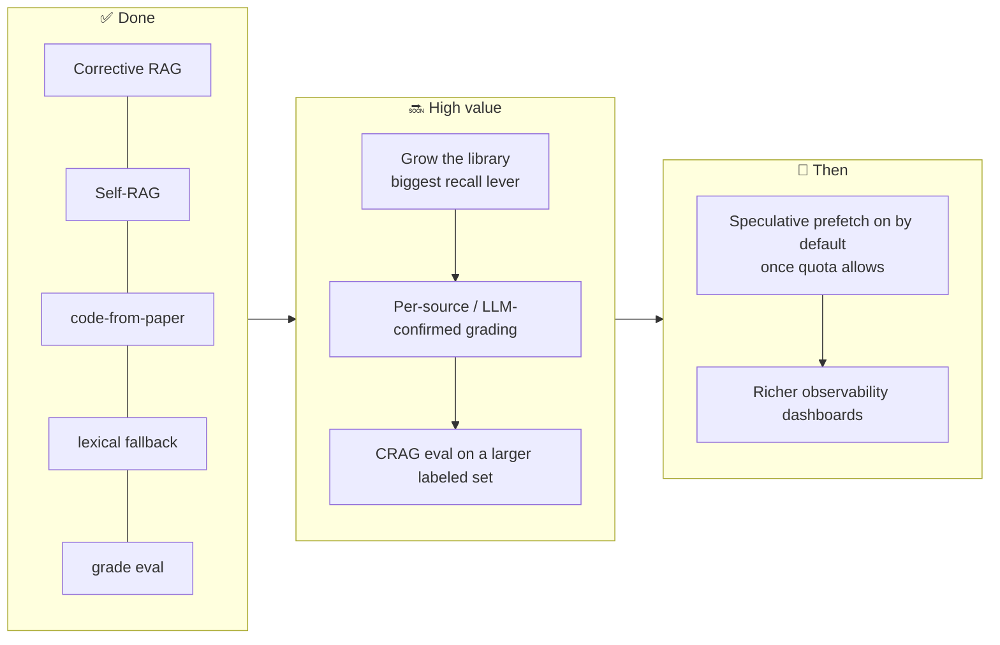

# Research Assistant — Full Project Report

> A self-hosted, cited, **grounded** research assistant. It searches your own PDFs *and* the open
> world (web, arXiv, Semantic Scholar, Wikipedia, patents, GitHub), grades the evidence before it
> answers (**Corrective RAG**), cites every claim, verifies the draft against the sources, and — when
> a question is really a coding task — writes the program, runs it in a locked-down Docker sandbox,
> and fixes it until it works.

*This document is a single, self-contained overview built for reading or exporting to PDF. It covers
what the project is, how every stage works (with diagrams), the technology behind each choice, all the
measurements taken so far, and where it goes next.*

**Status at time of writing:** 438 automated tests passing · fully offline/mocked suite · Python 3.11.

---

## Table of contents

1. [What this project is](#1-what-this-project-is)
2. [What you can do with it](#2-what-you-can-do-with-it)
3. [System architecture (the big picture)](#3-system-architecture-the-big-picture)
4. [The full pipeline, stage by stage](#4-the-full-pipeline-stage-by-stage)
5. [Corrective RAG — grade then act](#5-corrective-rag--grade-then-act)
6. [The autonomous code agent](#6-the-autonomous-code-agent)
7. [Technology & tools (and why each)](#7-technology--tools-and-why-each)
8. [Measurements & performance](#8-measurements--performance)
9. [Improvements made, and what comes next](#9-improvements-made-and-what-comes-next)
10. [How to run & configure](#10-how-to-run--configure)
11. [Appendix — code map](#11-appendix--code-map)

---

## 1. What this project is

Most "chat with AI" tools answer from the model's memory and hope it's right. **This one doesn't.** It
is a **Retrieval-Augmented Generation (RAG)** system with a correction loop:

> **find real evidence → grade it → answer only from what was found → cite every claim → verify the
> draft against the evidence before you see it.**

When the sources come up short it says so instead of inventing an answer. When the question is a coding
task it proves correctness by *running* the code, not by promising it would run.

It runs entirely on your machine: a **FastAPI** backend, a **dependency-free HTML/JS** front end, an
optional **Oracle 23ai** vector database for your PDFs, and whichever LLM you point it at
(Gemini, Mistral, OpenAI, or a local Ollama model).



---

## 2. What you can do with it

| You ask… | You get… |
|---|---|
| *"Compare Raft and Paxos and when to choose each."* | A structured, **cited** explanation from primary sources |
| *"Read this arXiv paper and explain the core idea."* | A grounded walkthrough straight from the PDF |
| *"Implement and benchmark quicksort vs mergesort on 1M ints."* | Working code, **run in a sandbox**, with the numbers |
| *"Write the MVDR beamformer from my paper."* | Tested code whose algorithm is **extracted from your PDF and cited** |
| *"What do my own papers say about Y?"* | Answers from the PDFs **you** uploaded, alongside the web |
| *"Find well-known GitHub projects that do X."* | Famous repos first, with stars and links |

Two run profiles, chosen with a toggle: **Fast** (local-first, one verification pass — the default) and
**Deep** (web + papers + patents + GitHub across multiple angles, multi-round verification + auto-review).
The accuracy bar is identical in both; Deep just does more digging.

---

## 3. System architecture (the big picture)



**Layered, with every optional system failing gracefully:** if the local RAG is off the app still works
(web-only); if the vector DB is down retrieval degrades; if web search fails local evidence still answers;
if the reranker can't load it falls back to a lexical scorer. Nothing optional can take the app down.

---

## 4. The full pipeline, stage by stage

The end-to-end journey of one question:



### 4.1 Ingestion — turning PDFs into searchable knowledge
`backend/ingestion`, driven by `pipeline.py`.

1. **Parse** — Docling extracts clean, structured text (layout, tables, sections); PyMuPDF is the fast
   fallback, with optional OCR for scanned pages.
2. **Chunk** — a section-aware chunker splits papers into meaningful passages tagged with section,
   chunk type (equation / algorithm / metrics / prose), and domain concepts.
3. **Contextual Retrieval** — at index time an LLM writes **one context sentence** per chunk
   ([Anthropic's technique](https://www.anthropic.com/news/contextual-retrieval)) and prepends it *inside
   the search index only*. A chunk that says *"the error dropped 0.4 over baseline"* becomes findable for
   *"echo-cancellation results"* even though it never says those words. **What you read in citations is
   always the original chunk** — the context sentence is stored separately and never shown.
4. **Embed** — Google `gemini-embedding` (768-dim), batched; metadata-enriched (title/section/concepts).
5. **Index** — vectors land in an Oracle 23ai native `VECTOR` column; an optional compressed local
   accelerator (`turbovec`) caches vectors on disk.

### 4.2 Hybrid retrieval — finding the right passages
`backend/retrieval/hybrid_retrieve.py`. No single method is enough, so the modern best-practice recipe runs them together:



| Step | What it adds |
|---|---|
| **Vector search** | semantic *meaning* match (cosine over Gemini embeddings) |
| **BM25F** | exact *term* match the vectors miss (titles/concepts weighted higher) |
| **HyDE** | recall — rewrites the question into a hypothetical answer before searching |
| **RRF** | robust fusion of vector + keyword rankings regardless of score scale |
| **Cross-encoder rerank** | precision — reads (question, passage) *together* to score true relevance |
| **MMR** | diversity — drops near-duplicates, caps passages per source |

> **Resilience:** the cross-encoder is heavy. If it can't load (a low-memory host that OOMs torch), or
> `LOCAL_RERANK_CROSS_ENCODER=false`, retrieval **falls back to a lexical scorer** (query-token recall,
> 0..1) so local search keeps working — just more conservatively. The rerank score is the signal the CRAG
> grader reads next, so it stays on the same 0..1 scale.

### 4.3 External search — the open world
`backend/external_search`. Web (DuckDuckGo, or Tavily if a key is set) · arXiv · Semantic Scholar ·
Wikipedia · Google Patents · GitHub. It downloads and reads full paper PDFs, and cites URL / file / page.
arXiv + GitHub work with **no API key**, so search is free out of the box.

### 4.4 Answering — draft, verify, refine
`backend/answering/agentic_answer.py`. The evidence is formatted (≈3,500 chars/source) and the LLM writes
a **cited** answer. Then an agentic loop runs:



- **Citation guard** — every claim is tagged `[1] [2]`; a citation pointing to a source number that
  doesn't exist is *automatically removed* (the model can't cite `[15]` when 8 sources were found).
- **Verification** — the draft is scored against the retrieved evidence; below the bar, it searches more
  and rewrites (bounded rounds). Deep mode adds an automatic peer-review pass.

### 4.5 Memory & caching
`backend/memory` (SQLite): conversations, extracted facts, and a per-user **answer cache** that reuses a
prior answer for a repeated/paraphrased question (lexical + optional semantic match) — short-circuiting
retrieval entirely on a hit.

---

## 5. Corrective RAG — grade then act

The headline of the latest work. Classic RAG always searches everything. This system **grades the local
evidence first and adapts** — the [Corrective RAG / Self-RAG](https://arxiv.org/abs/2401.15884) pattern,
implemented in plain Python (no LangGraph dependency).



**The grade** (computed from the reranker scores already in hand — no extra LLM call):

| Grade | Condition (defaults) | Action | UI badge |
|---|---|---|---|
| **STRONG** | ≥ `CRAG_STRONG_COUNT` (2) chunks at score ≥ `CRAG_STRONG_MIN` (0.55) | answer from the library, **skip external search** | 🟢 From your library |
| **PARTIAL** | at least one chunk ≥ `CRAG_PARTIAL_MIN` (0.30), but not STRONG | keep PDFs **and** search web/papers/GitHub, merge | 🟡 Library + web |
| **NONE** | nothing ≥ `CRAG_PARTIAL_MIN` | drop local, answer from the web | 🔵 From the web |

**Three capabilities build on the grade:**

- **Code-from-paper** — a code question whose algorithm lives in your PDFs: the algorithm description is
  extracted from the relevant chunks, passed to the code agent as the spec, and returned as
  **sandbox-tested code that cites the paper**. GitHub references supplement only when the paper is thin.
- **Self-RAG correction** — if a STRONG (library-only) answer *fails verification*, the library wasn't
  enough; it escalates to the web once, merges, and regenerates (the badge flips to *Library + web*).
- **Transparency** — a structured `grade` event drives the badge so the user sees, at a glance, where the
  answer came from.

**Why it's a win:** STRONG questions get *faster* and spend **no web/API quota**; PARTIAL/NONE get the
web exactly when they need it. Two opt-in latency levers (`CRAG_SPECULATIVE_EXTERNAL`, `CRAG_GRADE_CACHE`)
trade quota for speed when you want them; both default off. `CRAG_ENABLED=false` restores classic
always-search behavior.

---

## 6. The autonomous code agent

`backend/agent`. When a question needs a program, it doesn't print code and hope — it **runs** it.



The sandbox is locked down: **no network, capped CPU/memory, a hard timeout, non-root, auto-removed**.
The scientific stack (numpy, scipy, pandas, scikit-learn, …) is baked in. Generated code **only** ever
runs inside this container, never on the host.

---

## 7. Technology & tools (and why each)

| Layer | Technology | Why this choice |
|---|---|---|
| **Web app / API** | FastAPI + Uvicorn, NDJSON/SSE streaming | Streams the answer token-by-token to a no-build HTML/JS front end |
| **Front end** | Vanilla HTML/CSS/JS (no build step) | Zero toolchain; loads instantly; easy to host |
| **PDF parsing** | Docling (+ PyMuPDF fallback, optional OCR) | Best self-hosted parser for scientific PDFs (layout, tables) |
| **Chunking** | Custom section-aware chunker | Meaningful passages tagged by section/type/concept |
| **Context** | Contextual Retrieval (LLM context sentence/chunk) | Disambiguates lookalike chunks; cached on disk |
| **Embeddings** | Google `gemini-embedding` (768-dim) | Strong (~68 MTEB), free, no GPU needed |
| **Vector store** | Oracle 23ai native `VECTOR` | Data + vectors in one DB; in-database cosine search |
| **Keyword search** | Field-weighted BM25 (BM25F) | Catches exact terms vectors miss |
| **Fusion** | Reciprocal Rank Fusion (RRF) | Robust merge of vector + keyword ranks |
| **Query expansion** | HyDE | Improves recall on terse questions |
| **Re-ranking** | BAAI `bge-reranker-v2-m3` cross-encoder (+ lexical fallback) | Top open cross-encoder for precision; degrades gracefully |
| **Diversity** | MMR | Avoids duplicate evidence; caps per source |
| **Evidence grading** | Corrective RAG grader (reranker-score based) | Adaptive retrieval with no extra LLM call |
| **Answer model** | OpenAI-compatible client → Gemini / Mistral / OpenAI / Ollama | One interface; pick the model in the UI; free options |
| **Code sandbox** | Docker (network-off, capped, non-root) | Safe execution of generated code |
| **Memory** | SQLite | Conversations, facts, answer cache |
| **GPU** | CUDA (fp16 reranker, `DEVICE=auto`) | ~2× faster reranking at half VRAM; CPU fallback |
| **Observability** | Langfuse (optional, off by default) | Per-request latency, tokens, retrieval quality |

**Honest "is anything better?" verdict:** every component is the best available or the best *practical*
self-hostable option on commodity hardware. The upgrades that beat it need **paid APIs** (LlamaParse,
Cohere Rerank, Tavily) or a **big GPU** (Qwen3-Embedding-8B) — and each is swappable via one `.env` line.

---

## 8. Measurements & performance

Every number below comes from a reproducible harness in `backend/evaluation/` (or `pytest`), not from
hand-waving. Run them yourself with the commands shown.

### 8.1 Test suite
- **438 passed, 3 skipped** (`python -m pytest -q`). The 3 skips are opt-in DeepEval LLM-quality gates.
- Fully **offline**: Docker, the LLM, and the network are all mocked, so the suite is deterministic.
- Lint clean: `pyflakes backend webapp`.

### 8.2 Decision classifiers — `docs/MEASUREMENT.md`
The deterministic routers that guard every request, measured on labeled sets with confusion matrices.
`python -m backend.evaluation.measure_classifiers`

| Classifier | Type | N | Accuracy | Precision | Recall | F1 | MCC |
|---|---|---|---|---|---|---|---|
| Code-intent router (regex) | binary | 48 | 79.2% | 100.0% | 64.3% | 78.3% | 0.655 |
| Code-intent router (regex ∪ LLM) | binary | 48 | **87.5%** | 100.0% | 78.6% | 88.0% | 0.777 |
| Task-type classifier | 3-class | 28 | 96.4% | 96.8% | 96.4% | 96.4% | — |
| Query-sanity gate | binary | 24 | 95.8% | 100.0% | 91.7% | 95.7% | 0.920 |
| Answer-reuse safety | binary | 21 | 85.7% | 81.2% | 100.0% | 89.7% | 0.713 |
| Freshness detector | binary | 18 | 100.0% | 100.0% | 100.0% | 100.0% | 1.000 |

*Reading it:* routers are **precision-first** (100% precision on the code-intent router means it never
sends a prose question to the code agent); the LLM layer lifts recall +14 pts over regex alone.

### 8.3 Corrective RAG grader — `docs/CRAG_GRADING.md`
`python -m backend.evaluation.measure_evidence_grader`. 3-class STRONG/PARTIAL/NONE over a labeled set
that deliberately includes boundary cases, so the score is honest (not a trivial 100%).

**Overall accuracy: 83.3%** (12 labeled cases). Confusion matrix:

| actual ╲ predicted | STRONG | PARTIAL | NONE |
|---|:---:|:---:|:---:|
| **STRONG** | 3 | 1 | 0 |
| **PARTIAL** | 1 | 4 | 0 |
| **NONE** | 0 | 0 | 3 |

| class | precision | recall | F1 |
|---|---|---|---|
| STRONG | 75.0% | 75.0% | 75.0% |
| PARTIAL | 80.0% | 80.0% | 80.0% |
| NONE | 100.0% | 100.0% | 100.0% |

**External-skip rate:** 4/12 questions answered from the library with **no web search**; skip precision
**75%** (3 of 4 skips were truly STRONG). The lever for that precision is `CRAG_STRONG_MIN` / `CRAG_STRONG_COUNT`.

### 8.4 Retrieval & answer quality
Measured with `evaluate_retrieval.py` / `evaluate_llm.py`.

| Metric | Value | Note |
|---|---|---|
| Indexed corpus | 3 PDFs · **64 chunks** | a deliberately tiny test library — the dominant limit on broad recall |
| recall@10 (plain → contextual) | 0.405 → **0.425** | +4.9% relative from Contextual Retrieval |
| recall@5 (plain → contextual) | 0.355 → **0.365** | +2.8% relative |
| Ranking (MRR / nDCG) | ~0.81–0.82 | already near-ceiling on 3 papers |
| Answer keypoint accuracy | **≈94%** | purpose-built question set |
| Retrieval precision@1 / MRR | **≈0.88 / ≈0.88** | answer-level eval set |
| Latency / answer (default model) | **≈8.6 s** | end-to-end; retrieval-only baseline was ~12 s before parallelization |

> **Honest caveat:** recall numbers are bounded by the **tiny 64-chunk corpus** — most "misses" are
> audio terms no 3-paper library can contain. Contextual Retrieval's gain *grows with library size*
> (Anthropic measured up to ~35% fewer retrieval failures on large corpora). On a low-memory host the
> cross-encoder is replaced by the lexical fallback, which grades more conservatively (more PARTIAL/NONE
> → safely more web search).

### 8.5 GPU acceleration
With CUDA, the cross-encoder runs in fp16 (`DEVICE=auto`), pre-warmed at startup → retrieval ~3× faster
than CPU with none of the CPU reranker's latency spikes. No GPU → automatic CPU fallback.

---

## 9. Improvements made, and what comes next

### 9.1 Already shipped (measured, not guessed)

| Area | Before | After |
|---|---|---|
| Retrieval strategy | search everything, every time | **Corrective RAG** — grade local evidence, then act (STRONG skips the web) |
| Failed library answers | shipped as-is | **Self-RAG** — escalate to the web and regenerate once |
| Code on a paper's algorithm | written from scratch | **code-from-paper** — extract the spec from the PDF, test it, cite it |
| Low-memory host | local RAG crashed (torch OOM) | **lexical reranker fallback** — local search keeps working |
| Evidence depth | ~900 chars/source | **3,500 chars/source** |
| Paper reading | abstract only | **full PDF downloaded & read** |
| Sources returned | fixed 8 | **adaptive** (up to ~32 combined) |
| Knowledge reach | local PDFs only | **+ web, arXiv, Scholar, Wikipedia, patents, GitHub** |
| Chunk context | raw chunk | **Contextual Retrieval** (LLM context sentence/chunk) |
| Grade visibility | none | **UI badge** + structured event + a reproducible grader eval |
| Robustness | crashed on DB/network issues | graceful degradation + **438 automated tests** |

### 9.2 Roadmap — where it goes next



- **Grow the corpus** — the single biggest lever on real-world recall (64 chunks is tiny by design).
- **Smarter grading** — optional per-source relevance and an LLM confirm for borderline grades; expand
  the CRAG labeled set so the 83.3% number reflects a wider distribution.
- **Latency** — promote speculative external prefetch where web quota is not a constraint.
- **Stronger components when budget allows** — Tavily web, Cohere Rerank, or a GPU embedder, each a
  one-line `.env` swap.

---

## 10. How to run & configure

```bash
git clone https://github.com/ianjan10/research-assistant
cd research-assistant
python -m venv .venv && .venv\Scripts\activate     # macOS/Linux: source .venv/bin/activate
pip install -r requirements.txt
copy .env.example .env                             # macOS/Linux: cp .env.example .env
python run.py                                       # serves http://localhost:8600
```

Web search works with **no API key** (arXiv + GitHub are free); you only need one chat model (a free
Gemini key takes a minute). Optional: `ENABLE_LOCAL_RAG=true` + an Oracle DSN to use your own PDFs.

**Key knobs (`.env.example` is the fully-commented template):**

| Variable | What it does |
|---|---|
| `GEMINI_API_KEY` · `MISTRAL_API_KEY` · `OPENAI_CLOUD_KEY` | model keys (pick one+) |
| `ENABLE_WEB_SEARCH` · `ENABLE_LOCAL_RAG` | which knowledge sources are on |
| `CRAG_ENABLED` · `CRAG_STRONG_MIN` · `CRAG_PARTIAL_MIN` · `CRAG_STRONG_COUNT` | Corrective RAG grade thresholds |
| `CRAG_SPECULATIVE_EXTERNAL` · `CRAG_GRADE_CACHE` | opt-in latency levers (default off) |
| `LOCAL_RERANK_CROSS_ENCODER` | `false` → lexical fallback for low-memory hosts |
| `DEVICE` | `auto` uses your GPU when available |

**Useful commands:**
```bash
python -m pytest -q                                  # 438 tests, offline
python -m backend.evaluation.measure_classifiers     # → docs/MEASUREMENT.md
python -m backend.evaluation.measure_evidence_grader # → docs/CRAG_GRADING.md
python pipeline.py --status                           # what's indexed + GPU/CPU
python pipeline.py --corpus-report                    # coverage + gaps
```

---

## 11. Appendix — code map

| Folder | What lives here | Open first |
|---|---|---|
| `webapp/` | FastAPI server, chat orchestration, no-build UI | `server.py` · `chat_logic.py` |
| `backend/answering/` | route · **grade (evidence_grader.py)** · verify · cite · review | `agentic_answer.py` · `evidence_grader.py` |
| `backend/retrieval/` | hybrid RAG (vector + BM25 + RRF + rerank + MMR + **lexical fallback**) | `hybrid_retrieve.py` |
| `backend/external_search/` | web · arXiv · Scholar · Wikipedia · patents · GitHub · online PDFs | `orchestrator.py` |
| `backend/agent/` | autonomous code agent — write → run in Docker → verify | `loop.py` · `code_runner.py` |
| `backend/ingestion/` | PDF → chunks → embeddings (driven by `pipeline.py`) | `ingest_papers.py` |
| `backend/llm/` | one OpenAI-compatible streaming client + model router | `streaming_provider.py` |
| `backend/evaluation/` | retrieval, classifier, and **CRAG grader** measurement harnesses | `measure_evidence_grader.py` |
| `backend/memory/` | conversations, facts, answer cache (SQLite) | `store.py` |
| `backend/common/` | embeddings facade + GPU/CPU device picker | `embeddings.py` · `device.py` |
| `backend/auth/` | accounts, Google OAuth, password reset | `users.py` |
| `tests/` | 438 offline tests — Docker / LLM / network all mocked | `test_*.py` |

---

<div align="center">
<sub>Python · FastAPI · Oracle 23ai · vanilla JS · Docker · SQLite · CUDA — self-hosted, no telemetry · MIT License.</sub>
</div>
