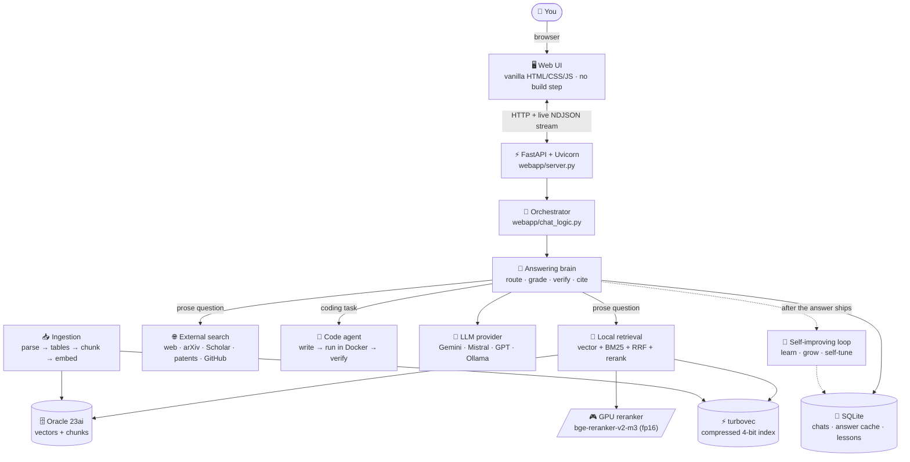
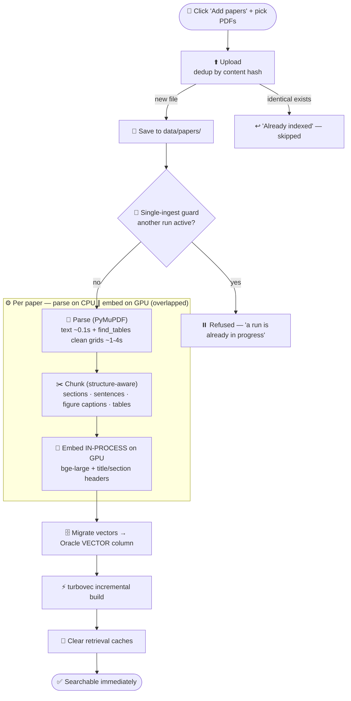
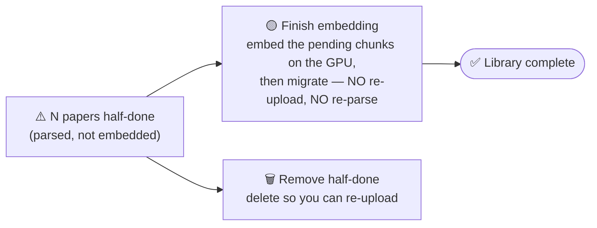
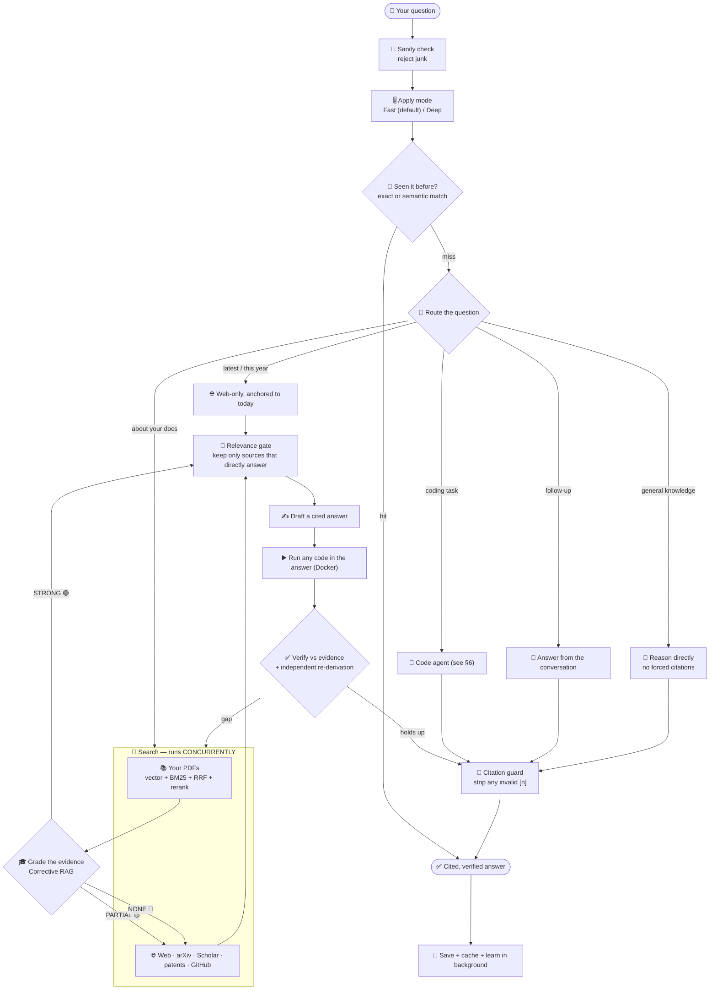
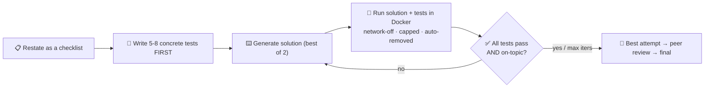
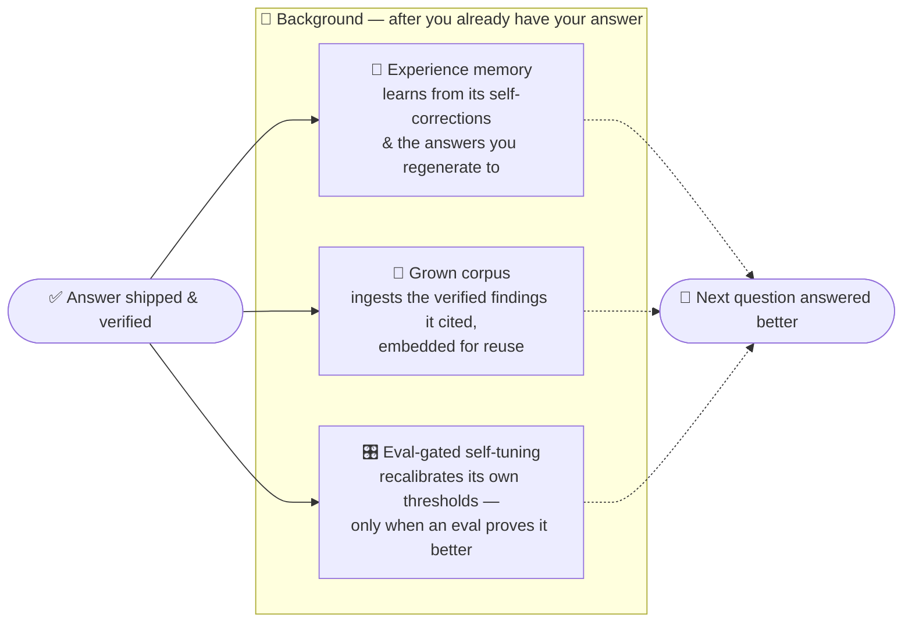
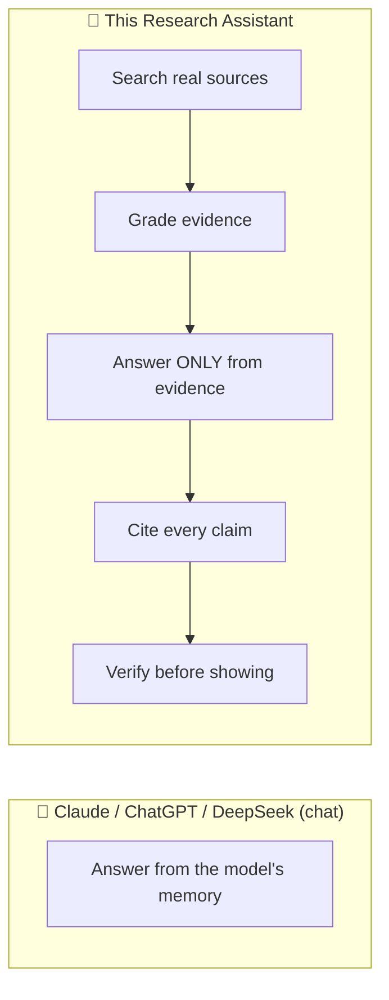

<div align="center">

# 📘 Research Assistant — Complete System Guide

**Everything the system uses, how it works, the two core workflows (add a paper · ask a question) drawn step‑by‑step, and an honest comparison with Claude / ChatGPT / DeepSeek.**

*Diagram‑first. Plain English. Accurate to the current codebase.*

</div>

> Companion docs: [README](../README.md) (overview) · [ARCHITECTURE.md](ARCHITECTURE.md) (engineering map) · [TECH_STACK.md](TECH_STACK.md) (versioned tool list) · [PIPELINE_GUIDE.md](PIPELINE_GUIDE.md) (deep pipeline).

---

## 1. What this is, in one paragraph

A **self‑hosted research assistant** that answers hard questions with **real, cited, verified** answers — and writes runnable code when a question is really a programming task. It is **not** a chatbot answering from memory. For every question it **searches real sources first** (your own PDFs + the open web + arXiv, Semantic Scholar, Wikipedia, patents, GitHub), answers **only from what it found**, **cites every claim**, and **checks the draft against the evidence before you see it**. It runs entirely on your machine, uses **free local models** for the heavy retrieval work, and **gets smarter the more you use it**.

**One honest sentence about where it sits:** it is an *orchestration layer* — it does not replace large models like Claude or GPT, it **wraps whichever model you choose** and makes it grounded, cited, private, and specialised to your library. (See §8.)

---

## 2. The whole system in one picture



**Three rules the whole design follows**

| Rule | What it means |
|---|---|
| **Reuse, don't rewrite** | Optional layers wrap proven functions; core paths stay untouched when a flag is off. |
| **Fallback‑safe** | DB off → web‑only · GPU absent → CPU · web fails → local evidence still answers. Nothing hard‑crashes. |
| **Lean & private** | One vector path, one parser path, one agent loop. No telemetry. Your data never leaves the machine. |

---

## 3. The technology stack — what & why

> 🟢 always used · 🔵 used in a specific mode · ⚪ optional, off by default

### Application & UI
| Tech | Role here |
|---|---|
| 🟢 **Python 3.11** | The whole backend (`backend/`, `webapp/`). |
| 🟢 **FastAPI + Uvicorn** | The web server and every route; streams answers as **NDJSON** so text appears token‑by‑token. |
| 🟢 **Vanilla HTML/CSS/JS** | The entire UI — **no framework, no bundler**. Edit a file, refresh. |
| 🟢 **marked.js · highlight.js · KaTeX** | Render markdown, code highlighting, and math in answers. |
| 🟢 **itsdangerous · python‑multipart · python‑dotenv** | Signed login cookies · PDF upload parsing · `.env` config. |

### Retrieval engine (the "accuracy" stack)
| Tech | Role here |
|---|---|
| 🟢 **PyTorch (CUDA, fp16)** | Runs the models on the GPU in half precision (≈2× faster, half the VRAM — fits a 6 GB card). |
| 🟢 **sentence‑transformers + transformers** | Load and run the embedder and the reranker. |
| 🟢 **BAAI/bge‑large‑en‑v1.5** (1024‑d) | **The embedder** — turns chunks + queries into vectors. **Local, free, on‑device.** No API, no quota. |
| 🟢 **BAAI/bge‑reranker‑v2‑m3** (cross‑encoder) | **The single biggest accuracy lever** — re‑orders search hits by true query↔passage relevance. GPU fp16, pre‑warmed at startup. |
| 🟢 **In‑house ranking** | **Vector** (meaning) + **BM25** (keywords) + **HyDE** (a second angle) fused with **RRF**, diversified with **MMR**, then reranked. |

### Storage
| Tech | Role here |
|---|---|
| 🟢 **Oracle Database 23ai** | Native `VECTOR` type + `VECTOR_DISTANCE`. Stores `papers` + `chunks` (text + embeddings) — your searchable corpus. |
| 🔵 **turbovec** | A compressed **4‑bit** local vector index — fast nearest‑neighbour with an exact re‑rank (the default backend). |
| 🟢 **SQLite (WAL)** | Chats, the answer‑reuse cache, accounts, and the self‑improvement memory. |

### PDF parsing & ingestion
| Tech | Role here |
|---|---|
| 🟢 **PyMuPDF** | **The default parser** — extracts text from born‑digital PDFs in ~0.1 s/paper, plus clean tables via its built‑in `find_tables()` (heuristic, **no ML, no GPU**, ~1–4 s/paper). |
| ⚪ **Docling** | A heavy ML layout/table parser — **opt‑in** (`ENABLE_DOCLING=true`); skipped by default because it is slow and memory‑hungry on a small GPU. |
| ⚪ **OCR** (PaddleOCR / Tesseract) | Only for scanned / image‑only pages (`ENABLE_OCR`), on the CPU. |

### The chat model & the web
| Tech | Role here |
|---|---|
| 🟢 **openai SDK** | One OpenAI‑compatible client that talks to **any** provider — pick the model in the sidebar, no restart. |
| 🟢 **Gemini · Mistral · GPT · Ollama** | The answer writer. Gemini & Mistral are **free**; local models via Ollama are free; OpenAI is paid. |
| 🟢 **requests + BeautifulSoup** | Fetch web pages / PDFs and extract the readable text. |
| 🟢 **arXiv · Semantic Scholar · Wikipedia · GitHub · Google Patents** | Free scholarly + code + patent search channels, run in parallel. |

### The code agent & its sandbox
| Tech | Role here |
|---|---|
| 🟢 **Docker** | Runs generated Python in a throwaway container: **`--network none`**, CPU/RAM/PID‑capped, hard timeout, non‑root, auto‑removed. Generated code **never** touches the host. |

### Optional (off by default)
| Tech | Role here |
|---|---|
| ⚪ **Langfuse** | Per‑request tracing (latency/cost/quality). No‑op + zero overhead when off. |
| ⚪ **DeepEval** | LLM‑quality gates (faithfulness / relevancy) for the test suite. |

> Full versions are pinned in [`requirements.txt`](../requirements.txt) and listed in [TECH_STACK.md](TECH_STACK.md).

---

## 4. 📄 Workflow A — what happens when you **add a paper**

You click **➕ Add papers**, choose one or more PDFs, and watch a live checklist. Here is everything that happens behind that checklist.



**Step by step (plain English)**

1. **Upload & dedup.** Each PDF is hashed; an identical file already in your library is skipped (no duplicates), otherwise it is saved to `data/papers/`.
2. **Single‑ingest guard.** Only one ingest runs at a time. A second click while one is running is politely refused — this is what stopped the old "double‑click → rate‑limit storm → crawl‑slow" problem.
3. **Parse (fast, no GPU).** **PyMuPDF** pulls the text layer of born‑digital papers almost instantly, and its built‑in **`find_tables()`** extracts tables as clean `|grid|` markdown — **no machine‑learning model, no GPU**. (The heavy Docling parser is *opt‑in* only.)
4. **Chunk (structure‑aware).** The text is split into meaningful pieces — canonical sections, sentence‑packed passages, separate chunks for **figure captions**, **algorithm blocks**, and each **table** — tagged with a `chunk_type`.
5. **Embed (GPU, in‑process).** Each chunk is turned into a 1024‑d vector by the **local bge‑large** model, reusing the already‑warm GPU model (no second model load → no out‑of‑memory crash). A short **"title · section" header** is prepended at embed time so a bare chunk still knows what paper and section it came from (better recall, **zero query‑time cost**).
6. **Migrate + turbovec.** Vectors are written into Oracle's native `VECTOR` column, then the compressed **turbovec** index is updated **incrementally** (only the new chunks).
7. **Caches cleared → instantly searchable.** No server restart needed.

**If something is interrupted** (DB hiccup, cancel) a paper can be left **half‑done** (parsed but not embedded). The library shows a banner with **two** choices:



**Speed:** a typical prose paper is parsed in well under a second; even a 129‑page paper's table scan is ~4 s. Embedding is the only GPU‑bound step and is reused across the batch.

---

## 5. 💬 Workflow B — what happens when you **ask a question**

You type a question (and optionally toggle **Deep**). The answer streams in with inline citations, an evidence‑grade badge, and — for code tasks — a live "wrote → ran → verified" timeline.



**Step by step (plain English)**

1. **Sanity + mode.** Junk questions are rejected. **Fast** (default) skips the *expensive* digging; **Deep** searches more angles and verifies more rounds. The **accuracy bar is identical** in both — Fast never lowers quality, only effort.
2. **Cache.** If you (or anyone) asked something equivalent before, the saved, citation‑repaired answer is reused instantly.
3. **Route.** A *source router* decides what the question actually needs — a **coding task** goes to the agent; a **follow‑up** is answered from the chat; **"latest/this year"** forces a fresh web search anchored to today (never the stale library presented as current); **general knowledge** is reasoned directly with no forced citations; a **question about your documents' subject** triggers retrieval.
4. **Search (concurrent).** Your PDFs (hybrid vector+BM25+rerank) and the web channels run at the same time.
5. **Grade — Corrective RAG.** The system **grades its own evidence before answering**:

   | Grade | Meaning | Action | Badge |
   |---|---|---|---|
   | 🟢 **STRONG** | your PDFs clearly cover it | answer from the library, skip the web | *From your library* |
   | 🟡 **PARTIAL** | relevant but thin | keep PDFs **and** search the web, merge | *Library + web* |
   | 🔵 **NONE** | not in your PDFs | drop local, answer from the web | *From the web* |

6. **Relevance gate.** Topically‑similar‑but‑irrelevant hits are dropped so they can't steer or be cited. If nothing is truly relevant, it answers from reasoning rather than forcing a citation.
7. **Draft → run → verify.** It writes a cited draft, **runs any Python in the answer** in the Docker sandbox, then **scores the draft against the evidence** and does an **independent re‑derivation + sanity checks** (units, magnitude, limiting cases) — a library‑only answer that falls short **escalates to the web** and retries. Self‑consistent ≠ correct, so it double‑checks.
8. **Citation guard.** Every `[n]` is validated; a citation to a source that doesn't exist is **automatically removed**, both in the saved answer and on screen.
9. **Save + learn.** The turn is saved and cached. Then — **after you already have your answer, adding zero latency** — the background learning loops run (§7).

---

## 6. 🤖 How the code agent works (when a question is really code)



Correctness is **machine‑verified, not assumed**: the agent writes its **own tests first**, plus held‑out checks and an independent reference oracle, with an **anti‑reward‑hacking scan** so it can't "game" the tests. If it can't fully verify, it stops honestly — *"partially verified — N/M checks"* — instead of faking a pass. The sandbox limits are **never weakened**.

---

## 7. 🧬 How it gets smarter every day

Three background loops run **after** the answer is delivered, so they cost you **no latency**, and every loop is **fail‑open** (a learning error can never break an answer).



| Loop | Learns from | Why it's safe |
|---|---|---|
| 🧠 **Experience memory** | its own corrections + the answers you **regenerate** to | stores *generalisable guidance*, never facts; preference lessons are shape‑only; recency‑weighted + pruned |
| 🌱 **Grown corpus** | the external findings a **verified** answer actually **cited** | only verified **and** cited passages; deduped; bounded; skipped for "latest" queries |
| 🎛️ **Self‑tuning** | its own scored outcomes through the eval harness | **eval‑gated** (adopt only on a proven gain), bounded, reversible, propose‑only by default |

---

## 8. 🏆 How we compare to Claude, ChatGPT & DeepSeek

**The honest framing first.** Claude, ChatGPT and DeepSeek are *frontier chat models* — enormous, multimodal, and far more capable as raw reasoners than anything that runs on a 6 GB laptop. **This project is not trying to beat them at being a model.** It is a **research harness** that can run *on top of* any of them (it speaks the OpenAI API, so a Claude/GPT key plugs straight in) and adds the things a bare chatbot doesn't give you: **grounding, citations, verification, your private library, privacy, and cost control.**



### Side‑by‑side

| Capability | 📘 **This system** | Claude.ai | ChatGPT | DeepSeek |
|---|---|---|---|---|
| **Grounded in real sources** | ✅ always searches first, answers only from what it found | ⚠️ only with browsing/tools | ⚠️ only with browsing/tools | ⚠️ limited |
| **Every claim cited** | ✅ inline `[n]`, invalid ones auto‑removed | ⚠️ sometimes, can hallucinate refs | ⚠️ sometimes | ⚠️ rarely |
| **Verifies its own answer** | ✅ draft → verify → independent re‑derivation gate | ❌ not built‑in | ❌ not built‑in | ❌ not built‑in |
| **Your private PDF library** | ✅ Oracle vectors, searched with the web | ⚠️ per‑chat uploads, not a persistent corpus | ⚠️ limited | ❌ |
| **Self‑hosted & private** | ✅ runs on your machine, **no telemetry** | ❌ cloud | ❌ cloud | ❌ cloud |
| **Cost** | ✅ free local embeddings + reranker; free Gemini/Mistral | 💲 subscription | 💲 subscription | 💲 / limited free |
| **Code runs in a locked sandbox** | ✅ network‑off Docker + self‑generated tests + anti‑cheat | ⚠️ cloud interpreter | ✅ cloud interpreter | ⚠️ limited |
| **Learns from your usage** | ✅ experience + grown corpus + eval‑gated tuning | ❌ frozen | ⚠️ opt‑in memory (facts only) | ❌ |
| **Multi‑source breadth** | ✅ web + arXiv + Scholar + Wikipedia + patents + GitHub + your PDFs | ⚠️ web only | ⚠️ web only | ⚠️ web only |
| **Raw model capability** | ⚠️ as good as the model you plug in | ✅✅ frontier | ✅✅ frontier | ✅ strong |
| **Multimodal (image/audio/video)** | ❌ text‑focused | ✅ | ✅ | ⚠️ partial |
| **Zero setup / mobile apps / voice** | ❌ you self‑host it | ✅ | ✅ | ✅ |

### Bottom line

- **Use a frontier chatbot** when you want the smartest possible single answer, multimodal input, or zero setup.
- **Use this system** when the answer must be **trustworthy** — grounded in **your** sources, **cited**, **verified**, **private**, and **free** — which is exactly what research, due diligence, and literature work demand. And because it's model‑agnostic, you can have **both**: point it at Claude or GPT and get frontier reasoning *with* citations and verification on top.

---

## 9. ✨ What we've improved (and what's next)

**Recently improved**
- **Free, local embeddings** — dropped the paid Google embedding model for **bge‑large‑en‑v1.5**: zero cost, zero quota, fully offline, and it frees memory/disk.
- **Fast, GPU‑safe ingestion** — parsing runs on the CPU while embedding runs **in‑process** on the GPU (no second model load → no out‑of‑memory crash); prose papers index in well under a second.
- **Clean tables for free** — PyMuPDF `find_tables()` now emits proper `|grid|` table chunks with **no ML and no GPU**; the heavy Docling parser is opt‑in only.
- **Contextual "headers" at embed time** — every chunk carries its paper title + section, improving recall with **zero query‑time latency**.
- **"Finish embedding" in the library** — complete half‑done papers from the UI without re‑uploading.
- **Concurrency‑safe** — a single‑ingest guard + a thread‑safe embed lock stop double‑runs and rate‑limit storms.

**Natural next steps**
- A small **incremental progress bar** during a large re‑embed.
- **Cloud‑parser escalation** for a handful of table‑critical PDFs (best‑quality tables on demand).
- **Multimodal figures** (understand charts/figures, not just their captions) — the one area the frontier chatbots lead.

---

## 10. ⚡ Quick reference

```bash
python run.py                 # serve the app at http://localhost:8600
python run.py --lan           # share on your network
python run.py --share         # temporary public link (Cloudflare tunnel)
python pipeline.py            # build/refresh the PDF index
python pipeline.py --status   # what's indexed + GPU/CPU
python -m pytest -q           # full offline test suite
```

| Knob (`.env`) | Effect |
|---|---|
| `ENABLE_LOCAL_RAG` · `ORACLE_DSN` | search your own PDFs (needs Oracle 23ai) |
| `ENABLE_PYMUPDF_TABLES` | clean `find_tables()` tables (on) |
| `ENABLE_DOCLING` | heavy ML parser (off — opt‑in) |
| `CONTEXTUAL_CHUNKS` | LLM situating sentence per chunk (off — headers are always on) |
| `DEVICE` | `auto` uses your GPU when present |
| `CRAG_ENABLED` | grade‑then‑act retrieval (on) |

---

<div align="center">
<sub>Self‑hosted · grounded · cited · verified · private · free. Pair with <a href="ARCHITECTURE.md">ARCHITECTURE.md</a> for the engineering map.</sub>
</div>
