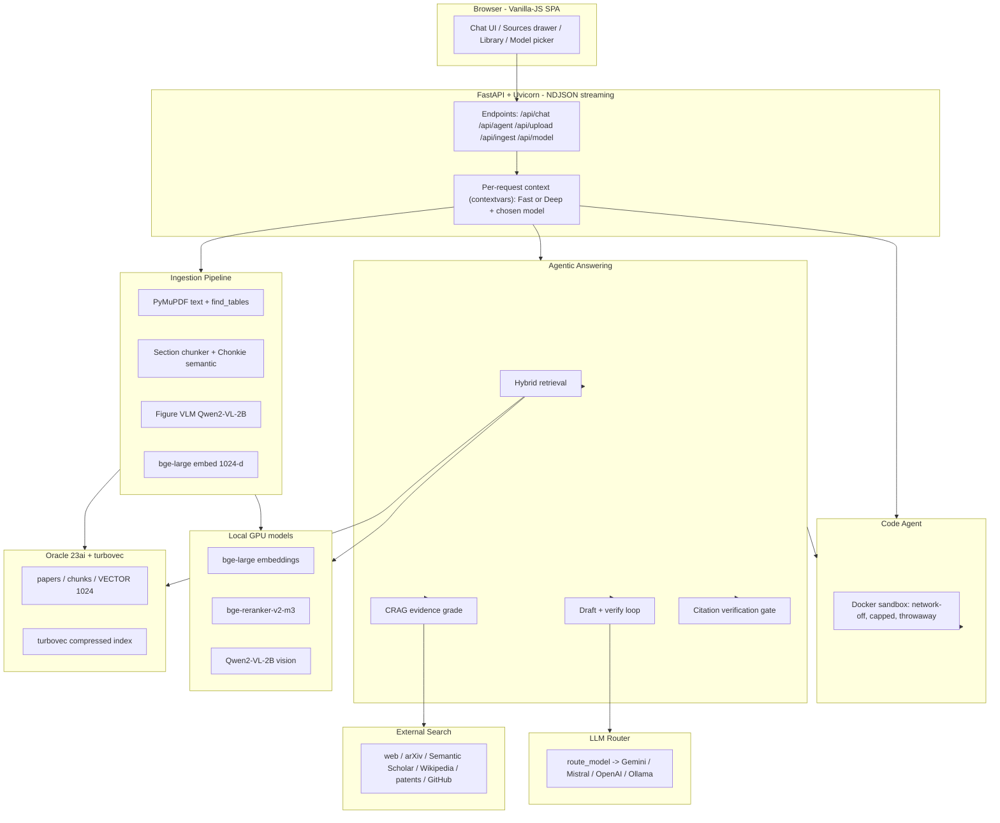
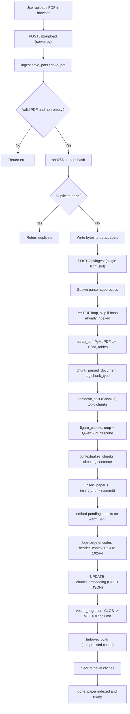
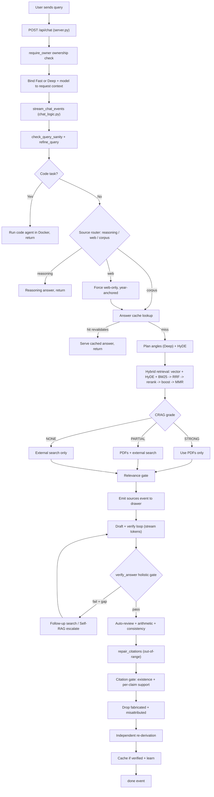

# Audio Research Assistant — System Report

**A self-hosted, verification-first agentic RAG platform for research papers.**

> Generated from a deep, code-grounded analysis of the repository (12 parallel subsystem audits).
> Reflects the code as of the latest `main`. Diagrams use **Mermaid** — if your PDF tool renders
> Mermaid they appear as flowcharts; every diagram is also written out as numbered steps so the
> document is fully understandable even without diagram rendering.

| | |
|---|---|
| **What it is** | A private RAG research assistant: ingest your own PDFs, ask questions, get **cited, verified** answers. |
| **Stack** | Python 3.11 · FastAPI · Oracle 23ai (native VECTOR) · local GPU models · OpenAI-compatible LLM routing |
| **Runs on** | A single workstation (6 GB RTX 3050 + 16 GB RAM target) — no cloud GPUs required |
| **Core moat** | Enforced grounding + **deterministic citation verification** + privacy + near-zero marginal cost |

---

## Table of Contents

1. [Executive Summary](#1-executive-summary)
2. [System Architecture](#2-system-architecture)
3. [Technology & Tools Catalog](#3-technology--tools-catalog)
4. [Workflow A — Uploading a Paper](#4-workflow-a--uploading-a-paper)
5. [Workflow B — Asking a Question](#5-workflow-b--asking-a-question)
6. [Accuracy & Error Rate](#6-accuracy--error-rate)
7. [Competitive Comparison (vs Claude / ChatGPT / DeepSeek / Perplexity)](#7-competitive-comparison)
8. [Improvement Roadmap](#8-improvement-roadmap)
9. [Appendix — Versions, Flags & Key Files](#9-appendix)

---

## 1. Executive Summary

The Audio Research Assistant turns a folder of research PDFs into a **searchable, citable knowledge
base** and answers questions about it with an agentic pipeline that is unusually aggressive about
**grounding** and **not hallucinating**.

What makes it different from a generic chatbot:

- **Private, self-owned corpus.** Your PDFs are parsed, embedded locally with `bge-large`, and stored
  as Oracle 23ai vectors on *your* machine. Nothing about your library leaves the box (except the
  text you send to whichever chat model you point at — which can be a fully local Ollama model).
- **Deterministic citation verification.** Every cited DOI / arXiv id is checked against real
  bibliographic indexes (Crossref / OpenAlex / arXiv). A reference that provably doesn't exist is
  deleted as *fabricated*, and an LLM judge drops citations whose source doesn't actually support the
  specific claim (*misattributed*). This is a hard anti-hallucination guarantee the big hosted
  assistants do not expose.
- **State-of-the-art, fully transparent retrieval.** Vector + HyDE + BM25F → Reciprocal Rank Fusion →
  cross-encoder rerank → chunk-type boost → MMR diversification. Every knob is in your `.env`.
- **A real agentic loop, not a single prompt.** Source routing → CRAG evidence grading → relevance
  gate → draft → verify → (Self-RAG escalation) → peer review → arithmetic check → independent
  re-derivation → citation gate. An answer is only labeled *verified* when multiple independent checks
  agree.
- **A sandboxed code agent.** AI-written Python runs *only* inside a throwaway, network-off Docker
  container, and is accepted only when it passes generated tests + held-out checks (with an
  anti-reward-hacking scanner).

> **This deployment's configuration.** The shipped *code defaults* keep heavy enrichments OFF
> (figure understanding, semantic chunking, contextual sentences). **This instance has them ON** —
> figure understanding is enabled and the corpus currently carries **389 figure-description chunks
> across ~94% of papers**, and semantic chunking is enabled. Defaults vs this instance are flagged
> throughout.

---

## 2. System Architecture



**Layers at a glance**

| Layer | Responsibility | Key property |
|---|---|---|
| **Frontend** (`webapp/static/`) | Vanilla-JS SPA, no build step; renders markdown/math/citations, streams events | Lightweight, CDN-loaded libs |
| **Web server** (`webapp/server.py`) | FastAPI routing, auth/session, NDJSON streaming | Thin wiring; per-request isolation |
| **Ingestion** (`backend/ingestion/`) | PDF → parsed → chunked → embedded → indexed | Fail-soft at every optional stage |
| **Retrieval** (`backend/retrieval/`) | Hybrid search over the local corpus | Fully transparent + tunable |
| **Answering** (`backend/answering/`) | Agentic draft + the verification gauntlet | Conservative; "verified" is earned |
| **External search** (`backend/external_search/`) | Web + academic + code search | Concurrent, fail-isolated |
| **Code agent** (`backend/agent/`) | Writes & runs Python, self-verifies | Docker-sandboxed, non-negotiable limits |
| **LLM** (`backend/llm/`) | One OpenAI-compatible client for all vendors | Per-request model, vendor routing |
| **Database** (`backend/database/`) | Oracle 23ai store + native VECTOR + turbovec | Source-of-truth; derived indexes rebuildable |

---

## 3. Technology & Tools Catalog

Versions are pinned in `requirements.txt`. "Default" = shipped default; this instance overrides some
(noted inline).

### 3.1 Ingestion & Indexing

| Tool / Model | Version | What it does & how it works |
|---|---|---|
| **PyMuPDF (fitz)** | 1.27.2.3 | **Default parser.** Extracts per-page text via `get_text("blocks")`, re-sorts blocks into reading order, and pulls clean grid tables with `find_tables()` (heuristic line/whitespace detection — no ML/GPU). Also renders page pixmaps for OCR and figure crops. |
| **Docling** | 2.93.0 | *Opt-in (OFF)* heavy ML layout/table parser. Runs only on table-rich PDFs and only with enough free RAM; output used only if it covers ≥60% of the PyMuPDF text. Falls back to PyMuPDF on any error. |
| **Qwen2-VL-2B-Instruct** | transformers 4.57.6 | **Figure understanding** (this instance: **ON**). Crops each figure region (pdffigures2-style), describes it once with a grounded prompt (caption + the paper's own sentences), caches by content hash, stores a searchable `figure` chunk. fp16, ~4.8 GB VRAM (fits 6 GB). `torch.cuda.empty_cache()` after every figure so VRAM can't accumulate. |
| **Chonkie SemanticChunker + Model2Vec** | 1.6.8 / 0.8.2 | **Semantic chunking** (this instance: **ON**). Uses a tiny CPU static embedder (`potion-base-8M`, ~30 MB) to split prose where the topic shifts (threshold 0.75) instead of at a fixed length. Falls back to the legacy sentence-packer on any error. |
| **BAAI/bge-large-en-v1.5** | sentence-transformers 5.5.0 | **The embedding model.** 1024-d, L2-normalized, fp16 on CUDA with automatic CPU-OOM fallback. Asymmetric: documents embedded raw, queries get a retrieval-instruction prefix. A **free contextual header** (paper title + section) is prepended at embed time. |
| **Contextual Retrieval LLM** | Gemini/Mistral | *Opt-in (OFF)* Anthropic-style per-chunk "situating sentence", batched + disk-cached. The free title+section header gives most of the benefit without LLM cost. |
| **PaddleOCR + Tesseract** | optional | *Opt-in (OFF)* CPU OCR for scanned/text-poor pages only. |
| **Oracle 23ai + python-oracledb** | oracledb 4.0.0 | Stores `papers` + `chunks`; embeddings written as JSON CLOB then migrated to a native `VECTOR(1024, FLOAT32)` column. |

**Reliability:** every paper is wrapped in try/except (a parse error, OOM, or duplicate never aborts
the batch); every optional component degrades to the safe default.

### 3.2 Hybrid Retrieval

| Technique | Detail |
|---|---|
| **Dense vector search** | Oracle `VECTOR_DISTANCE(..., COSINE)` exact search (or turbovec) on the original query **and** a HyDE-expanded pseudo-document. |
| **HyDE expansion** | `hyde_generator.py` — a **local, no-LLM** template approach: detects intent + audio-DSP topic, fills a hypothetical-answer paragraph, appends the original query. Widens dense recall. |
| **BM25F keyword search** | Hand-rolled field-weighted BM25 (title 3.0 > concepts 2.5 > section 2.0 > body 1.0) for exact-term/acronym matches. |
| **Reciprocal Rank Fusion** | `k=60`, rank-based — robust to the scale mismatch between cosine and BM25. |
| **Cross-encoder rerank** | `BAAI/bge-reranker-v2-m3` (fp16, pre-warmed) scores each candidate against the **original** question. Degrades to a lexical reranker if it can't load. |
| **Chunk-type boost** | Small additive nudges for equation/algorithm/metrics chunks on matching questions. |
| **MMR diversification** | Greedy MMR (λ=0.7) with a per-paper cap so you don't get five near-duplicates. |
| **turbovec** (0.7.0) | Optional compressed (4-bit) ANN cache keyed by chunk id; over-fetches 3× then re-hydrates from Oracle. Oracle stays the exact source-of-truth/fallback. *(Active in this instance.)* |

### 3.3 Answering & Verification

The "gauntlet" an answer passes before it's shown / labeled *verified* / cached:

| Stage | What it guarantees |
|---|---|
| **Source router** | Decides *reasoning* vs *web* vs *corpus* before retrieving at all. |
| **CRAG evidence grade** | Labels local evidence STRONG / PARTIAL / NONE; escalates to web when the library is thin. |
| **Relevance gate** | Drops topically-similar-but-irrelevant sources before drafting. |
| **Draft + verify loop** | Streams a cited draft; a strict evidence verifier scores grounding; gaps trigger follow-up search + a guided rewrite (bounded). |
| **Arithmetic check** | Deterministic — overrides wrong `EXPR = NUM` equalities (no LLM). |
| **Consistency check** | Confirms the conclusion matches the shown work. |
| **Citation gate** | **Existence**: DOI/arXiv ids verified against Crossref/OpenAlex/arXiv → fabricated refs deleted. **Support**: an LLM judge drops citations the source doesn't actually support. Code/math spans are masked so `arr[0]` is never read as a citation. |
| **Independent re-derivation** | A from-scratch re-derivation must *agree* (plus unit/magnitude/limiting-case sanity) before the *verified* badge. |

**Fail-open by design:** any provider/lookup error keeps the answer as drafted — the gates *reduce*
bad citations, they never crash a turn or fabricate a contradiction.

### 3.4 LLM Provider & Model Routing

- **One OpenAI-compatible client** (`openai` 1.109.1) fronts every vendor — only `base_url` + key change.
- **`route_model()`** maps a model id to the right endpoint: `gemini-*` → Google's OpenAI-compatible
  endpoint, `mistral/codestral/pixtral/ministral/...` → Mistral, `gpt-*` → OpenAI, else → OpenAI.
- **Catalog:** `gemini-2.5-flash` (default, free), `mistral-large-latest` (free), `codestral-latest`
  (free), `gpt-5.5` (paid). **Any other model id also works** — typed in the picker, routed by vendor prefix.
- **Per-request model** is carried in each request body and bound to a `contextvars` context — never
  `os.environ` — so concurrent users with different models never clobber each other.
- **Resilience:** the *agent* path wraps a `ResilientProvider` that retries 429/timeout/5xx and falls
  over to the next model. *(The main chat path currently has timeout but no 429-failover — see roadmap.)*

### 3.5 External / Web-wide Search

Concurrent, fail-isolated channels merged into the same numbered evidence block as local chunks:

| Channel | Source | Key needed? |
|---|---|---|
| Web | Tavily / Brave / SerpApi, **DuckDuckGo** fallback | Key for Tavily/Brave/SerpApi; DDG free |
| Academic | **arXiv** (reads full PDFs), **Semantic Scholar**, **Wikipedia** | Free, no key |
| Patents | Google Patents via the web provider | Uses the web channel |
| Code | **GitHub** repos/READMEs + optional code search | Free (token enables code search) |
| Online PDFs | PyMuPDF page extraction of fetched PDFs | Free |

All wrapped in one hardened fetcher (timeout, 3 MB cap, 429 backoff, 1-hour disk cache). **Note:** by
the owner's explicit choice there is **no SSRF/private-IP filter** — unrestricted fetch reach is intentional.

### 3.6 Code Agent & Docker Sandbox

A test-first, self-verifying agent (AlphaCodium-style). The **security boundary is the Docker sandbox**:

```
docker run --rm -i --network none --memory 512m --cpus 1.0 --pids-limit 128 <image> python -
```

- Code is piped via **stdin** (no host file written, no directory mounted), runs as a **non-root** user,
  in a **throwaway** (`--rm`), **network-off** container, with **memory/CPU/PID caps** and a **wall-clock timeout**.
- **If Docker is unavailable, it refuses to run — never falls back to the host.**
- A candidate is accepted only when it passes **generated tests + held-out/invariant checks across
  multiple seeds** — never on "it ran". A static **anti-reward-hacking scanner** rejects test-gaming.
- Verdicts are honest: `verified` / `partial` / `rejected_cheating` / `failed`.

### 3.7 Web App & Frontend

- **FastAPI + Uvicorn**, served at `http://localhost:8600`. Streaming is **manual NDJSON over POST +
  `fetch` ReadableStream** (not SSE/EventSource).
- **Fast vs Deep** profiles are server-resolved: Fast = 0 sub-queries, 1 verify round, lean budgets;
  Deep = 3 sub-queries, 3 verify rounds, auto-review on, larger budgets.
- **Vanilla-JS SPA** (no bundler): `marked` (markdown), `highlight.js` (code), `KaTeX` (math),
  a reasoning timeline, an agent timeline, and a navigable **sources drawer**.
- **Model picker** sends the chosen model per request; a custom (non-catalog) model is surfaced as a
  "Custom" row. *(Recently fixed so clicking a model switches smoothly and the selection sticks.)*

### 3.8 Database & Vector Store

- **Oracle 23ai Free** in Docker (`oracle-ai-db`, `FREEPDB1:1521`) is the single source of truth.
- Embeddings: JSON CLOB → migrated to native `VECTOR(1024, FLOAT32)`; the migration **auto-sizes** the
  column to the live model dimension (avoids `ORA-51803`).
- **Default search is exact brute-force cosine** → 100% recall at current scale; an optional IVF index
  and the turbovec cache are accelerators for larger corpora.
- All derived indexes (VECTOR column, turbovec) are rebuildable from the CLOB source of truth.

---

## 4. Workflow A — Uploading a Paper

*What happens from "drop a PDF" to "searchable & ready".*



**Step by step**

1. **Upload** → `POST /api/upload` (`webapp/server.py`) reads the file and calls `ingest.save_pdfs`.
2. **Dedup & save** — validates the `%PDF` magic, computes a **sha256**, checks it against the library,
   writes to a collision-safe path. Identical content → reported as duplicate and stopped.
3. **Start indexing** → `POST /api/ingest` claims a **single-flight slot** (only one indexing run at a
   time) and streams progress as NDJSON.
4. **Parser subprocess** — runs `backend.ingestion.ingest_papers` so CPU parsing and GPU embedding overlap.
5. **Hash skip** — already-indexed papers (by `file_hash`) are skipped.
6. **Parse** — PyMuPDF text in reading order; `find_tables()` captures real grid tables (OCR only on text-poor pages, if enabled).
7. **Chunk & tag** — split by section; each chunk tagged `text`/`table`/`equation`/`algorithm` + audio concepts (so retrieval can favor the right evidence). Long tables are split into header-preserving row groups.
8. **Semantic chunking** *(this instance: on)* — Chonkie picks topic-coherent boundaries.
9. **Figure understanding** *(this instance: on)* — each figure cropped, described once by Qwen2-VL-2B, cached, stored as a searchable `figure` chunk.
10. **Contextual sentence** *(opt-in)* — one situating sentence per chunk.
11. **Insert** — `papers` row + `chunks` rows committed to Oracle.
12. **Embed** — `bge-large` encodes `title | section + context + text` → 1024-d, written as JSON CLOB.
13. **Migrate** — CLOB → native `VECTOR` column (auto-dimension).
14. **turbovec build** — compressed cache (incremental when the corpus only grew).
15. **Refresh & finish** — retrieval caches cleared; "Paper indexed and ready" emitted.

> **In plain English:** the app fingerprints the file so it never indexes the same paper twice, reads
> the text and tables, optionally reads the *figures* with a small vision model, turns every piece into
> a 1024-number "meaning vector", stores those in a database built for vector search, and makes the
> paper searchable immediately — all while failing safely if any optional step is unavailable.

---

## 5. Workflow B — Asking a Question

*The full agentic path from "send" to a cited, verified answer.*



**Step by step (condensed)**

1. **Request & ownership** — `POST /api/chat`; `_require_owner` checks you own the conversation before any streaming.
2. **Bind profile** — Fast/Deep + chosen model bound to the request context (isolated per request).
3. **Cheap gatekeeping** — sanity check, silent typo-fix, **code-task classifier** (a coding task is handed to the Docker agent instead), follow-up detection.
4. **Source router** — *reasoning* (answer from model knowledge), *web* (must be fresh), or *corpus* (needs documents).
5. **Answer cache** — a near-identical earlier question is reused only after a consistency re-check.
6. **Retrieval** — HyDE expansion → 3 parallel rankers (vector original, vector HyDE, BM25F) → RRF → cross-encoder rerank → chunk-type boost → MMR diversify → adaptive source selection.
7. **CRAG grade** — STRONG → PDFs only; PARTIAL/NONE → fan out to web/arXiv/Semantic Scholar/Wikipedia/patents/GitHub concurrently and merge.
8. **Relevance gate** → **sources drawer** populated.
9. **Draft + verify loop** — cited tokens streamed; a verifier scores grounding; a concrete gap triggers more search + a guided rewrite (bounded by the mode's loop budget). A STRONG-but-failing answer triggers a one-time Self-RAG web escalation.
10. **Post-checks** — peer review (Deep), deterministic arithmetic fix, conclusion-matches-work consistency.
11. **Citation gate** — out-of-range `[n]` stripped; DOI/arXiv existence checked (fabricated removed); per-claim LLM support judge (misattributed removed).
12. **Finalize** — drawer pruned to actually-cited sources; **independent re-derivation** sanity-checks; only a genuinely verified answer is cached and learned from; `done` event closes the stream.

> **In plain English:** before searching, it figures out whether your question even needs your papers.
> When it does, it runs several searches at once, grades how good the evidence is, and pulls in the web
> only if your library is thin. It then writes the answer **with citations**, re-checks it several
> independent ways, and *mechanically deletes any citation that's fake or doesn't support the sentence
> it's attached to*. It would rather admit a gap than guess.

---

## 6. Accuracy & Error Rate

> **Honesty first:** retrieval is the only area with committed measurements. Treat answer/citation/
> figure accuracy as *design arguments backed by unit tests*, not measured rates. The realistic
> accuracy anchor is the **hard retrieval recall ≈ 0.88**.

### 6.1 What is actually measured

| Eval | Set | Result | Caveat |
|---|---|---|---|
| **A/B chunking** (`evaluate_retrieval.py`) | 18 **easy** named-paper Qs | Semantic chunking: `paper_recall@1 = 1.0`, `MRR = 1.0` (legacy 0.944 / 0.972). Semantic strictly dominates. | Easy set + substring term-matching → **optimistic**. |
| **Hard cluster discrimination** (`cluster_eval.py`) | 26 **hard** Qs (describe a paper without naming it; must beat topically-identical siblings) | `recall@1 = @3 = @5 = @10 = MRR = 0.8846` → **≈11.5% hard-miss** | The **honest anchor**. Recall flat across k ⇒ hits are clean rank-1, misses are *total* (paper absent from top-10). n=26 ⇒ wide CI. |
| **End-to-end answer** (`evaluate_llm.py`) | wired to the live prompt path | **UNMEASURED** — no scorecard committed; default coverage metric is substring-based | Biggest visibility gap. Only `--judge` mode gives a defensible number; not run. |
| **Figure description** | unit tests only | **UNMEASURED** — plumbing tested, *quality* never scored | Default OFF in code (ON here). |
| **Citation gate** | unit tests | Effectiveness **asserted, not quantified** | Fail-open ⇒ reduces but can't guarantee zero bad citations. |

### 6.2 Error modes & residual risk

| Error mode | Mitigation | Residual risk |
|---|---|---|
| **Hard retrieval miss** (right paper absent from top-10 on a paraphrased query) | Hybrid retrieval + cluster eval + semantic chunking | **Measured ≈11.5%**; a miss is total → answer leans on a wrong sibling or general knowledge |
| **Fabricated / misattributed citation** | Deterministic DOI/arXiv existence + LLM support judge; fabricated → un-verified | Gate is **fail-open**: outages/title-only/web sources are kept; judge can err. No measured precision/recall |
| **Figure mis-description** | Crop-to-region + grounded prompt + "never invent values"; describe-once cache | Quality unmeasured; ambiguous layout → whole-page fallback can mix figures; a 2B VLM is weak at fine numeric reading |
| **LLM 429 / quota / timeout** | Agent path has retry+failover; figure/biblio paths have backoff | **Main chat stream path** has timeout but no 429-failover → a quota hit surfaces as a failed/partial answer and silently lowers the *verified* rate |
| **Table / large-chunk truncation** | Header-preserving table row-group splitting (unit-tested) | Only applies to *parser-extracted* tables; a table rendered as flowing text can still be truncated |
| **Embedding-time CUDA OOM** (6 GB GPU) | Catches OOM, retries on CPU at smaller batch | CPU fallback is slow; figure VLM + server contending for the GPU → VLM load fails and figures are silently skipped |
| **Over-optimistic eval metrics** | Paper-level gold; punctuation-normalized matching (unit-tested) | Substring matching inflates scores; small in-domain sets → trust 0.88, not the near-perfect A/B numbers |

### 6.3 The honest bottom line

- **Retrieval:** essentially solved on easy queries; **~88% recall** on hard, realistic ones.
- **Answers/citations/figures:** guarded by layered fail-open checks + unit tests, **not yet quantified**.
- The verification stack is deliberately **conservative** — the dominant residual error is *silently
  dropping correct evidence* (a retrieval miss) or *quietly withholding the "verified" badge* under
  quota pressure, **not** confidently asserting a wrong, badge-stamped answer. That's the right failure
  direction for a research tool.

---

## 7. Competitive Comparison

*vs the hosted assistants (Claude, ChatGPT, DeepSeek, Perplexity). Claims verified against the code.*

| Capability | This system | Hosted assistants | Verdict |
|---|---|---|---|
| **Private local-PDF corpus** | Persistent, self-owned Oracle vector index; transparent, tunable retrieval; offline once ingested | File uploads / Projects / Spaces, but vendor-hosted, capped, opaque retrieval | **This system wins** for a persistent private library |
| **Deterministic citation verification** | DOI/arXiv existence checks + per-claim support judge mechanically delete fabricated/misattributed refs | Citations attached, but no mechanical existence/support gate | **This system wins clearly** |
| **Figure / chart understanding** | Cropped figures described by a small local VLM at ingest, then *searchable* (default-off; on here) | Always-on frontier multimodal; live visual Q&A | **Hosted wins** per-image; this system's edge is figures become retrievable |
| **Hybrid retrieval quality** | vector + HyDE + BM25F + RRF + cross-encoder + MMR, every knob tunable | Well-engineered but a black box | **This system wins** on transparency & tunability |
| **Sandboxed code execution** | Self-hosted Docker, you own the limits, custom images, anti-reward-hacking loop | Polished, zero-setup, great data-analysis UX | **Even** — different axes |
| **Web + academic search** | arXiv full-text + S2 + patents + GitHub in one concurrent pass | Perplexity/ChatGPT excel at breadth, freshness, scale | **Hosted wins** on breadth/freshness |
| **Cost (sustained use)** | Embeddings/rerank/VLM local & free; free academic search; a free chat key suffices | Metered subscriptions / per-token billing | **This system wins** on marginal cost |
| **Latency** | Fast local retrieval, but deep verification + Docker startup add time | Large optimized fleets, low steady latency | **Hosted wins** on raw latency |
| **Privacy / data control** | Self-hosted, no telemetry; can run air-gapped with a local model | Processed on vendor servers under their policies | **This system wins** on data sovereignty |
| **Customizability** | MIT, fully forkable; every stage editable; self-tuning loops | Config only (custom instructions, GPTs/Projects) | **This system wins decisively** |
| **Accuracy / hallucination control** | Enforced grounding + layered verification + citation gate | Excellent raw reasoning; grounding best-effort | **Split** — this system wins on *enforced* faithfulness; hosted wins on raw model intelligence |

**Where this system wins:** deterministic citation verification · private self-owned corpus ·
transparent tunable retrieval · near-zero marginal cost · privacy/air-gap · full customizability ·
sandbox ownership.

**Where it loses:** raw figure/chart vision · raw model reasoning (only as smart as the chat model you
point it at) · web breadth/freshness · latency · zero-setup convenience · turnkey polish · the operator
carries the GPU/Docker/Oracle burden.

> **The honest framing:** this is a **verification-and-privacy-first RAG layer**, complementary to (not
> a strict substitute for) the general-purpose frontier assistants. Its moat is *enforced grounding +
> citation faithfulness + privacy + cost + customizability* over a private research-paper corpus.

---

## 8. Improvement Roadmap

Prioritized across all subsystems. Effort tags from the audits.

### Tier 1 — Quick wins (low effort, high payoff)

1. **Harden the Docker sandbox further** *(low)* — add `--read-only` rootfs + `--tmpfs /tmp`,
   `--security-opt no-new-privileges`, `--cap-drop ALL`. Already non-root + network-off; this closes
   the writable-layer / default-capability surface with zero behavior change. **(Security.)**
2. **Add 429/timeout retry + model failover to the MAIN chat stream** *(medium)* — today only the
   *agent* path is resilient; a Gemini quota hit during normal chat should degrade to Mistral instead
   of producing a failed/partial answer and silently lowering the verified rate. **(Reliability — high impact.)**
3. **Run & commit an end-to-end `evaluate_llm.py --judge` scorecard** *(high value, modest effort)* —
   the single biggest *visibility* gap; replace the substring coverage metric with the LLM-judge score
   as the headline accuracy number. **(Measurability.)**
4. **Write `embedding_vec` directly during embedding** *(medium)* — skip the separate CLOB→VECTOR
   migration scan and eliminate the window where a freshly embedded chunk is briefly unsearchable.
5. **Invalidate the in-process BM25 cache on live ingest** *(low)* — key it on the same Oracle
   signature turbovec already computes, so a long-running server doesn't serve stale lexical stats.
6. **Add an Oracle session pool** *(low)* — replace per-call `connect()/close()` to cut per-query
   latency under concurrent load.
7. **Cache the citation support-judge verdicts** *(low)* — keyed by `(claim hash, source id)`, like
   existence already is, to cut rerun cost/latency.
8. **Pin frontend CDN deps + add SRI** *(low)* — `marked` uses a floating `latest` tag; lock versions
   and add integrity hashes.

### Tier 2 — Quality & correctness (medium effort)

9. **Real LLM-HyDE for Deep mode** — replace the fixed audio-DSP template with a genuine
   hypothetical-answer generation (keep the template as the Fast/offline fallback) to lift recall on
   novel/cross-topic queries. **(Directly attacks the ~11.5% hard-miss.)**
10. **Upgrade MMR similarity from word-Jaccard to embedding cosine** — better de-duplication of
    semantically-redundant chunks with different vocabulary.
11. **Diagnose & drive down the 3 current hard-eval misses** — they're *total* misses (absent from
    top-10), so tune RRF `k`, rerank weighting, and BM25-vs-vector contribution.
12. **Figure-description accuracy eval** — a small labeled set scored by an LLM judge; flag
    whole-page-fallback crops as low-confidence to curb cross-figure contamination.
13. **Quantify the citation gate** — labeled (claim, source) pairs to measure support-judge
    precision/recall; existence-check title-only/web sources instead of trusting "exists by construction".
14. **Surface per-claim verdicts as UI provenance** — persist existence + support decisions and show
    them on hover, turning invisible filtering into auditable trust.
15. **Grow the gold sets** — more hard cluster queries (quantum-EC, speech-restoration, deepfake) +
    "no-answer-in-corpus" negatives to measure false grounding.

### Tier 3 — Strategic / scale

16. **Multi-worker safety** — move in-process caches, the rate limiter, and the single-flight ingest
    slot to a shared store (or document the single-process assumption) before running multiple Uvicorn workers.
17. **Auto-select the ANN index by corpus size** — switch from exact cosine to the on-disk IVF index
    above a row threshold automatically, keeping latency flat as the library grows.
18. **Pipeline parsing (CPU) with embedding (GPU) at the batch level** — keep the GPU busy during
    CPU-bound parsing for large libraries (the web UI already overlaps them).
19. **Optional, env-gated SSRF guard** — default-off to honor the owner's choice, but available to flip
    on for any future internet-facing/multi-tenant deployment; fix the now-stale "SSRF-guarded" comments.
20. **Persist eval results over time + wire into CI / a nightly routine** — catch retrieval/answer
    regressions automatically instead of discovering them ad hoc.

---

## 9. Appendix

### 9.1 Dependency versions (from `requirements.txt`)

| Area | Packages |
|---|---|
| Web | `fastapi==0.136.1`, `uvicorn==0.46.0`, `python-multipart==0.0.28`, `itsdangerous==2.2.0` |
| Embeddings / ML | `sentence-transformers==5.5.0`, `transformers==4.57.6`, `torch==2.7.1` (+cu126 for GPU) |
| Parsing | `PyMuPDF==1.27.2.3`, `pypdf==6.11.0`, `docling==2.93.0` (opt-in) |
| Chunking | `chonkie==1.6.8`, `model2vec==0.8.2` |
| Vector store | `oracledb==4.0.0`, `turbovec==0.7.0` |
| LLM | `openai==1.109.1`, `google-genai==1.75.0` |
| Web search | `requests==2.34.1`, `beautifulsoup4==4.14.3` |
| Numerics | `numpy==2.3.5`, `scipy==1.17.1`, `pandas==3.0.3` |
| Observability / eval | `langfuse==4.7.1`, `deepeval==4.0.6` |
| Quality | `pytest==9.0.3`, `pyflakes==3.4.0`, `vulture==2.16` |

### 9.2 Models

| Role | Model | Notes |
|---|---|---|
| Text embedding | `BAAI/bge-large-en-v1.5` | 1024-d, L2-normalized, fp16; alt `bge-m3` |
| Reranker | `BAAI/bge-reranker-v2-m3` | cross-encoder, fp16, lexical fallback |
| Figure VLM | `Qwen/Qwen2-VL-2B-Instruct` | ~4.8 GB VRAM; configurable via `FIGURE_VLM_MODEL` |
| Semantic chunker | `minishlab/potion-base-8M` (Model2Vec) | CPU static embeddings |
| Chat (catalog) | `gemini-2.5-flash` · `mistral-large-latest` · `codestral-latest` · `gpt-5.5` | any model id also routable |

### 9.3 Key feature flags (`.env`)

| Flag | Default | This instance |
|---|---|---|
| `SEMANTIC_CHUNKER` | off | **on** |
| `ENABLE_FIGURE_UNDERSTANDING` | off | **on** |
| `FIGURE_BACKEND` | `local` (Qwen2-VL) | `local` |
| `CONTEXTUAL_CHUNKS` | off (free header always on) | off |
| `ENABLE_DOCLING` | off | off |
| `ENABLE_OCR` | off | off |
| `TURBOVEC` | — | active |
| `CREATE_VECTOR_INDEX` | off (exact cosine) | off |
| `ENABLE_AUTH` | off (single local user) | per deployment |

### 9.4 Subsystem → key files

| Subsystem | Entry points |
|---|---|
| Ingestion | `backend/ingestion/{pdf_parser,document_chunker,semantic_chunker,figure_describer,contextualizer,embed_chunks,ingest_papers}.py`, `pipeline.py` |
| Retrieval | `backend/retrieval/{hybrid_retrieve,retrieval_fusion,vector_retriever,hyde_generator,turbovec_index}.py` |
| Answering | `backend/answering/{agentic_answer,citation_verifier,citations,reviewer,arithmetic_check,evidence_grader,source_router}.py` |
| LLM | `backend/llm/streaming_provider.py`, `backend/common/request_context.py` |
| External search | `backend/external_search/{orchestrator,web_search,scholar_search,github_search,pdf_reader,source_ranker,biblio_lookup}.py` |
| Code agent | `backend/agent/{code_runner,loop,anticheat,hooks,deps}.py`, `sandbox.Dockerfile` |
| Web app | `webapp/{server,chat_logic,settings,ingest}.py`, `webapp/static/{app.js,index.html,styles.css}` |
| Database | `backend/database/{create_schema,vector_migration,reset_embeddings}.py` |

---

*End of report. Generated from a 12-agent parallel code audit; all technology claims were verified
against the source, not just documentation.*
